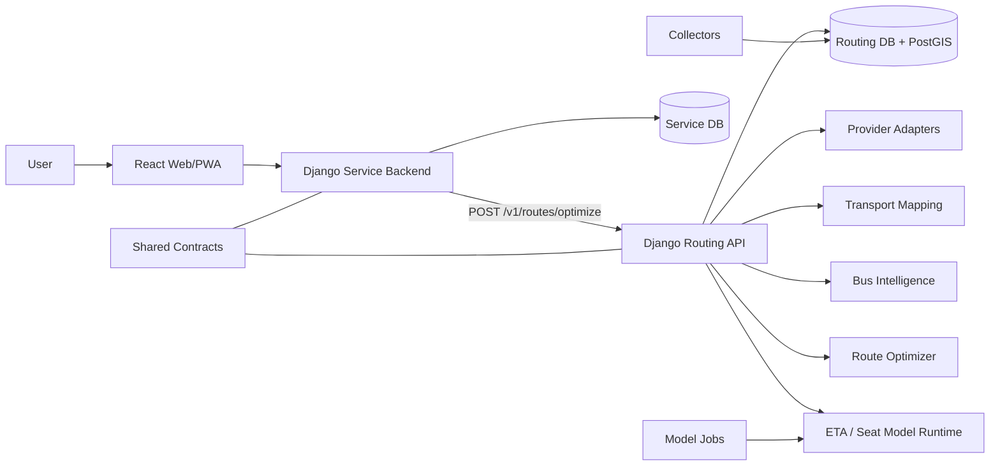

# 82TA

> **Historical design archive:** 초기 dual-harness 설계 기록이다. mandatory snapshot, durable workspace, agent ownership/team-size, prompt-library 절차는 현재 gate가 아니다. 현재 운영은 루트 `AGENTS.md`, `src/docs/codex/CODEX_RUNBOOK.md`, current source와 live lock을 따른다.

## 1. 문서 목적

이 문서는 Budget Route Platform을 두 명이 독립적으로 개발하면서도 이후 안전하게 합칠 수 있도록 구성한 두 개의 개발 하네스를 설명한다.

- **Service Product Harness**: React Web App/PWA + Django Service Backend
- **Routing & Intelligence Harness**: 교통 Provider + Mapping + Routing + Bus Intelligence + Data/ML

두 하네스는 별도 작업공간·에이전트 팀·소유 경로를 가지지만 다음은 하나만 존재한다.

- 제품 목표와 범위
- 공통 용어와 단위
- Public/Private API
- Service/Routing DB ERD와 소유권
- reason/warning/error code
- event contract
- 요구사항 추적
- 보안·성능·릴리스 기준

## 2. 저장소 최상위 규칙

```text
budget-route-platform-harness/
├─ .codex/ 및 .agents/          Harness 제어: agents, skills
├─ _workspace/       실행별 중간 산출물과 context snapshot
├─ src/              모든 최종 제품 원본
├─ AGENTS.md         하네스 트리거 포인터
├─ README.md         진입 안내
└─ .gitignore
```

제품 코드·PRD·ERD·OpenAPI·DBML·테스트·인프라·스크립트는 모두 `src/` 아래에 둔다.

루트에 `frontend/`, `backend/`, `docs/`, `tests/`, `infra/`, `scripts/`를 만들지 않는다.

## 3. 공통 단일 원본

```text
src/docs/shared/
src/contracts/
```

두 하네스는 위 파일을 읽기만 하며 workstream 폴더에 공통 계약 복사본을 만들지 않는다.

### 컨텍스트 잠금

```text
src/contracts/CONTEXT_MANIFEST.json
src/contracts/CONTRACT_LOCK.json
```

- Manifest는 canonical 파일 목록과 소유권을 정의한다.
- Lock은 각 canonical 파일의 SHA-256과 aggregate SHA-256을 저장한다.
- 각 하네스 실행은 context snapshot을 `_workspace/<harness>/`에 만든다.
- 합류 시 두 snapshot의 aggregate hash가 다르면 통합을 중단한다.

검증:

```bash
python src/scripts/verify_contract_lock.py
python src/scripts/snapshot_context.py service-product
python src/scripts/snapshot_context.py routing-intelligence
python src/scripts/compare_context_snapshots.py
```

## 4. 전체 구조



## 5. Service Product Harness

### 5.1 미션

사용자가 장소·시각·택시 예산·제약을 입력하고, Routing 결과를 신뢰 가능한 지도와 카드로 확인하며, 선택적으로 계정·기록·즐겨찾기·설정을 관리하는 제품 경험을 구현한다.

### 5.2 소유 경로

```text
src/apps/web/**
src/services/service-api/**
src/docs/harnesses/service-product/**
```

공동 test 경로는 관련 범위에서 수정할 수 있다.

### 5.3 금지 경계

- GBIS raw response 해석
- Provider 호출 순서 결정
- Kakao Transit↔GBIS 매핑
- ETA·Seat model artifact 로딩
- candidate generation, Pareto, ranking
- Routing DB 직접 조회
- Routing의 시간·비용·확률 재계산

### 5.4 오케스트레이터

```text
.agents/skills/service-product-orchestrator/SKILL.md
```

### 5.5 Codex Custom Subagents

| Agent | 책임 |
|---|---|
| service-product-lead | 요구사항·작업·의존성 조율 |
| service-ux-engineer | 정보 구조·상태·접근성 |
| service-frontend-engineer | React/PWA/Kakao map |
| service-backend-engineer | Django Public API·RoutingGateway |
| service-data-engineer | Service DB·보존·삭제 |
| service-security-engineer | session·privacy·abuse |
| service-qa-engineer | API↔UI↔DB incremental QA |

공통 변경 또는 릴리스에는 contract steward·architecture auditor·integration QA를 선택적으로 추가한다.

### 5.6 표준 흐름

```text
Context Snapshot
  -> Service Work Planning
  -> UX + Contract Fixture
  -> Frontend / Backend / Data 병렬
  -> Incremental QA
  -> Security / Privacy Review
  -> Mock E2E
  -> Real Routing Integration
  -> src/ 승격 + Release Evidence
```

Routing 구현이 완료되지 않아도 `StubRoutingGateway`, `ReplayRoutingGateway`로 개발한다.

## 6. Routing & Intelligence Harness

### 6.1 미션

대중교통·택시·경기버스·날씨·교통 데이터를 canonical model로 정규화하고, 사용자 도착시각 기준 Bus Intelligence와 시간 의존 복합교통 최적화를 적용해 private Routing API를 구현한다.

### 6.2 소유 경로

```text
src/services/routing-api/**
src/packages/routing-domain/**
src/packages/provider-core/**
src/packages/bus-intelligence-core/**
src/workers/**
src/docs/harnesses/routing-intelligence/**
```

### 6.3 금지 경계

- 사용자 email·이름·전화번호·social ID 수신
- 저장 장소의 집·직장·학교 label 수신
- Service DB 조회
- 검색 기록·즐겨찾기 UX 정책
- Frontend 전용 임의 JSON 설계

### 6.4 오케스트레이터

```text
.agents/skills/routing-intelligence-orchestrator/SKILL.md
```

### 6.5 Agent Pool

| Agent | 책임 |
|---|---|
| routing-technical-lead | dependency·deadline·통합 |
| provider-integration-engineer | Provider adapter·cache·resilience |
| transport-mapping-engineer | route·stop·direction mapping |
| route-optimization-engineer | candidate·time cost·Pareto·ranking |
| bus-intelligence-engineer | ETA·seat risk·expected wait |
| routing-data-ml-engineer | collector·dataset·model registry |
| routing-security-performance-engineer | private auth·SSRF·quota·SLO |
| routing-qa-engineer | adapter·mapping·algorithm·model QA |

### 6.6 Phase별 팀 재구성

```text
Team A: Provider + Mapping + Data + QA
  -> subagent result collection
Team B: Bus Intelligence + Optimization + Data/ML + QA
  -> subagent result collection
Team C: Private API + Security/Performance + QA + Integration
  -> subagent result collection
```

팀을 5~7명으로 유지하고 각 Phase 사이에 WORKPLAN/STATUS/HANDOFF 기반 handoff를 남긴다.

## 7. 공통 Contract Governance

공통 변경은 두 하네스 중 어느 쪽도 직접 확정하지 않는다.

```text
Change Request
  -> ADR if semantic/boundary change
  -> Shared PRD/OpenAPI/DBML/Events/Codes atomic update
  -> Examples and generated client impact
  -> Consumer + Producer Contract Test
  -> Service QA + Routing QA + Integration QA
  -> Version + Changelog
  -> CONTRACT_LOCK Update
  -> New Context Snapshots
```

실행 스킬:

```text
.agents/skills/shared-contract-governance/SKILL.md
```

## 8. API 경계

### Public

```http
POST /api/v1/route-searches
```

사용자 identity·history·projection은 Service가 소유한다.

### Private

```http
POST /v1/routes/optimize
```

Provider·Mapping·Bus Intelligence·Optimization은 Routing이 소유한다.

Service는 private 응답을 사용자용으로 축약할 수 있지만 다음을 바꾸지 않는다.

- 총시간·P50·P90
- taxi cost range
- recommendation ranking
- Bus Intelligence probability·wait
- provenance·model version의 사실관계

## 9. DB 경계

```text
Service Backend -> Service DB only
Routing Server  -> Routing DB only
```

금지:

- cross-service FK
- 상대 ORM model import
- DB link·cross query
- 같은 model class 공유

하나의 GCE 환경이나 managed PostgreSQL instance에 배치하더라도 database/schema/role/migration은 분리한다.

## 10. QA 경계 검증

통합 QA는 양쪽을 동시에 읽는다.

| 경계 | 생산자 | 소비자 |
|---|---|---|
| Public API | Django serializer | TS generated client·React hook |
| Private API | Routing serializer | Python generated client·Gateway |
| DB | DBML | model·migration·repository |
| Codes | Routing generation | Service projection·UI renderer |
| Capability | Provider/model registry | support API·UI control |
| Model | feature schema/training | online builder/runtime |

실행 스킬:

```text
.agents/skills/integration-coherence-qa/SKILL.md
```

## 11. 자동 검증

```bash
python src/scripts/validate_repository.py
```

포함:

- `src-only` 루트 정책
- agent/skill frontmatter와 연결
- 두 오케스트레이터 Team lifecycle
- canonical JSON/YAML
- OpenAPI local reference와 4개 canonical example
- 두 하네스 registry
- 모든 25개 skill의 trigger boundary eval
- 35개 canonical 파일 contract lock

## 12. 핵심 문서

| 목적 | 경로 |
|---|---|
| 공통 PRD | `src/docs/shared/PRD.md` |
| ERD | `src/docs/shared/ERD.md` |
| API 규칙 | `src/docs/shared/API_CONTRACT_GUIDE.md` |
| Public OpenAPI | `src/contracts/openapi/service-public.v1.yaml` |
| Private OpenAPI | `src/contracts/openapi/routing-private.v1.yaml` |
| Service DBML | `src/contracts/database/service-db.dbml` |
| Routing DBML | `src/contracts/database/routing-db.dbml` |
| Code Registry | `src/contracts/codes/reason-warning-error-codes.yaml` |
| Service PRD | `src/docs/harnesses/service-product/WORKSTREAM_PRD.md` |
| Routing PRD | `src/docs/harnesses/routing-intelligence/WORKSTREAM_PRD.md` |
| Algorithm | `src/docs/harnesses/routing-intelligence/ALGORITHM_SPEC.md` |
| Model | `src/docs/harnesses/routing-intelligence/MODEL_SPEC.md` |
| Integration | `src/docs/shared/INTEGRATION_PLAYBOOK.md` |
| Release | `src/docs/shared/RELEASE_GATES.md` |

## 13. 실행 예시

### Service

```text
서비스 제품 하네스 실행해줘.
명지대→판교 검색 화면과 Django Public API를 공통 계약에 맞춰 구현해줘.
```

### Routing

```text
라우팅 인텔리전스 하네스 실행해줘.
명지대→판교의 taxi-transit 후보, GBIS mapping, ETA·Seat risk를 구현해줘.
```

### 계약 변경

```text
공통 계약 변경 검토해줘.
Routing 응답의 새 provenance 필드를 Public API까지 호환되게 추가해줘.
```

### 통합

```text
두 하네스 통합 정합성 검사해줘.
context hash, generated client, DB ownership, partial/error state, R1~R4 replay를 검증해줘.
```

## 14. 현재 baseline 상태

이 패키지는 구현 코드가 아니라 **구현을 생성·조율·검증하기 위한 하네스와 기준 문서**다.

- 제품·기능·API·ERD·데이터·모델·보안·배포 기준: 작성됨
- 두 하네스와 agents/skills/orchestrators: 작성됨
- 자동 정적 검증과 context parity: 통과
- 실제 Kakao 대중교통·다중 목적지 권한, 데이터 통계, 모델 성능: capability/release gate로 검증 대기
- 실제 제품 코드는 각 하네스를 실행하며 지정된 `src/` 경로에 추가한다.


# 14. Codex Prompt Library

사용자가 직접 내릴 지시는 `src/docs/codex-prompts/`에 정리한다.

- 1번 최초·계속·기능·버그·QA
- 2번 최초·계속·Provider·Mapping·Bus Intelligence·Optimizer·QA
- 계약·DB·코드 레지스트리 변경
- 양방향 handoff·context sync
- 최초/반복 통합·merge readiness·conflict resolution
- 보안·성능·데이터 감사·모델·장애·release·rollback·V2

전체 복붙판: `ALL_COPY_PASTE_PROMPTS.md`.
