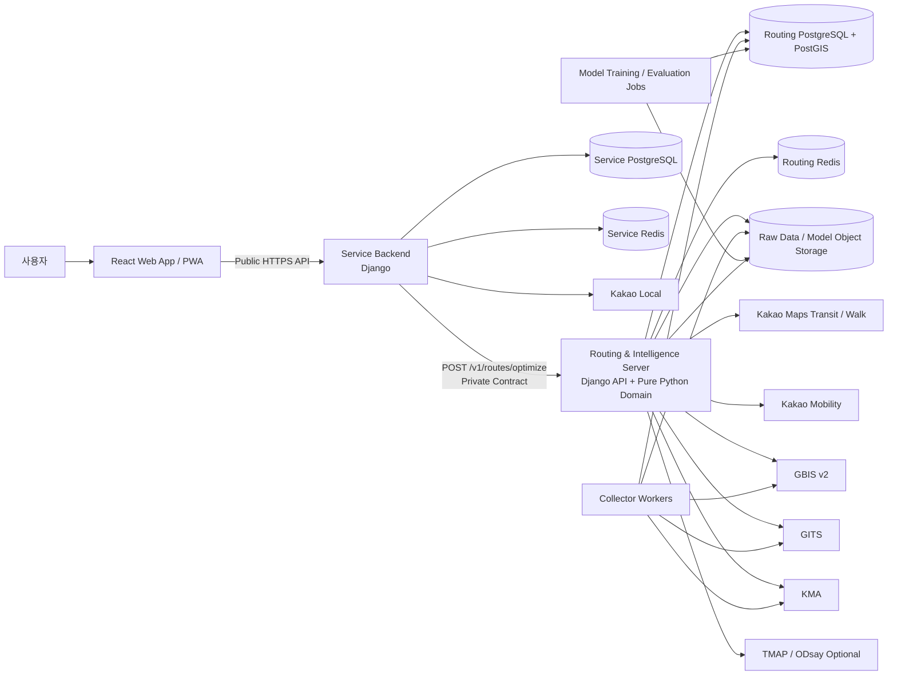
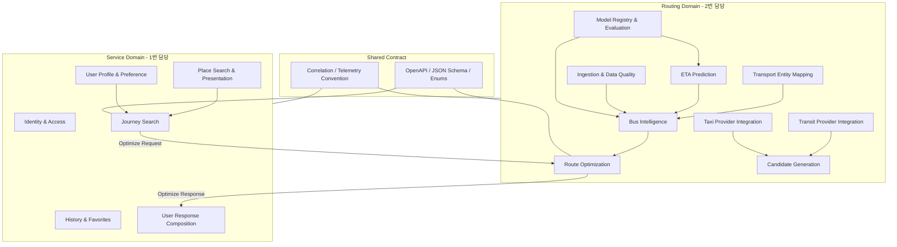
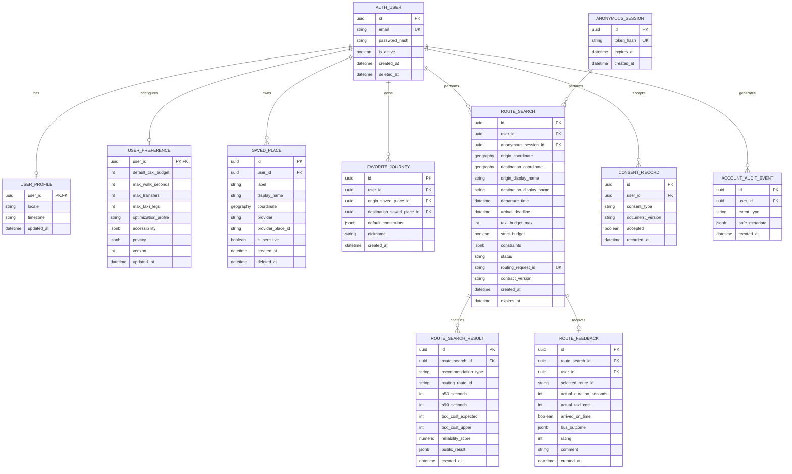
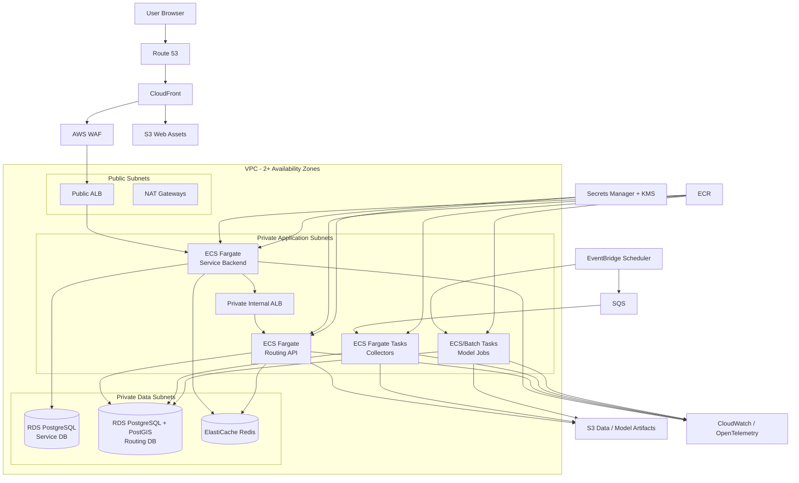

# 실시간 교통·버스 승차 가능성을 반영한 예산 기반 복합교통 경로 추천 시스템

> **최종 제품·기능·데이터·API·모델·아키텍처 통합기획서**  
> 문서 버전: **Final Plan v1.0**  
> 기준일: **2026-08-23 (KST)**  
> 기반 프로젝트: [`yunttai/BusCrowdRisk-KOR`](https://github.com/yunttai/BusCrowdRisk-KOR)

---

## 문서 목적

이 문서는 지금까지 논의한 프로젝트 아이디어와 구현 결정을 하나의 최종 기준으로 통합한다.

기존 문서가 “무엇을 만들 것인가”에 집중했다면, 이번 최종안은 다음까지 확정한다.

- 제품의 정체성·타겟·핵심 기능·비목표
- 외부 API와 데이터의 역할·한계·fallback
- `BusCrowdRisk-KOR`를 Bus Intelligence로 재구성하는 방법
- ETA·좌석 위험·실질 대기시간 모델의 분리
- 하이브리드 time-dependent multimodal routing과 Pareto 최적화
- React Web App과 Django Service Backend
- Django Routing & Intelligence Server
- 두 명의 책임 경계와 병렬 개발 방식
- monorepo와 공통 계약
- public API·private Routing API 명세
- canonical data model·error·warning·reason code
- Service DB·Routing DB ERD
- AWS 배포·CI/CD·관측성·복구·비용통제
- 보안·개인정보·외부 API 약관 검토
- 테스트·현장검증·상용 GA 기준·V2 확장

이 프로젝트의 목표는 단기 MVP에서 종료하는 것이 아니다. MVP는 내부 가설 검증 단계로만 사용하고, 최종적으로는 외부 사용자가 지속적으로 이용하고 판매할 수 있는 운영 가능한 제품을 목표로 한다.

## 확정된 핵심 결정

| 항목 | 결정 |
|---|---|
| 초기 지역 | 경기 남부 ↔ 서울 |
| 대표 검증 축 | 명지대↔판교, 광교↔판교 |
| 제공 기능 | 경로 추천. 실제 턴바이턴 내비게이션과 택시 호출은 제외 |
| 실시간 재추천 | V2 |
| Routing | 하이브리드형 time-dependent multimodal routing |
| Frontend | React 기반 웹앱·PWA |
| Backend | Django |
| 배포 | AWS |
| 코드 구성 | 하나의 monorepo, 두 개의 독립 배포 단위 |
| 분업 1 | Frontend + Service Backend |
| 분업 2 | Routing + Bus Intelligence + 외부 교통 API |
| 내부 핵심 API | `POST /v1/routes/optimize` |
| 응답 성능 | 정상 검색 P95 7초 목표 |
| 기존 프로젝트 | 새 monorepo의 Bus Intelligence 영역으로 재구성 |
| ETA | 초기 제품부터 별도 모델로 포함 |

## 근거 상태 구분

이 문서의 내용은 다음 세 종류로 구분한다.

1. **사용자 확정사항**: 위 표와 최신 요청에서 확정된 제품·기술·분업 결정
2. **현재 저장소 기반 판단**: `BusCrowdRisk-KOR` README·API·모델·수집·schema 코드에서 확인한 구조
3. **외부 공식 문서 기반 판단**: Kakao·Kakao Mobility·공공데이터·AWS 등의 공식 문서

아직 실제 키 또는 데이터 통계로 확인되지 않은 항목은 별도 `미시험`, `검증 대기`, `release gate`로 명시한다. 특히 다음은 추후 결과를 반영해야 한다.

- Kakao Maps 대중교통 경로 실제 호출
- Kakao Mobility 다중 목적지·출발지·미래 경로 권한
- 현재 SQLite 데이터의 정확한 행 수·결측률·노선별 coverage
- 현재 모델의 실제 diagnostics와 calibration
- GITS 접근 상태와 버스 노선·도로 링크 매핑 가능성

## 문서 구조

- **1~37장**: 제품·기능·외부 API·데이터·모델 구상
- **38~63장**: 최종 구현·분업·계약·ERD·AWS·보안·검증 계획
- **부록**: 용어, 판단 흐름, 계약 코드, 완료 체크리스트

---

# 1. 한 페이지 결론

## 1.1 프로젝트 정체성

이 프로젝트는 일반적인 최단경로 서비스가 아니다.

> **택시·버스·지하철·도보를 조합하여, 사용자가 허용한 택시 총예산 안에서 실제 도착시간이 가장 빠르거나 지연 위험이 가장 낮은 경로를 추천하는 서비스**

기술적으로는 다음 표현이 가장 정확하다.

> **Budget-Constrained Time-Dependent Multimodal Route Optimizer with Bus Boardability Intelligence**

한국어 기술명은 다음으로 정의한다.

> **실시간 교통과 버스 승차 가능성을 반영한 예산 제약형 복합교통 최소도착시간 추천 시스템**

## 1.2 해결하려는 질문

사용자는 다음 질문에 답을 원한다.

> “택시비를 최대 1만 원까지 사용할 수 있을 때, 택시를 어디까지 타고 어느 버스나 지하철로 갈아타야 실제로 가장 빨리 도착할 수 있는가?”

여기서 “실제로”에는 다음이 포함된다.

- 택시가 이동하는 시간
- 택시 호출 후 탑승하기까지의 대기
- 역·정류장까지 도보 이동
- 버스·지하철 대기
- 광역·좌석버스의 좌석 부족으로 첫 차량을 타지 못할 가능성
- 환승 통로와 정류장 간 이동
- 환승 실패 가능성
- 실시간 교통과 돌발 상황
- 목적지까지 마지막 도보

## 1.3 핵심 차별점

일반 길찾기는 “버스가 언제 오는가”를 중심으로 판단한다.

이 프로젝트는 다음까지 판단한다.

> **사용자가 정류장에 도착한 이후 오는 차량 중, 실제로 탈 수 있을 것으로 예상되는 첫 차량은 무엇인가?**

따라서 기존 `BusCrowdRisk-KOR`는 독립적인 만차 확률 서비스가 아니라 전체 프로젝트의 **Bus Intelligence** 기능으로 편입한다.

## 1.4 사용자에게 제공할 네 가지 추천

결과는 최대 네 가지로 정리한다.

1. **가장 빠름**: 예산 안에서 기대 도착시간이 가장 짧은 경로
2. **비용 대비 추천**: 추가 택시비 대비 단축시간이 가장 큰 경로
3. **가장 안정적**: 지연·만차·환승 실패 위험이 가장 낮은 경로
4. **택시 없는 대안**: 비교 기준이 되는 순수 대중교통 경로

## 1.5 대표 기능

이 프로젝트를 다른 복합교통 길찾기와 구분하는 대표 기능은 다음이다.

> **가까운 정류장이 만차 위험이 높다면, 택시로 노선 상류 정류장까지 이동하여 먼저 탑승하는 경로를 추천한다.**

이를 문서에서는 **선탑승 정류장 추천**이라고 부른다.

---

# 2. 문제 정의

## 2.1 현재 길찾기의 한계

현재의 일반적인 길찾기 결과는 다음 문제를 충분히 반영하지 못한다.

- 광역·좌석버스가 도착해도 좌석 부족으로 승차하지 못할 수 있다.
- 택시를 일부만 사용했을 때 어느 구간에서 시간 절감 효과가 가장 큰지 알기 어렵다.
- 택시 주행시간은 제공되더라도 실제 배차·탑승 대기시간은 빠지는 경우가 많다.
- 지도상 가능한 환승이 실제 보행시간과 정류장 위치를 고려하면 불가능할 수 있다.
- 실시간 도착정보가 없을 때 정확한 숫자로 보이는 부정확한 결과가 제공될 수 있다.
- 사용자가 “몇 시까지 도착”해야 할 때 최소한 얼마의 택시 예산이 필요한지 알 수 없다.
- 대중교통 경로와 택시 경로가 각각 제공될 뿐, 전체 여정의 총예산을 기준으로 조합되지 않는다.

## 2.2 사용자에게 중요한 것은 최단거리보다 최소도착시간

경로의 목적함수는 거리가 아니다.

```text
목적함수 = 사용자가 출발 준비를 마친 시점부터 목적지에 실제 도착할 때까지의 전체 시간
```

또한 동일 구간의 비용은 시각에 따라 달라진다.

```text
22:30 택시 이동시간 ≠ 02:30 택시 이동시간
08:10 버스 대기시간 ≠ 08:20 버스 대기시간
```

따라서 각 이동 구간의 시간은 고정값이 아니라 다음과 같다.

```text
구간 비용 = w(edge, 해당 구간에 진입하는 시각, 실시간 상태, 데이터 신뢰도)
```

## 2.3 초기 집중 문제

초기에는 다음 문제에 집중한다.

- 경기 남부에서 서울로 이동하는 통근·통학
- 용인·수원·성남 등에서 광역·좌석버스를 이용하는 경로
- 역세권이 아니어서 출발지 또는 목적지 일부 구간에 택시를 사용할 가치가 큰 이동
- 출근·수업·약속 등 도착 마감시간이 존재하는 이동

전국 서비스로 보이게 만들 수는 있지만, **버스 좌석·승차 가능성 기능의 실제 적용 범위는 경기버스 데이터가 확보된 노선으로 명확히 표시**해야 한다.

---

# 3. 사용자와 사용 상황

## 3.1 핵심 사용자

| 사용자 유형 | 주요 문제 | 서비스가 제공할 판단 |
|---|---|---|
| 경기권 통근자 | 광역버스 만차와 출근 지각 | 어느 정류장에서 어느 차량을 타야 하는지 |
| 대학생·통학생 | 수업 시작시각과 제한된 택시비 | 최소 예산으로 정시 도착 가능한 경로 |
| 비역세권 거주자 | 어느 역까지 택시를 타야 효율적인지 모름 | 택시 구간별 시간 절감 효과 |
| 약속 시간이 있는 이용자 | 평균시간보다 지연 위험이 중요 | 정시 도착 확률이 높은 경로 |
| 여러 명이 함께 이동 | 택시 전체 요금은 비싸지만 분담 가능 | 인원별 비용 대비 시간 절감 |
| 짐이 많거나 날씨가 나쁜 이용자 | 긴 도보와 복잡한 환승이 어려움 | 도보·환승 제약을 만족하는 경로 |

## 3.2 대표 사용자 질문

- “지금 명지대에서 강남역까지 1만 원만 택시에 쓰면 가장 빨리 어떻게 가야 하는가?”
- “8시 50분까지 도착할 확률이 90% 이상이 되려면 택시비가 최소 얼마 필요한가?”
- “집 앞 5005번 정류장보다 택시로 몇 정거장 앞에 가서 타는 것이 빠른가?”
- “다음 버스가 좌석 부족이면 지하철역으로 택시를 타는 편이 실제로 더 빠른가?”
- “택시를 5천 원 더 써서 몇 분을 줄일 수 있는가?”

---

# 4. 설계 원칙

## 4.1 데이터가 없다는 것은 위험이 낮다는 뜻이 아니다

다음 상태를 반드시 구분한다.

- 위험 낮음
- 위험 높음
- 데이터 부족
- 데이터가 오래됨
- 노선 식별 불확실
- 해당 노선 유형에는 좌석 부족 개념을 적용할 수 없음

`NULL`, 미수집, API 실패를 `0% 위험`으로 바꾸지 않는다.

## 4.2 예측값과 관측값을 구분한다

모든 핵심 정보에는 출처를 붙인다.

```text
observed      공식 실시간 관측
provider_eta  외부 경로·도착 API 값
predicted     자체 모델 예측
historical    과거 이력 기반 추정
unknown       판단 불가
```

## 4.3 한 개의 정밀한 숫자보다 범위와 신뢰도를 제공한다

부정확한 예측을 다음처럼 표시하지 않는다.

```text
8분 후 도착
```

다음처럼 표시한다.

```text
약 7~11분 후 도착
중앙 예상값 9분
신뢰도 보통
```

## 4.4 BusCrowdRisk는 경로 순위를 바꿔야 한다

`만차 위험 72%`를 부가 정보로만 보여주면 전체 프로젝트의 차별점이 아니다.

해당 위험이 다음에 실제로 반영되어야 한다.

- 실질 버스 대기시간
- 첫 차량 승차 가능성
- 다음 차량까지의 지연
- 경로 기대 도착시간
- 경로의 P90 도착시간
- 정시 도착 확률
- 선탑승 정류장 추천 여부

## 4.5 경로가 빠르더라도 사용자가 실행하기 어려우면 제외한다

- 환승 여유가 지나치게 짧은 경로
- 1~2분만 빠르지만 환승이 과도하게 복잡한 경로
- 택시 승하차 지점과 정류장·역 출입구 연결이 부정확한 경로
- 데이터 신뢰도가 낮으면서 촉박한 환승에 의존하는 경로
- 거의 같은 경로가 중복으로 반복되는 결과

## 4.6 예산은 총 택시 사용액 기준이다

`택시 → 대중교통 → 택시` 경로라면 앞뒤 택시비를 합산한다.

```text
총 택시비 = 모든 택시 구간 예상비용의 합
```

기본 모드는 **예산 엄수**로 한다.

---

# 5. 사용자 입력

## 5.1 필수 입력

| 입력 | 설명 |
|---|---|
| 출발지 | 현재 위치, 장소명, 주소, 지도 선택 |
| 목적지 | 장소명, 주소, 역, 정류장 |
| 출발시각 | 지금 출발 또는 지정 시각 |
| 택시 총예산 | 0원, 5천 원, 1만 원, 2만 원, 직접 입력 |

## 5.2 선택 입력

| 입력 | 설명 |
|---|---|
| 도착 마감시각 | 특정 시각까지 도착해야 하는 경우 |
| 최대 도보시간·거리 | 사용자가 감수 가능한 보행량 |
| 최대 환승 횟수 | 복잡한 경로 제한 |
| 택시 최대 이용 횟수 | 기본 최대 2회 권장 |
| 추천 성향 | 가장 빠름, 안정성, 비용 효율 |
| 예산 정책 | 엄수 또는 일부 초과 허용 |
| 혼잡 회피 | 일반버스·지하철 혼잡을 불편도에 반영 |
| 이동 제약 | 계단 회피, 짐 많음, 우천 시 도보 최소화 |
| 동행 인원 | 택시비 1인당 비용 계산 |

---

# 6. 사용자에게 반환할 결과

## 6.1 예산별 비교

| 택시 예산 | 추천 조합 | 기대 소요시간 | 예상 범위 | 0원 대비 단축 | 택시 예상비 |
|---:|---|---:|---:|---:|---:|
| 0원 | 버스 → 지하철 | 78분 | 72~91분 | 기준 | 0원 |
| 5천 원 | 택시 → 광역버스 | 66분 | 61~79분 | 12분 | 4,300~5,000원 |
| 1만 원 | 택시 → 지하철 | 54분 | 51~61분 | 24분 | 8,400~9,600원 |
| 2만 원 | 택시 → 고속 대중교통 → 택시 | 48분 | 45~54분 | 30분 | 16,800~19,200원 |

## 6.2 경로 카드에 필요한 항목

### 시간

- 기대 총 소요시간
- 중앙 예상 도착시각
- 도착시간 범위
- P90 도착시간
- 순수 대중교통 대비 단축시간
- 택시 배차·탑승 대기 추정
- 각 버스·지하철 대기시간
- 도보·역사 내부 이동·환승시간

### 비용

- 택시비 중앙 추정값
- 택시비 예상 범위
- 예산 초과 가능성
- 대중교통 요금
- 전체 교통비
- 1,000원당 단축시간
- 이전 예산 단계 대비 한계 시간 절감

### 버스 승차 가능성

- 사용자가 정류장에 도착할 예상시각
- 그 이후 첫 후보 차량
- 해당 차량 좌석 부족 확률
- 좌석 가용성 추정
- 첫 후보 차량 승차 가능성 또는 승차 가능성 대용값
- 첫 차량을 놓칠 경우 다음 차량
- 실질 기대 대기시간과 P90 대기시간

### 신뢰도

- ETA 출처
- 좌석 정보 출처
- 데이터 수집 시각과 경과시간
- 노선·정류장 식별 신뢰도
- 모델 버전
- 전체 경로 신뢰도

### 설명

- 이 경로를 추천한 이유
- 가장 큰 시간 절감 구간
- 주요 위험요소
- 택시 예산을 늘릴 때 추가로 줄어드는 시간
- 더 저렴한 대안과의 차이

## 6.3 추천 설명 예시

> 가까운 정류장에서 오는 5005번 첫 차량은 좌석 부족 위험이 높습니다. 택시로 3개 앞 정류장까지 이동하면 첫 후보 차량의 좌석 가용성 추정이 높아지고, 다음 차량을 기다릴 위험이 감소하여 기대 도착시간이 16분 단축됩니다.

> 택시 예산을 1만 원에서 2만 원으로 늘려도 기대시간은 6분만 줄어듭니다. 1만 원 경로가 추가 지출 대비 시간 절감이 가장 큽니다.

---

# 7. 핵심 기능 전체 목록

## 7.1 장소·위치 기능

- 현재 위치 사용
- 장소명 검색
- 주소 검색
- 역·정류장 검색
- 동일 이름 장소 구분
- 출발·도착 좌표의 행정구역 식별
- 지도상 직접 위치 지정

## 7.2 기본 대중교통 경로

- 버스·지하철·도보가 결합된 기준 경로
- 총시간, 환승, 요금, 도보 구간
- 이동수단과 경유 정류장·역
- 현재 출발 경로와 지정 시각 경로의 구분
- 외부 공급자의 경로 원본과 자체 보정값 구분

## 7.3 택시 결합 경로

초기에는 다음 패턴을 허용한다.

1. `대중교통만`
2. `택시 → 대중교통`
3. `대중교통 → 택시`
4. `택시 → 대중교통 → 택시`
5. `택시만`

확장 패턴은 다음이다.

6. `대중교통 → 택시 연결 구간 → 대중교통`

마지막 패턴은 서로 직접 연결되지 않거나 환승이 비효율적인 두 고속 교통망을 짧은 택시 구간으로 연결하는 **Taxi Bridge**이다.

## 7.4 예산별 최소시간 추천

- 전체 택시 예산 이하의 후보만 유지
- 비용과 시간이 모두 불리한 경로 제거
- 예산별 가장 빠른 경로 반환
- 예산 구간별 한계 효율 계산
- 예산이 늘어도 시간이 거의 줄지 않는 구간 표시

## 7.5 도착 마감시각 모드

- 지정 시각까지 도착할 확률이 가장 높은 경로
- 목표 정시 도착 확률을 만족하는 최소 택시 예산
- 70%, 80%, 90% 등 목표 신뢰수준 선택
- 막차·운행 종료 위험 표시

## 7.6 버스 승차 가능성 보정

- 사용자가 정류장에 도착하는 시각 이후의 차량만 평가
- 좌석형 노선과 일반형 노선을 다른 의미로 처리
- 첫 차량의 좌석 부족 위험
- 다음 차량까지 포함한 실질 대기시간
- 데이터가 없으면 미확인으로 표시
- 노선 식별이 불확실하면 위험 보정을 적용하지 않음

## 7.7 선탑승 정류장 추천

- 가까운 정류장과 상류 정류장 비교
- 상류 정류장까지 택시·도보 시간과 비용
- 각 정류장에서의 후보 차량 도착시각
- 정류장별 좌석 가용성 변화
- 총도착시간과 지연 위험 비교
- 회차·방향·정류장 순서를 고려한 유효 상류 정류장만 선택

## 7.8 버스 ETA 보완

- 공식 실시간 도착정보 우선
- 차량 위치 기반 ETA
- 구간별 최근 이동시간 기반 ETA
- 과거 동일 노선·시간대 기반 ETA
- 예측 구간과 신뢰구간
- 공식 ETA와 자체 ETA의 오차 추적

## 7.9 환승 성공 가능성

- 역 승강장부터 출구까지의 내부 이동
- 출구에서 버스정류장까지의 실제 보행
- 신호·횡단보도·중앙차로 진입
- 환승 여유시간
- ETA 불확실성
- 놓쳤을 때 다음 차량 지연
- 촉박한 환승을 경로 위험으로 반영

## 7.10 실시간 재추천

다음 상황에서 재추천 필요성을 판단한다.

- 택시 배차가 예상보다 늦음
- 차량 정체로 예정 버스를 놓칠 가능성이 커짐
- 버스 도착이 지연되거나 좌석 부족 상태가 변함
- 첫 버스 탑승 실패
- 대중교통 지연 또는 운행 종료
- 사용자가 경로 이탈
- 예상 택시비가 증가하여 남은 예산이 감소

경로가 1~2분 차이로 계속 바뀌지 않도록 다음을 적용한다.

- 의미 있는 시간 이득이 있을 때만 변경
- 현재 경로 실패 위험이 일정 기준을 넘을 때 변경
- 변경 비용과 사용자 혼란을 반영

## 7.11 저장·반복 이동

- 자주 가는 출발지·목적지 저장
- 평일 특정 시각 반복 검색
- 실제 이용 결과 기록
- 개인 보행속도와 환승 습관 반영
- 개인별 택시 대기시간 보정

## 7.12 그룹 이동

- 택시 총액과 1인당 금액 동시 표시
- 인원별 최대 예산
- 그룹 전체가 함께 이동하는 경로만 추천

---

# 8. 총 소요시간과 위험의 정의

## 8.1 총 소요시간

경로 `r`의 총 소요시간은 다음 항목의 합으로 정의한다.

```text
T_total(r)
  = 출발 준비·실제 이동 시작 지연
  + 모든 도보시간
  + 모든 택시 배차·탑승 대기시간
  + 모든 택시 주행시간
  + 모든 대중교통 대기시간
  + 좌석 부족·환승 실패에 따른 추가 대기시간
  + 모든 대중교통 탑승시간
  + 역사 내부·정류장 간 환승시간
  + 최종 도보시간
```

단일값만 사용하지 않고 다음을 함께 본다.

- 기대값
- 중앙값
- P90
- 최소·최대 또는 예측구간
- 도착 마감시각 내 도착 확률

## 8.2 택시 배차 대기

카카오모빌리티 자동차 길찾기 API가 제공하는 것은 도로 이동시간과 예상 택시요금이다.

공개 길찾기 응답만으로 실제 택시 호출 후 차량이 사용자에게 도착하는 시간을 직접 얻는 것으로 간주하지 않는다.

따라서 택시 구간은 다음처럼 분리한다.

```text
택시 구간시간 = 배차·접근 대기 추정 + 실제 도로 주행시간
```

배차 대기 정보가 없을 때는 다음 원칙을 사용한다.

- 단일 확정값이 아니라 범위
- 시간대·지역별 경험적 사전값
- 사용자 실제 호출 기록이 있다면 개인화
- 공식 배차 정보가 아니라는 출처 표시

## 8.3 여러 버스를 고려한 실질 대기시간

사용자가 정류장에 도착하는 시각을 `t_s`라고 한다.

그 이후 도착하는 후보 차량을 `1, 2, ..., n`으로 두고,

- 차량 `i`의 도착시각: `A_i`
- 차량 `i`의 승차 가능성 또는 승차 가능성 대용값: `q_i`

로 정의한다.

첫 번째로 승차 가능한 차량이 `i`일 확률은 다음과 같이 표현할 수 있다.

```text
P(first boardable = i)
  = q_i × Π(j < i)(1 - q_j)
```

기대 대기시간은 후보 차량별 확률을 이용해 계산하며, 모든 후보에서 승차하지 못하는 경우에는 다음 배차 또는 보수적인 fallback 지연을 반영한다.

단순한 초기 근사식은 다음과 같다.

```text
기대 대기시간 ≈ 기본 대기시간 + 좌석부족확률 × 평균 배차간격
```

그러나 최종 제품 개념에서는 여러 차량을 개별적으로 평가하는 방식이 더 적절하다.

## 8.4 환승 성공 확률

다음 조건을 모두 반영한다.

```text
사용 가능한 환승시간
  = 다음 교통수단 출발·도착시각
  - 이전 교통수단 하차시각
  - 역사 내부 이동
  - 정류장 이동
  - 보행 변동성
  - 안전 여유시간
```

환승 가능성을 단순한 참·거짓만으로 처리하지 않고 다음으로 표현한다.

- 성공 확률
- 여유시간
- 실패 시 추가 지연
- 결과에 미치는 영향

## 8.5 예산 제약

엄수 모드에서는 평균 택시비가 아니라 보수적인 상한을 사용한다.

```text
C_taxi_upper(r) ≤ 사용자 예산 B
```

유연 모드에서는 다음을 표시한다.

- 평균 추정비용
- 상한 추정비용
- 예산 초과 확률
- 초과 예상금액

## 8.6 Pareto Frontier

경로 A가 경로 B보다 다음 두 조건을 모두 만족하면 B는 제거한다.

```text
택시비(A) ≤ 택시비(B)
도착시간(A) ≤ 도착시간(B)
```

그리고 최소 하나는 엄격하게 더 좋아야 한다.

안정성까지 포함하는 모드에서는 다음을 추가할 수 있다.

```text
P90 도착시간(A) ≤ P90 도착시간(B)
```

사용자 예산 `B`에 대한 기본 추천은 다음이다.

```text
예산 이하인 비지배 경로 중 기대 도착시간 최소
```

## 8.7 비용 대비 효율

예산을 늘렸을 때의 한계 효율을 계산한다.

```text
추가 1,000원당 단축시간
추가 10분 단축에 필요한 비용
이전 예산 단계 대비 추가 단축시간
```

서비스는 단순히 더 비싼 경로를 추천하지 않고, 비용 증가가 실제 시간 절감으로 이어지는지 설명해야 한다.

---

# 9. 외부 API·데이터 전체 구성

## 9.1 API 선택 원칙

1. 외부 API가 직접 제공하는 값을 자체 예측값처럼 표현하지 않는다.
2. 하나의 항목에 여러 공급자가 있으면 주 공급자와 fallback을 명확히 구분한다.
3. API가 제공하지 않는 정보를 제공한다고 가정하지 않는다.
4. 정류장·노선 ID 체계가 다르면 식별 신뢰도를 별도로 관리한다.
5. 쿼터, 과금, 저장 제한을 기능 범위에 반영한다.
6. 외부 API 실패 시 잘못된 확정값을 만들지 않는다.
7. 모델 학습용으로 저장할 수 있는 데이터인지 이용약관을 확인한다.

## 9.2 전체 API 역할표

| 영역 | 우선 공급자 | 정확한 API·데이터 | 역할 | 주요 한계 |
|---|---|---|---|---|
| 주소→좌표 | Kakao Maps REST | `/v2/local/search/address.json` | 주소 지오코딩 | 검색어 품질 영향 |
| 장소 검색 | Kakao Maps REST | `/v2/local/search/keyword.json` | 출발·목적지 검색 | 장소 ID는 카카오 체계 |
| 좌표→주소 | Kakao Maps REST | `/v2/local/geo/coord2address.json` | 현재 위치 설명 | 일부 도로명 주소 누락 가능 |
| 행정구역 | Kakao Maps REST | `/v2/local/geo/coord2regioncode.json` | 지역·시군 분류 | 교통 ID와 별개 |
| 현재 대중교통 경로 | Kakao Maps REST | `/v2/routing/publictraffic` | 버스·지하철·도보 기준 경로 | 출발시각 파라미터와 안정적 정류장·노선 ID가 없음 |
| 도보 경로 | Kakao Maps REST | `/v2/routing/walk` | 출발·환승·최종 도보 | 일 1,000건 무료 쿼터 |
| 지정 시각 대중교통 | TMAP Transit | `POST /transit/routes` | `searchDttm` 기반 운행 여부·노선·정류장 ID | 무료 10건/일, 응답 저장 24시간 제한 |
| 대중교통 보조 검증 | ODsay | `/v1/api/searchPubTransPathT` | 전국 경로·정류장·노선 세부정보 | 지정 출발시각 대기시간을 반영한 경로가 아님 |
| 현재 택시 주행 | Kakao Mobility | `GET /v1/directions` | 현재 교통 반영 주행시간·예상요금 | 실제 배차 대기 미제공 |
| 다중 목적지 선별 | Kakao Mobility | `POST /v1/destinations/directions` | 출발지→후보 역·정류장 최대 30개 시간 선별 | 거리·시간 요약용, 최종 요금은 별도 검증 |
| 다중 출발지 선별 | Kakao Mobility | `POST /v1/origins/directions` | 후보 역·정류장→목적지 선별 | 거리·시간 요약용 |
| 미래 택시 주행 | Kakao Mobility | `GET /v1/future/directions` | 미래 출발시각 도로 주행시간·요금 | 실제 계정 권한·서비스 정책 확인 필요 |
| 경기버스 도착·위치·노선 | GBIS v2 | `apis.data.go.kr/6410000/...` | 실시간 차량, 잔여좌석, 혼잡, 노선·정류장 | 경기버스 중심, 노선 유형별 필드가 다름 |
| 실시간·예보 날씨 | 기상청 | `VilageFcstInfoService_2.0` | 강수·기온·풍속·습도 등 | 격자 좌표 변환 필요 |
| 과거 날씨 | 기상청 ASOS | `AsosHourlyInfoService/getWthrDataList` | 모델 학습용 과거 관측 | 관측소와 정류장 공간 차이 |
| 공휴일 | 한국천문연구원 | `SpcdeInfoService/getRestDeInfo` | 공휴일·휴일 feature | 임시공휴일 갱신 확인 필요 |
| 축제·행사 | 한국관광공사 TourAPI | `KorService2/searchFestival2` | 행사 수요 feature | 모든 지역 행사를 포괄하지 않음 |
| 도로 소통 | 경기교통정보센터 GITS | `getRoadTrafficInfoList`, `getRoadLinkTrafficInfo` | 버스 ETA용 구간 속도·통행시간 | 버스 경로와 도로 링크 매핑 필요 |
| 도로 돌발 | 경기교통정보센터 GITS | `getIncidentInfo` | 사고·공사·통제 feature | 영향 범위 판단 필요 |
| 학교 일정 | NEIS | `/hub/SchoolSchedule` | 등교·방학·학교 행사 수요 | 대학 일정은 포함하지 않음 |
| 대기질 | AirKorea | `getMsrstnAcctoRltmMesureDnsty` | 실험적 외부상황 feature | 직접 효과가 약할 수 있음 |
| 정류장 수요 | STICS·지자체 자료 | 노선별·정류장별 승차인원 | 실제 수요 feature | 노선·지역별 공개 범위 차이, 민영노선 제한 가능 |
| 정적 노선·정류장 매핑 | 경기도 파일데이터 | 버스 카드데이터 기준 노선 경유정류소 CSV | 식별자·정류장 순서·거리 보강 | 1회성·갱신 지연 가능 |
| 차량 재원 | 경기도 파일데이터 | 버스 차량 재원 CSV | 차량 형식·정원 추정 보강 | 번호판·차량 ID 매핑 가능성 확인 필요 |

---

# 10. API별 구체적 사용 방안

## 10.1 Kakao Maps REST

공식 문서: <https://developers.kakao.com/docs/ko/kakaomap/rest-api>

### 10.1.1 주소로 좌표 변환

```http
GET https://dapi.kakao.com/v2/local/search/address.json
```

사용 목적:

- 사용자가 입력한 도로명·지번 주소를 WGS84 좌표로 변환
- 출발지와 목적지 좌표 확정

### 10.1.2 키워드로 장소 검색

```http
GET https://dapi.kakao.com/v2/local/search/keyword.json
```

사용 목적:

- “강남역”, “명지대학교 자연캠퍼스”와 같은 장소 검색
- 장소명, 주소, 좌표 후보 제공

### 10.1.3 좌표로 주소 변환

```http
GET https://dapi.kakao.com/v2/local/geo/coord2address.json
```

사용 목적:

- 현재 위치 좌표를 사용자에게 이해 가능한 주소로 표시

### 10.1.4 좌표로 행정구역 변환

```http
GET https://dapi.kakao.com/v2/local/geo/coord2regioncode.json
```

사용 목적:

- 지역별 데이터 적용 여부 판단
- 경기버스 Bus Intelligence 적용 범위 표시
- 날씨·행사·지역 수요 매핑 보조

### 10.1.5 대중교통 경로 조회

```http
GET https://dapi.kakao.com/v2/routing/publictraffic
```

공식 응답에서 사용할 정보:

- `totalTime`
- `totalDistance`
- `transfers`
- `fare`
- `BUS`, `SUBWAY`, `WALKING` 단계
- 정류장명
- 차량·노선 표시명
- 단계별 좌표 경로

중요한 한계:

- 공식 요청 명세에 출발시각 파라미터가 없다.
- 응답 정류장은 이름 중심이며 안정적인 정류장 ID가 제공되지 않는다.
- 차량은 표시명과 유형 중심이며 GBIS `routeId`가 직접 제공되지 않는다.
- 따라서 **현재 출발 기준 경로 후보**로는 유용하지만, 미래 출발 경로와 GBIS 정밀 결합에는 별도 보완이 필요하다.

### 10.1.6 도보 경로 조회

```http
GET https://dapi.kakao.com/v2/routing/walk
```

사용 목적:

- 출발지→택시 승차지점
- 택시 하차지점→정류장·역
- 역 출구→정류장
- 마지막 역·정류장→목적지
- `ACCESSIBLE`, `SHORTEST`, `BROAD_FIRST` 경로 비교

### 10.1.7 2026년 8월 기준 쿼터 주의

공식 쿼터 문서 기준:

- 주소·좌표 변환: 각 100,000건/일
- 장소 검색: 각 100,000건/일
- 대중교통 경로: 1,000건/일
- 도보 경로: 1,000건/일

카카오맵 무료 쿼터는 개발자 계정에서 첫 번째로 활성화한 앱에 적용되는 정책이 있으므로 프로젝트 앱의 적용 상태를 확인해야 한다.

## 10.2 Kakao Mobility 자동차 길찾기

공식 문서: <https://developers.kakaomobility.com/guide/navi-api/directions>

### 10.2.1 현재 자동차 길찾기

```http
GET https://apis-navi.kakaomobility.com/v1/directions
```

주요 사용값:

- `duration`
- `distance`
- `fare.taxi`
- `fare.toll`
- `traffic_speed`
- `traffic_state`
- 도로 통제·돌발 반영 옵션

기본 택시 후보의 주행 우선순위는 `priority=TIME`을 사용한다.

단, `fare.taxi`는 예상 택시비이며 실제 호출요금 보장이 아니다.

### 10.2.2 다중 목적지 길찾기

```http
POST https://apis-navi.kakaomobility.com/v1/destinations/directions
```

- 하나의 출발지에서 최대 30개 후보 목적지
- 후보 지하철역, GTX역, 광역버스 정류장을 빠르게 비교
- 응답의 거리·시간으로 후보를 줄이는 용도
- 최종 선택 후보는 단일 자동차 길찾기로 요금·상세 경로를 다시 확인

### 10.2.3 다중 출발지 길찾기

```http
POST https://apis-navi.kakaomobility.com/v1/origins/directions
```

- 최대 30개 후보 출발지에서 하나의 목적지까지 비교
- 목적지 근처 어느 역·정류장에서 택시로 전환할지 선별

### 10.2.4 미래 운행 정보 길찾기

```http
GET https://apis-navi.kakaomobility.com/v1/future/directions
```

- `departure_time=YYYYMMDDHHMM`
- 미래 출발시각의 자동차 이동시간·예상요금
- 예약 출발 기능에서 사용

공개 가이드와 제휴 가이드가 별도로 존재하므로 실제 프로젝트 앱에서 사용할 수 있는 권한·계약·쿼터를 사전에 확인한다.

### 10.2.5 쿼터 주의

2026년 8월 공식 카카오 쿼터 문서 기준:

- 자동차 길찾기: 10,000건/일
- 다중 경유지: 5,000건/일
- 다중 출발지: 1,000건/일
- 다중 목적지: 1,000건/일
- 미래 운행 정보: 5,000건/일

## 10.3 Kakao Mobility에서 얻을 수 없는 것으로 취급할 정보

공개 자동차 길찾기 API 문서만을 기준으로 다음은 직접 제공된다고 가정하지 않는다.

- 현재 주변 택시 수
- 실제 호출 수락 확률
- 실제 배차까지 걸리는 시간
- 호출 취소율
- 특정 호출 서비스의 할증·쿠폰 반영 최종 결제액

따라서 택시 배차 대기는 별도 추정값이며 사용자에게 출처를 명확히 표시한다.

## 10.4 TMAP 대중교통 API

공식 문서: <https://transit.tmapmobility.com/docs/routes>

```http
POST https://apis.openapi.sk.com/transit/routes
```

주요 사용값:

- `searchDttm`
- `totalTime`
- `transferCount`
- `totalWalkDistance`
- `totalWalkTime`
- `totalFare`
- `routeId`
- `service`
- `stationID`
- 정류장 좌표와 경유 순서
- 버스·지하철·기차·고속버스 등 이동수단

이 프로젝트에서의 역할:

- 지정 출발시각 경로
- 운행 여부 확인
- 정류장·노선 ID가 필요한 경로
- Kakao 대중교통 결과와 GBIS 연결이 불확실할 때 보조

2026년 8월 공식 페이지 기준:

- 무료체험: 대중교통 10건/일, 요약정보 10건/일
- 종량제 표시 가격: 대중교통 0.88원/건, 요약정보 0.55원/건
- 응답 데이터는 저장 후 24시간 이상 사용하지 못한다는 약관이 있으므로 모델 학습 데이터로 장기 저장하지 않는다.

## 10.5 ODsay

공식 가이드: <https://lab.odsay.com/guide/guide>

```http
GET/POST https://api.odsay.com/v1/api/searchPubTransPathT
```

사용 목적:

- 전국 대중교통 경로 보조
- 버스·정류장·노선 상세정보 조회
- 공급자 간 결과 검증
- Kakao 결과에 ID가 부족할 때 보조 식별

중요한 한계:

- ODsay 공식 개발자 포럼 답변에 따르면 `searchPubTransPathT`는 지정 출발시각의 시간표·대기시간을 포함한 경로가 아니라 정적 기반정보를 사용한 경로이다.
- 따라서 시간 의존 최종 ETA의 주 공급자로 사용하지 않는다.
- 호출 한도는 애플리케이션 설정과 상품 정책에서 확인하며 문서에 고정값을 가정하지 않는다.

## 10.6 GBIS v2

기존 프로젝트에서 사용하는 기본 URL:

```text
https://apis.data.go.kr/6410000
```

### 도착정보

```text
/busarrivalservice/v2/getBusArrivalListv2
/busarrivalservice/v2/getBusArrivalItemv2
```

사용값:

- 첫 번째·두 번째 차량 예측시간
- 초 단위 예측시간
- 잔여좌석
- 일반버스 혼잡도
- 차량 ID·번호판
- 현재 위치 정류장 수
- 운행 상태

### 위치정보

```text
/buslocationservice/v2/getBusLocationListv2
```

사용값:

- 노선 내 차량 위치
- 현재 정류장 순서
- 차량 ID·번호판
- 잔여좌석
- 혼잡도
- 운행 상태

### 노선정보

```text
/busrouteservice/v2/getBusRouteListv2
/busrouteservice/v2/getBusRouteInfoItemv2
/busrouteservice/v2/getBusRouteStationListv2
/busrouteservice/v2/getBusRouteLineListv2
```

사용 목적:

- 노선 검색과 메타데이터
- 방향·기점·종점
- 경유 정류장과 순서
- 상류 정류장 후보
- 노선 선형 좌표

### 정류장정보

```text
/busstationservice/v2/getBusStationListv2
/busstationservice/v2/getBusStationAroundListv2
/busstationservice/v2/getBusStationViaRouteListv2
/busstationservice/v2/getBusStationInfoItemv2
```

사용 목적:

- 정류장 검색
- 주변 정류장
- 특정 정류장 경유 노선
- 정류장 좌표와 메타데이터

### 기준정보

```text
/baseinfoservice/v2/getBaseInfoItemv2
```

### 노선 유형별 의미

GBIS 필드는 노선 유형에 따라 의미가 다르다.

- 좌석·직행·광역 계열: `remainSeatCnt` 중심
- 일반형 계열: `crowded` 중심

따라서 모든 노선에 동일한 “만차 확률”을 적용하지 않는다.

## 10.7 기상청

### 실시간 초단기 실황

```http
GET https://apis.data.go.kr/1360000/VilageFcstInfoService_2.0/getUltraSrtNcst
```

### 초단기 예보

```http
GET https://apis.data.go.kr/1360000/VilageFcstInfoService_2.0/getUltraSrtFcst
```

### 단기예보

```http
GET https://apis.data.go.kr/1360000/VilageFcstInfoService_2.0/getVilageFcst
```

사용 목적:

- 현재·미래 출발시각의 기온, 강수, 습도, 풍속, 하늘 상태
- 우천 시 도보 불편도
- 버스 수요와 도로 이동시간 보조 feature

공식 단기예보 서비스는 5km 격자 좌표를 사용하므로 정류장·경로 좌표를 `nx`, `ny`로 변환한다.

### 과거 ASOS 시간자료

```http
GET https://apis.data.go.kr/1360000/AsosHourlyInfoService/getWthrDataList
```

사용 목적:

- 과거 스냅샷과 날씨를 시간 단위로 결합
- 모델 학습·평가

실시간 예측에는 ASOS 과거조회가 아니라 초단기·단기예보를 사용한다.

## 10.8 한국천문연구원 특일정보

```http
GET http://apis.data.go.kr/B090041/openapi/service/SpcdeInfoService/getRestDeInfo
```

사용 목적:

- 공휴일
- 대체공휴일
- 휴일 수요 변화

공휴일 여부만으로 수요 증가 방향을 고정하지 않고, 노선·시간대별 학습 결과에 맡긴다.

## 10.9 한국관광공사 TourAPI 축제정보

```http
GET https://apis.data.go.kr/B551011/KorService2/searchFestival2
```

사용 목적:

- 행사 시작·종료일
- 행사 위치
- 특정 정류장·노선 주변 행사 수요

주의:

- 시·군 전체 행사 여부를 모든 정류장에 동일하게 적용하지 않는다.
- 행사 위치와 노선·정류장 거리, 행사 시간, 이동 방향을 고려한다.

## 10.10 경기교통정보센터 GITS

### 전체·도로별 소통정보

```http
GET https://openapigits.gg.go.kr/api/rest/getRoadTrafficInfoList
GET https://openapigits.gg.go.kr/api/rest/getRoadLinkTrafficInfoList
GET https://openapigits.gg.go.kr/api/rest/getRoadLinkTrafficInfo
```

주요 값:

- 구간 속도
- 교통량
- 통행시간
- 지체시간
- 혼잡 등급
- 수집 시각

### 돌발정보

```http
GET https://openapigits.gg.go.kr/api/rest/getIncidentInfo
```

주요 값:

- 사고·공사·통제 내용
- 시작·종료·예정 종료시각
- 위치
- 통제 차로

사용 목적:

- 버스 ETA 모델의 도로 상태 보강
- 특정 노선 구간 돌발 위험
- 예상시간 범위 확대

택시 구간은 Kakao Mobility가 현재 도로상황을 반영하므로, GITS 값을 중복 합산하지 않는다.

## 10.11 NEIS 학사일정

```http
GET https://open.neis.go.kr/hub/SchoolSchedule
```

사용 목적:

- 초·중·고 등교일·방학·학교 행사
- 학교 밀집 정류장의 통학 수요 변화

필수 조건:

- 교육청 코드와 학교 코드가 필요
- 학교 일정이 실제 대상 노선 수요에 영향을 주는 지역에만 적용
- 대학 일정은 별도 데이터가 필요

## 10.12 AirKorea

```http
GET https://apis.data.go.kr/B552584/ArpltnInforInqireSvc/getMsrstnAcctoRltmMesureDnsty
```

사용 목적:

- 미세먼지·초미세먼지·오존 등 외부 환경
- 도보 회피 선호 또는 대중교통 수요와의 상관성 실험

핵심 feature로 전제하지 않는다. 모델 제거 실험에서 실제 개선이 확인될 때만 유지한다.

## 10.13 정류장·노선별 수요 데이터

현재 공개 데이터 환경에서는 모든 경기버스에 대해 정류장×노선×시간대 승하차를 단일 공개 API로 안정적으로 얻을 수 있다고 가정하면 안 된다.

사용 가능한 후보:

- 교통카드 빅데이터 시스템 STICS
- 지자체별 제공 자료
- 연구·공공데이터 제공신청
- 경기도 노선 경유정류소 파일데이터
- 자체 수집한 차량별 잔여좌석 변화

공공데이터 조정사례에서도 일부 지역 노선별 정류장별 승차인원은 STICS에서 안내되었지만, 민영노선은 계약관계 때문에 제공이 제한될 수 있다고 명시되어 있다.

따라서 실제 수요 데이터가 없으면 다음처럼 표시한다.

```text
수요값 출처 = heuristic / historical seat delta / official ridership
수요 신뢰도 = low / medium / high
```

---

# 11. 대중교통 공급자 사용 정책

## 11.1 현재 출발

기본 후보는 Kakao Maps 대중교통 경로를 사용한다.

장점:

- 버스·지하철·도보 통합
- 총시간·환승·요금·경로 좌표
- 동일 지도·장소 생태계

보완:

- 경기버스 구간을 별도로 식별하여 GBIS와 결합
- 정류장·노선 ID가 불명확하면 식별 신뢰도 표시

## 11.2 미래 출발

Kakao Maps 대중교통 경로 요청에는 출발시각 파라미터가 없으므로 미래 출발을 그대로 동일하게 취급하지 않는다.

미래 출발은 다음 우선순위로 본다.

1. TMAP `searchDttm` 기반 경로
2. 자체 운행이력·시간대 prior
3. ODsay 정적 경로를 구조 후보로 사용하되 대기시간은 별도 추정

## 11.3 공급자 혼합 시 금지 사항

- 서로 다른 공급자의 `totalTime`을 근거 없이 평균내지 않는다.
- 공급자 A의 노선 이름을 공급자 B의 route ID로 확정 매핑하지 않는다.
- 동일 이름 정류장을 좌표 확인 없이 동일 정류장으로 간주하지 않는다.
- 저장 제한이 있는 데이터를 장기 학습 데이터로 사용하지 않는다.

---

# 12. Kakao 대중교통 경로와 GBIS를 연결하는 문제

## 12.1 핵심 문제

Kakao 대중교통 응답은 정류장명과 차량 표시명을 제공하지만, GBIS의 `routeId`, `stationId`가 직접 제공되지 않는다.

BusCrowdRisk를 적용하려면 경로의 버스 구간을 GBIS 노선·정류장으로 식별해야 한다.

## 12.2 식별에 사용할 정보

- 노선 표시명 정규화
- 버스 유형
- 승차·하차 정류장명
- 주변 GBIS 정류장 좌표
- 노선 경유 정류장 목록
- 승차·하차 정류장의 순서
- 기점·종점과 운행 방향
- Kakao 경로 좌표와 GBIS 노선 선형의 근접도
- TMAP·ODsay가 제공하는 local BIS ID

## 12.3 식별 신뢰도

| 등급 | 조건 | 처리 |
|---|---|---|
| 높음 | 노선명, 양쪽 정류장, 방향, 순서가 일치 | BusCrowdRisk 적용 |
| 보통 | 노선명과 승차 정류장 일치, 일부 모호성 | 위험값에 낮은 신뢰도 표시 |
| 낮음 | 동명 노선·정류장 다수, 방향 불명 | BusCrowdRisk 미적용 |
| 실패 | GBIS 대응 노선 없음 | 일반 대중교통 시간만 사용 |

## 12.4 잘못된 결합 방지

모호한 매핑을 억지로 적용하면 다른 방향 차량의 잔여좌석을 사용할 수 있다.

따라서 다음을 금지한다.

- 노선 번호만 같은 이유로 결합
- 정류장 이름만 같은 이유로 결합
- 회차 전·후 방향을 무시
- A/B 분기 노선을 하나로 합침

---

# 13. 기존 BusCrowdRisk-KOR 현재 상태

## 13.1 현재 확보된 기능

현재 저장소에는 다음 범위가 존재한다.

- GBIS v2 클라이언트
- 정류장·노선 검색
- 주변 정류장 조회
- 노선 경유 정류장·위치·도착 조회
- 도착·위치 스냅샷 저장
- 용인 5000 계열 대상 노선 수집
- 시간·노선·정류장 순서·잔여좌석 feature
- 날씨·공휴일·행사·교통·대기질 외부 context
- `target_no_seat_next_station` 등 target 생성
- LightGBM 기반 분류 artifact
- 분류 성능·Brier Score 등 진단
- 실시간 차량 row가 없을 때 시간표·과거 이력 proxy
- `fullSeatProbability`, `fullSeatRiskScore`, `riskLevel` 출력

## 13.2 현재 구조의 좋은 점

- 실시간 관측을 스냅샷으로 장기 축적할 수 있다.
- 차량 ID·번호판·정류장 순서를 함께 저장한다.
- 단순 가중치 합산이 아니라 학습 모델을 사용한다.
- 현재·5분 후·10분 후·다음 정류장 등 여러 target 개념이 있다.
- 시간 순서 기반 backtest가 고려되어 있다.
- 좌석 부족 점수와 최종 확률을 구분한다.
- 날씨·공휴일·행사 등 외부 context를 분리해 적재하려는 기반이 있다.

## 13.3 현재 프로젝트의 정확한 의미

현재 기본 target인 `target_no_seat_next_station`은 다음 의미에 가깝다.

> **현재 관측 차량이 다음 정류장 상태에 도달했을 때 잔여좌석이 0일 확률**

이 값은 다음과 동일하지 않다.

- 특정 사용자가 실제로 승차 거부될 확률
- 버스 내부 총 탑승객 수
- 모든 노선에 공통인 만차 확률
- 특정 사용자 도착시각에 오는 첫 버스의 승차 확률

따라서 전체 프로젝트에서는 명칭과 설명을 더 엄밀하게 바꿔야 한다.

---

# 14. 기존 BusCrowdRisk-KOR에서 부족한 점

## 14.1 target 결측을 음성으로 처리하는 문제

현행 target 생성 로직은 미래 관측 또는 다음 정류장 관측이 없을 때 target 값을 0으로 반환한다.

이는 다음 두 상태를 혼동한다.

```text
관측 결과 좌석이 남아 있었음
미래 관측 자체가 없음
```

미래 관측이 없으면 `unknown` 또는 학습 제외로 처리해야 한다.

이 문제를 유지하면 음성 라벨이 인위적으로 증가하고 확률이 낮게 편향될 수 있다.

## 14.2 사용자가 탈 정류장과 시각이 target에 직접 반영되지 않음

`다음 정류장`은 모델 관점의 편리한 target이지만 서비스가 묻는 질문은 다르다.

```text
사용자가 정류장 S에 시각 T에 도착할 때,
그 이후 오는 차량의 좌석 상태는 어떠한가?
```

따라서 차량 현재 위치부터 사용자 승차 정류장까지 여러 정류장을 진행한 뒤의 상태를 예측해야 한다.

## 14.3 고정 시간대 수요 비율

현재 수요 모듈에는 하루 24시간에 대한 고정 비율이 있고, 실제 시간대 수요 데이터가 없으면 이를 사용한다.

이 값은 임시 prior일 뿐 다음 차이를 반영하지 못한다.

- 노선별 출근 방향
- 정류장별 주거·업무·학교 특성
- 평일·주말
- 방학·학기
- 상행·하행
- 행사·날씨

## 14.4 정류장 경유 노선에 균등 수요 배분

현재 방식은 한 정류장을 지나는 노선들에 수요 비중을 균등하게 나누는 proxy가 포함된다.

실제로는 노선별 목적지, 배차, 요금, 소요시간이 달라 균등분배가 성립하지 않는다.

실제 자료가 없으면 이 값을 **저신뢰도 heuristic**으로 명시하고 모델의 핵심 근거로 사용하지 않아야 한다.

## 14.5 시간당 차량 수 기본값

관측이 부족할 때 시간당 차량 수를 고정값으로 대체하면 실제 배차가 긴 노선과 짧은 노선이 같은 수요로 계산될 수 있다.

노선·요일·시간대별 실측 배차 또는 도착 스냅샷 기반 headway를 우선해야 한다.

## 14.6 좌석 정원 추정

현재 정원은 다음으로 추정된다.

- 해당 차량에서 관측된 최대 잔여좌석
- 노선 유형별 기본 45석

문제:

- 수집 시작 이후 한 번도 빈 차량을 관측하지 못하면 실제 정원보다 작게 추정할 수 있다.
- 45석이 모든 차종에 동일하지 않다.
- 번호판·차량 변경과 대체차를 반영하기 어렵다.

정원 자체에 출처와 신뢰도를 붙여야 한다.

## 14.7 동일 모델에 schedule proxy를 넣는 문제

실시간 차량 상태가 없을 때 과거 평균으로 만든 proxy row를 실시간용 모델에 입력하면 결과가 그럴듯한 확률로 보일 수 있다.

실시간 관측과 과거 prior는 데이터 성격이 다르므로 다음을 구분한다.

- 실시간 차량 기반 예측
- 위치만 있는 예측
- 시간표·과거 이력 기반 prior
- 데이터 없음

## 14.8 고정 임계값

현재 artifact 기본 임계값 `0.9`는 모든 노선·시간대·사용자에게 동일하게 적절하지 않다.

예를 들어 배차간격이 3분인 노선과 25분인 노선은 같은 확률이라도 의사결정 비용이 다르다.

경로 추천은 확률 임계값보다 다음 기대손실을 고려해야 한다.

```text
좌석 부족 확률 × 실패 시 추가 대기시간
```

## 14.9 확률 calibration

분류 정확도가 높아도 `70%`가 실제 70% 빈도로 발생하지 않을 수 있다.

서비스가 확률을 직접 표시하려면 calibration을 별도로 평가해야 한다.

## 14.10 스냅샷 상관성과 데이터 누수 위험

같은 차량을 1분 간격으로 수집하면 인접 행이 매우 유사하다.

임의 행 단위 분할은 사실상 같은 차량·운행이 학습과 평가에 함께 들어갈 수 있다.

평가는 시간·운행·차량·날짜·노선 단위 분리를 고려해야 한다.

## 14.11 노선 범위 하드코딩

현재 전처리에는 5000, 5001A/B, 5001-1A/B, 5003A/B, 5005가 고정되어 있다.

새 프로젝트에서는 다음을 관리해야 한다.

- 노선별 coverage 상태
- 수집 시작일
- 관측 행 수
- 좌석 데이터 제공 여부
- 모델 성능
- 마지막 갱신시각

## 14.12 ETA 모델과 좌석 모델의 혼동

현재 실시간 row가 없을 때 사용하는 schedule prior는 좌석 위험 fallback이지 실제 ETA 모델이 아니다.

버스 도착시간 예측은 별도 목표와 평가 지표가 필요하다.

## 14.13 외부 context의 실제 기여 검증 부족

날씨·행사·대기질을 많이 넣는다고 모델이 반드시 좋아지는 것은 아니다.

- 행사 위치가 멀 수 있음
- 대기질의 직접 영향이 약할 수 있음
- 결측 대체값만 학습할 수 있음
- 시간대와 중복된 상관관계일 수 있음

feature 그룹별 제거 실험이 필요하다.

## 14.14 모델 artifact 안전성

현재 모델은 pickle artifact를 사용한다.

pickle은 신뢰하지 않는 파일을 역직렬화할 경우 임의 코드 실행 위험이 있다.

또한 공개 요청에서 artifact 경로를 임의 문자열로 받는 구조는 제거 대상으로 본다.

---

# 15. BusCrowdRisk-KOR 재정의

## 15.1 새로운 역할

기존 역할:

> 다음 정류장에서 좌석이 없을 확률 계산

새로운 역할:

> **경로에 포함된 경기버스 구간에 대해 사용자 도착시각 이후 후보 차량들의 ETA, 좌석 가용성, 승차 가능성 대용값, 실질 대기시간과 신뢰도를 제공하는 Bus Intelligence 기능**

## 15.2 권장 기능명

저장소 이름은 유지할 수 있지만 서비스 내부의 기능명은 다음처럼 명확히 한다.

- `Bus Intelligence`
- `Bus Boardability & ETA Intelligence`
- `경기버스 승차 가능성·ETA 예측`

`만차`라는 표현은 좌석형 노선에서만 제한적으로 사용한다.

## 15.3 새로운 질문 단위

모델 입력과 출력의 기준을 다음으로 바꾼다.

```text
노선 R
차량 V 또는 미래 후보 차량 집합
사용자 승차 정류장 S
사용자 정류장 도착시각 T
운행 방향 D
```

출력 질문:

1. 차량은 정류장 S에 언제 도착하는가?
2. 도착 시 잔여좌석이 0일 확률은 얼마인가?
3. 잔여좌석 1~2석 이하일 확률은 얼마인가?
4. 이 값을 승차 가능성 대용값으로 해석할 수 있는가?
5. 첫 차량을 타지 못하면 다음 후보는 언제 오는가?
6. 기대 대기시간과 P90 대기시간은 얼마인가?

---

# 16. Bus Intelligence 출력 계약

각 버스 구간은 다음 정보를 반환해야 한다.

| 필드 개념 | 의미 |
|---|---|
| `routeIdentity` | GBIS 노선 식별자와 정규화 노선명 |
| `boardingStop` | 사용자 승차 정류장 |
| `userArrivalTime` | 사용자가 정류장에 도착할 예상시각 |
| `candidateVehicles` | 이후 도착할 후보 차량 목록 |
| `etaSource` | official, position_model, historical, unknown |
| `etaSeconds` | 중앙 ETA |
| `etaLowerSeconds` | 하한 |
| `etaUpperSeconds` | 상한 |
| `remainSeatObserved` | 현재 관측 잔여좌석 |
| `seatUnavailableProbabilityAtStop` | 승차 정류장에서 0석일 확률 |
| `lowSeatProbabilityAtStop` | 1~2석 또는 1~5석 이하 확률 |
| `boardabilityProxy` | 좌석 가용성을 이용한 승차 가능성 대용값 |
| `boardabilityMeaning` | 실제 승차 outcome인지 좌석 proxy인지 설명 |
| `expectedWaitSeconds` | 승차 실패를 반영한 기대 대기 |
| `p90WaitSeconds` | 보수적 대기시간 |
| `dataFreshnessSeconds` | 핵심 관측의 경과시간 |
| `identityConfidence` | 노선·정류장 결합 신뢰도 |
| `predictionConfidence` | 모델·데이터 신뢰도 |
| `coverageLevel` | live, partial, historical, unsupported |
| `reasonCodes` | 위험 증가·감소 이유 코드 |
| `modelVersion` | 사용 모델 버전 |

사용자 화면에 내부 필드를 그대로 노출할 필요는 없지만, 서비스 판단은 이 정보를 바탕으로 해야 한다.

---

# 17. Bus Intelligence 모델 문제를 분리

한 개 모델이 모든 것을 해결한다고 가정하지 않는다.

## 17.1 모델 A: 현재 좌석 상태 정규화

목적:

- GBIS의 잔여좌석과 혼잡 필드 정리
- 비정상값·결측·갱신 지연 판별
- 차량별 정원과 관측 잔여좌석 분리

## 17.2 모델 B: 승차 정류장 도착 시 좌석 부족 확률

예측값:

```text
P(remainSeat = 0 at target stop)
P(remainSeat ≤ 2 at target stop)
P(remainSeat ≤ 5 at target stop)
```

현재 차량 위치에서 사용자 승차 정류장까지의 남은 정류장 수를 반영한다.

## 17.3 모델 C: 버스 ETA

예측값:

- 정류장 도착까지 초
- 예측구간

주요 입력:

- 현재 정류장 순서
- 목표 정류장 순서
- 남은 정류장 수
- 최근 구간 이동시간
- 동일 노선·시간대 구간 이력
- 교통속도·돌발
- 날씨
- 승하차 지연 proxy

## 17.4 모델 D: 후보 차량별 실질 승차 대기

입력:

- 사용자 도착시각
- 각 차량 ETA
- 각 차량 좌석 가용성
- 배차간격

출력:

- 첫 승차 가능 차량 분포
- 기대 대기시간
- P90 대기시간

## 17.5 모델 E: 신뢰도·coverage

다음 정보로 결과 신뢰도를 산정한다.

- 데이터 최신성
- 차량 식별 성공 여부
- 노선별 학습 데이터 수
- 예측 시점이 학습 범위 안인지
- 모델 calibration
- fallback 단계
- 외부 API 장애

---

# 18. 라벨 재설계

## 18.1 결측 라벨

미래 관측이 없으면 다음처럼 처리한다.

```text
target = unknown
has_target = 0
```

학습에서 음성으로 사용하지 않는다.

## 18.2 차량 운행 단위 그룹화

같은 번호판이라도 날짜·회차·방향이 다르면 별도 운행으로 본다.

그룹 키 후보:

```text
service_date
route_id
direction_or_trip
veh_id
plate_no
```

## 18.3 목표 정류장 라벨

현재 관측에서 바로 다음 정류장만 보지 않고, 목표 정류장 순서까지 도달한 최초의 유효 관측을 연결한다.

필요 조건:

- 동일 운행
- 정류장 순서가 진행 방향과 일치
- 시간차가 합리적 범위
- 차량 ID가 유지됨

## 18.4 boardability의 한계

현재 데이터만으로 실제 사용자가 승차에 성공했는지 직접 관측하지 못할 수 있다.

따라서 다음을 구분한다.

```text
seatAvailabilityProbability = 좌석이 남을 확률
boardabilityProxy = 좌석 가용성을 기반으로 한 승차 가능성 대용값
actualBoardingProbability = 실제 승차 outcome 데이터가 있을 때만 사용
```

서비스 설명에서도 “승차 보장”이라는 표현을 사용하지 않는다.

---

# 19. feature 재구성

## 19.1 차량 상태

- 현재 잔여좌석
- 현재 혼잡 단계
- 잔여좌석 변화율
- 최근 N개 정류장의 좌석 증감
- 차량 정원 추정
- 현재 정원 대비 좌석 비율
- 좌석 정보 갱신 경과시간

## 19.2 노선·운행

- route ID와 정규화 노선명
- 노선 유형
- 운행 방향
- 기점·종점
- 평일·주말·공휴일 운행 특성
- 차량별·노선별 배차간격
- 분기 A/B 노선

## 19.3 정류장 위치

- 현재 정류장 순서
- 목표 정류장 순서
- 남은 정류장 수
- 노선 진행률
- 환승센터·학교·주거·업무지역 여부
- 해당 정류장의 평균 승하차 변화
- 상류·하류 구간 특성

## 19.4 시간

- 시각
- 요일
- 공휴일
- 출근·퇴근 첨두
- 학기·방학
- 행사 전후 시간
- 월·계절

## 19.5 수요

우선순위:

1. 공식 정류장×노선×시간대 승차인원
2. 차량 잔여좌석의 정류장 간 변화
3. 동일 노선·정류장·시간대 과거 패턴
4. 정류장 일평균 수요
5. 고정 시간대 비율 heuristic

각 feature에는 출처와 신뢰도를 둔다.

## 19.6 도로·ETA

- 최근 구간 이동시간
- 동일 링크 현재 속도
- 혼잡 등급
- 돌발·통제
- 강수
- 정류장 체류시간

## 19.7 외부상황

- 기온
- 강수량·강수 형태
- 습도
- 풍속
- 공휴일
- 축제·행사 거리와 시간
- 학교 일정
- 대기질은 실험 feature

## 19.8 결측 정보 자체

결측을 단순 평균으로 대체하고 끝내지 않는다.

- 해당 값이 관측됐는지 여부
- 마지막 관측 후 경과시간
- 대체값의 출처
- 대체 단계

도 feature로 유지한다.

---

# 20. 차량 정원 재설계

## 20.1 정원 출처 우선순위

1. 차량 재원·차종 데이터에서 확인된 정원
2. 운영기관·노선별 차량 명세
3. 장기 관측 최대 잔여좌석과 충분한 표본
4. 노선 유형별 prior

## 20.2 정원 신뢰도

```text
capacityValue
capacitySource
capacityConfidence
capacityObservedMax
capacityObservationCount
```

정원이 불확실해도 현재 `remainSeatCnt` 자체는 사용할 수 있지만, 정원 비율 기반 feature의 신뢰도를 낮춘다.

## 20.3 대체차량

동일 노선에 다른 차종이 투입될 수 있으므로 노선 고정 정원이 아니라 차량 단위 정원을 우선한다.

---

# 21. 수요 추정 재설계

## 21.1 현재 heuristic의 위치

다음 공식은 데이터가 전혀 없을 때의 임시 prior로만 둔다.

```text
정류장 일평균 승차
× 시간대 비율
× 노선 점유 비중
÷ 시간당 차량 수
```

## 21.2 균등 노선 비중 제거 원칙

정류장에 노선이 5개 있다고 모두 20%씩 이용한다고 가정하지 않는다.

대체 우선순위:

- 공식 카드 수요
- 노선별 관측 좌석 감소
- 배차와 목적지 유사도
- 과거 노선별 수요
- 데이터가 없으면 low-confidence prior

## 21.3 잔여좌석 변화 기반 수요

차량이 정류장 `k`에서 `k+1`로 갈 때 잔여좌석 변화는 승하차의 순효과를 반영한다.

```text
seat_delta = remainSeat(k+1) - remainSeat(k)
```

단, 다음 문제가 있다.

- 중간 수집 누락
- 같은 정류장 반복 관측
- 좌석 필드 갱신 지연
- 승차와 하차를 분리할 수 없음

따라서 정류장 수요의 직접 관측이 아니라 **순좌석 변화 신호**로 사용한다.

---

# 22. ETA 재구성

## 22.1 ETA 출처 우선순위

1. GBIS 공식 초 단위 도착정보
2. GBIS 공식 분 단위 도착정보
3. 차량 위치와 최근 구간시간 기반 자체 예측
4. 동일 노선·정류장·시간대 이력
5. 노선 전체 평균
6. 정보 없음

## 22.2 ETA 출력

```text
source
pointEstimate
lowerBound
upperBound
confidence
asOf
freshness
```

## 22.3 ETA 평가

- MAE
- Median Absolute Error
- P90 Absolute Error
- 예측구간 coverage
- 노선·정류장·시간대별 오차
- 비·눈·돌발 시 오차

## 22.4 공식 ETA와 자체 ETA

공식 ETA가 있더라도 자체 모델과 비교하여 다음을 기록한다.

- 공식 ETA 오차
- 자체 ETA 오차
- 특정 상황에서 더 안정적인 출처

최종 사용자 값은 무조건 자체 모델로 덮어쓰지 않고, 공급자별 신뢰도를 근거로 선택한다.

---

# 23. 확률과 신뢰도

## 23.1 확률 calibration

평가:

- Brier Score
- Expected Calibration Error
- reliability diagram
- 노선·시간대별 calibration

`0.7`이라고 출력한 사례 중 실제 약 70%가 좌석 부족 상태가 되는지 확인한다.

## 23.2 threshold 대신 기대 지연

경로 추천에는 다음이 더 중요하다.

```text
Expected Delay
  = 좌석 부족 확률 × 다음 차량까지 추가 대기
```

따라서 같은 60%라도 다음과 같이 다르게 처리한다.

| 상황 | 좌석 부족 확률 | 다음 배차 | 기대 추가 지연 |
|---|---:|---:|---:|
| 노선 A | 60% | 3분 | 1.8분 |
| 노선 B | 60% | 20분 | 12분 |

## 23.3 신뢰도 등급

| 등급 | 조건 예시 |
|---|---|
| 높음 | 최신 실시간 좌석·위치, 식별 확실, 노선 데이터 충분 |
| 보통 | 위치는 최신이나 좌석 일부 결측, 과거 보정 포함 |
| 낮음 | 과거 prior 중심, 노선 데이터 적음 |
| 미확인 | 노선 식별 실패, API 장애, 지원하지 않는 유형 |

---

# 24. 노선 유형별 정책

## 24.1 좌석·직행·광역 계열

- 잔여좌석과 좌석 부족 확률을 사용
- 첫 차량 좌석 가용성에 따라 추가 대기 반영
- 다만 실제 승차 거부 규칙이 노선마다 다를 수 있으므로 `0석 = 확정 승차 실패`로 단정하지 않음

## 24.2 일반형 버스

- GBIS `crowded`를 혼잡·쾌적성 정보로 사용
- 혼잡하다는 이유만으로 자동으로 다음 버스를 기다리는 시간 penalty를 주지 않음
- 극심한 혼잡에 따른 승차 어려움은 실제 outcome 데이터가 있을 때 별도 모델화

## 24.3 데이터 미지원 노선

- 일반 대중교통 경로시간은 제공
- Bus Intelligence badge를 `미지원`으로 표시
- 임의 확률 생성 금지

---

# 25. 경로 후보 생성 원칙

## 25.1 출발지 주변 후보

- 가까운 지하철역
- GTX·고속 대중교통역
- 광역버스 정류장
- 대상 노선의 상류 정류장
- 환승센터

직선거리만으로 고르지 않고 실제 도보·자동차 이동시간을 사용한다.

## 25.2 목적지 주변 후보

- 목적지와 가까운 역·정류장
- 택시 전환 시 시간이 크게 줄어드는 하차 지점
- 출구·도로 접근성이 좋은 지점

## 25.3 후보 제거

- 예산을 명백히 초과
- 시간 절감이 거의 없음
- 경로가 역방향으로 크게 우회
- 같은 경로와 사실상 동일
- 환승 성공 가능성이 지나치게 낮음
- 데이터 신뢰도가 낮은데 촉박한 연결에 의존

## 25.4 선탑승 정류장 후보

모든 상류 정류장을 무한히 평가하지 않는다.

유효 후보:

- 현재 위치에서 합리적인 택시비·시간
- 사용자 도착 이후 차량이 존재
- 같은 운행 방향
- 좌석 가용성 개선 가능성이 있음
- 지나치게 상류로 가서 버스 탑승시간이 크게 늘지 않음

---

# 26. 추천 순위

## 26.1 가장 빠름

```text
예산 상한을 만족하는 경로 중 기대 총시간 최소
```

## 26.2 가장 안정적

다음 중 하나를 기준으로 정의한다.

- P90 총시간 최소
- 도착 마감시각 내 도착 확률 최대
- 좌석 부족·환승 실패를 포함한 실패 위험 최소

## 26.3 비용 대비 추천

- 추가 택시비 대비 시간 절감 최대
- 이전 예산 단계에서 큰 효율 증가가 발생하는 지점
- 더 비싼 경로의 한계효용 설명

## 26.4 대중교통만

택시를 사용하지 않는 비교 기준이며, 다른 경로의 `savedTime` 계산 기준이다.

## 26.5 경로 설명 reason code

예시:

- `UPSTREAM_STOP_IMPROVES_SEAT_AVAILABILITY`
- `TAXI_TO_RAIL_SAVES_ACCESS_TIME`
- `FIRST_BUS_HIGH_SEAT_UNAVAILABLE_RISK`
- `TRANSFER_BUFFER_TOO_SHORT`
- `ADDITIONAL_BUDGET_LOW_MARGINAL_GAIN`
- `WEATHER_INCREASES_WALKING_PENALTY`
- `DATA_STALE`
- `ROUTE_IDENTITY_UNCERTAIN`

---

# 27. 결과 화면의 정보 원칙

이 절은 기술 선택이 아니라 사용자가 반드시 확인할 정보 요구사항이다.

## 27.1 기본 요약

```text
총 54분
08:34 도착 예상
예상 범위 08:31~08:41
택시비 8,400~9,600원
대중교통만 대비 24분 단축
```

## 27.2 구간별 표시

```text
택시 11분 + 배차 대기 약 3~7분
도보 4분
지하철 31분
환승 5분
최종 도보 3분
```

## 27.3 버스 구간 표시

```text
사용자 정류장 도착 08:14
첫 후보 08:17
좌석 부족 위험 81%
다음 후보 08:29
실질 기대 대기 10분
데이터 갱신 35초 전
```

## 27.4 신뢰도 표시

```text
경로 신뢰도 높음
택시 주행시간 실시간
택시 배차시간 추정
버스 ETA 공식
좌석 상태 자체 예측
```

## 27.5 경고

- 예산 초과 가능성
- 막차 또는 운행 종료
- 승차 가능성 정보 미지원
- 예상시간 변동성 큼
- API 데이터 지연
- 촉박한 환승

---

# 28. 데이터 최신성과 fallback

## 28.1 데이터 신선도 기준

각 데이터 유형에 별도 기준을 둔다.

- 버스 위치
- 잔여좌석
- 도착정보
- 도로 주행시간
- 날씨
- 돌발정보
- 대중교통 정적 경로

기준을 넘으면 다음을 수행한다.

- 신뢰도 하향
- 예측구간 확대
- 실시간 표현 제거
- 경로 순위 보수화

## 28.2 Bus Intelligence fallback

```text
1. 최신 도착 + 최신 좌석 + 최신 위치
2. 최신 위치 + 좌석 관측
3. 위치 기반 ETA + 좌석 모델
4. 동일 노선·정류장·시간대 과거 prior
5. 노선 전체 prior
6. 미확인
```

## 28.3 fallback 표시

`historical`을 `live`처럼 보이지 않게 한다.

예:

```text
과거 동일 시간대 기반
신뢰도 낮음
실시간 좌석정보 없음
```

---

# 29. 모델 평가 기준

## 29.1 좌석 부족 분류

- PR-AUC
- ROC-AUC
- Precision
- Recall
- F1
- Brier Score
- Expected Calibration Error
- 고위험 상위 구간 precision
- 노선별·정류장 구간별·시간대별 성능

희귀한 좌석 부족 사건에서는 Accuracy를 핵심 지표로 사용하지 않는다.

## 29.2 ETA

- MAE
- Median AE
- P90 AE
- 예측구간 coverage
- 공식 ETA 대비 개선·악화
- 돌발·우천·첨두시간 성능

## 29.3 실질 대기시간

- 실제 첫 승차 가능 차량 시각과의 오차
- 첫 후보 차량 선택 정확도
- 기대 대기시간 오차
- P90 과소추정 비율

실제 승차 outcome이 없으면 이 항목은 좌석 가용성 proxy 평가로 제한한다.

## 29.4 분할 전략

- 시간 순서 분할
- 날짜·운행 단위 분리
- 차량 단위 분리 검토
- 노선 holdout
- 신규 노선 일반화 평가

## 29.5 feature 제거 실험

각 그룹을 제거하여 성능 변화를 확인한다.

- 실시간 좌석 상태
- 노선·정류장 순서
- 과거 수요
- 날씨
- 행사
- 교통
- 대기질

개선이 없는 외부 feature는 제거한다.

---

# 30. 전체 서비스 평가 기준

모델 성능만 좋아도 제품이 성공한 것은 아니다.

## 30.1 경로 품질

- 실제 도착시간 오차
- 순수 대중교통 대비 실제 절감시간
- 추천 경로 후회값(regret)
- 비지배 경로 누락률
- 추천 중복률

## 30.2 예산

- 예산 엄수율
- 택시비 상한 과소추정률
- 평균 예산 초과금액

## 30.3 안정성

- 첫 버스 좌석 가용 성공률
- 환승 성공률
- 정시 도착률
- P90 도착시간 calibration

## 30.4 사용자 가치

- 사용자가 선택한 추천 유형
- 추천 이유 이해도
- 경로 변경 수용률
- 재검색·반복 사용
- 추가 1,000원당 실제 절감시간

## 30.5 데이터 coverage

- 전체 검색 중 Bus Intelligence 적용 비율
- 실시간 좌석 적용 비율
- ETA 공식·자체·과거 비중
- 노선 식별 성공률

---

# 31. 검증 시나리오

## 31.1 기본 비교

```text
출발: 명지대학교 자연캠퍼스
도착: 강남역
시각: 평일 07:40
예산: 0 / 5,000 / 10,000 / 20,000원
```

검증:

- 예산 증가에 따라 경로가 실제로 개선되는가
- 지배되는 경로가 제거되는가
- 택시비 범위가 예산 정책과 일치하는가

## 31.2 만차로 경로 역전

- 지도 기본 경로의 첫 광역버스 좌석 부족 위험이 높음
- 다음 차량 배차간격이 김
- 지하철역 택시 접근 경로가 순위를 역전해야 함

## 31.3 선탑승 정류장

- 집 앞 정류장과 2~4개 상류 정류장 비교
- 택시 추가비용보다 승차 실패 감소 효과가 큼
- 상류 이동이 실제 총시간을 줄이는지 검증

## 31.4 데이터 없음

- 잔여좌석 필드 없음
- 위치정보 지연
- API 장애

기대 행동:

- 0% 위험을 표시하지 않음
- 정보 부족 표시
- 보수적인 시간 범위

## 31.5 촉박한 환승

- 공급자 기본 경로상 3분 환승
- 실제 도보·역사 이동 5분

기대 행동:

- 환승 위험 경고
- 안정적 대안 우선

## 31.6 미래 출발

- 다음 날 08:00 출발
- Kakao 현재 대중교통 경로를 그대로 사용하지 않음
- TMAP `searchDttm` 또는 미래용 fallback 사용

---

# 32. 보안·개인정보·운영 위험

## 32.1 위치정보 최소화

- 정확한 현재 위치는 경로 계산 목적에 한정
- 불필요한 장기 저장 금지
- 이동 이력 저장은 명시적 동의
- 분석용 위치는 필요시 격자·구역 단위로 비식별화

## 32.2 자주 가는 장소

집·학교·직장 정보는 민감한 생활패턴 데이터다.

- 저장 여부 선택
- 삭제 기능
- 목적 외 사용 금지
- 로그에 원문 주소를 불필요하게 남기지 않음

## 32.3 API 키

- 공개 저장소에 실제 키 금지
- 클라이언트에 비공개 서버 키 노출 금지
- 공급자별 키 분리
- 키 권한 최소화
- 호출량·비용 이상 탐지
- 유출 시 즉시 교체 가능한 관리

## 32.4 모델 artifact

- 외부 입력으로 artifact 파일 경로를 받지 않음
- 신뢰된 모델 레지스트리만 사용
- 파일 해시·서명 또는 무결성 검증
- pickle artifact는 신뢰된 배포물만 로드
- 모델 버전과 생성 정보를 기록

## 32.5 외부 API 입력

- 사용자 입력을 URL로 직접 결합하지 않음
- 좌표·주소 길이와 형식 검증
- 공급자 URL은 고정 allowlist
- 응답 크기·시간 제한
- XML 파서 사용 시 외부 엔터티 비활성화

## 32.6 비용 공격

경로 검색은 여러 유료·쿼터 제한 API를 호출할 수 있다.

위험:

- 반복 자동검색
- 다중 목적지 남용
- 비정상 좌표 조합
- 캐시 우회

필요 정책:

- 사용자·세션·IP 호출 제한
- 동일 검색 재사용
- 최대 후보 수
- 일일 비용 한도
- 공급자별 차단·fallback

## 32.7 번호판·차량 식별자

공개 데이터라도 장기 저장·외부 노출 범위를 제한한다.

- 모델 내부 연결 키로만 사용
- 사용자에게 불필요한 번호판 노출 금지
- 연구 데이터 공유 시 비식별화

## 32.8 결과 안전성

- 좌석을 보장한다고 표현하지 않음
- 택시비를 확정 결제액으로 표현하지 않음
- 촉박한 막차 환승은 보수적으로 표시
- 장애 시 임의 경로를 정상 결과처럼 반환하지 않음

---

# 33. 범위 계층

이 절은 개발 일정이 아니라 제품 기능의 중요도 구분이다.

## 33.1 핵심 범위

- 출발·목적지·시각·택시 예산
- 대중교통 기준 경로
- 앞단 또는 뒷단 택시 결합
- 예산별 최소시간 비교
- 순수 대중교통 대비 단축시간
- 경기 광역·좌석버스의 좌석 부족 위험
- 사용자 도착시각 이후 후보 차량 평가
- ETA 출처와 신뢰도
- 택시비 범위와 예산 엄수
- 최대 네 개 결과와 추천 이유

## 33.2 차별화 범위

- 선탑승 정류장 추천
- 여러 후보 차량을 반영한 실질 대기시간
- 도착 마감시각과 최소 필요 택시 예산
- 가장 빠름과 가장 안정적 경로 분리
- 환승 성공 가능성
- 비용 대비 효율

## 33.3 확장 범위

- Taxi Bridge
- 이동 중 재추천
- 반복 통근 자동 비교
- 개인 보행·배차 대기 개인화
- 그룹 비용 분담
- 전국 버스 데이터 공급자 확장
- 지하철 혼잡·운행 장애 통합

---

# 34. 비목표

초기 프로젝트가 하지 않는 것으로 명확히 둘 항목:

- 실제 택시 호출·배차 중개
- 버스 좌석 예약
- 좌석 또는 승차 성공 보장
- 전국 모든 버스의 만차 예측
- 외부 API가 제공하지 않는 실시간 지하철 혼잡 생성
- 모든 교통수단을 무제한으로 조합한 완전 일반 경로탐색
- 사용자에게 수십 개 경로를 나열
- 근거 없는 AI 설명
- 정확한 데이터가 없는데도 정밀한 단일 ETA 제공

---

# 35. 반드시 지켜야 할 제품 규칙

1. 사용자가 정류장에 도착하기 전에 지나가는 버스를 후보로 사용하지 않는다.
2. 좌석형과 일반형 버스의 혼잡 의미를 구분한다.
3. 정보 없음은 낮은 위험으로 표시하지 않는다.
4. BusCrowdRisk 값이 경로 시간과 순위에 실제 영향을 주어야 한다.
5. 택시 주행시간과 택시 배차 대기시간을 구분한다.
6. 택시비는 총액과 범위로 계산한다.
7. 예산 엄수 모드에서는 보수적 비용 상한이 예산을 넘는 경로를 제외한다.
8. 같은 비용·시간에서 열등한 경로는 제거한다.
9. 경로별 ETA·좌석·비용의 출처와 갱신시각을 제공한다.
10. 노선·정류장 매핑이 불확실하면 BusCrowdRisk를 적용하지 않는다.
11. 실제 승차 outcome이 없으면 `승차 확률`을 확정적 지표로 표현하지 않는다.
12. 미래 관측 결측을 음성 라벨로 사용하지 않는다.
13. 실시간·과거·proxy 예측을 동일한 신뢰도로 표현하지 않는다.
14. 확률은 calibration을 평가한 뒤 표시한다.
15. 외부 데이터 저장·재사용 약관을 준수한다.

---

# 36. 최종 성공 기준

프로젝트가 다음 조건을 만족해야 전체 아이디어가 성립한다.

## 36.1 기능

- 사용자가 택시 예산을 지정할 수 있다.
- 예산별로 실제 의미가 다른 경로가 제공된다.
- 순수 대중교통 기준과 단축시간을 비교할 수 있다.
- 좌석 부족 위험이 높은 광역버스 때문에 다른 경로가 추천되는 사례가 존재한다.
- 상류 정류장 이동이 유리한 사례를 찾고 설명할 수 있다.
- ETA·비용·좌석 정보가 관측인지 예측인지 구분된다.

## 36.2 정확성

- 예산 엄수율을 측정할 수 있다.
- 실제 도착시간 오차를 측정할 수 있다.
- 좌석 부족 확률이 calibration되어 있다.
- 버스 ETA의 오차와 구간 coverage가 측정된다.
- 노선 식별 실패를 감지한다.

## 36.3 신뢰

- 사용자는 왜 이 경로가 추천됐는지 이해할 수 있다.
- 데이터 부족 시 과도한 확신을 보이지 않는다.
- 좌석과 도착을 보장하지 않는다.
- 개인정보와 API 키가 노출되지 않는다.

---

# 37. 최종 프로젝트 설명문

## 37.1 한 문장

> 사용자가 허용한 택시 예산 안에서 택시·버스·지하철·도보를 조합하고, 실시간 교통과 광역버스 좌석 부족으로 인한 추가 대기까지 반영하여 실제 도착시간이 가장 빠르거나 안정적인 경로를 추천한다.

## 37.2 차별점 한 문장

> 단순히 다음 버스가 언제 오는지를 넘어, 사용자가 그 정류장에 도착한 뒤 어떤 차량을 실제로 탈 가능성이 높은지까지 경로 시간에 반영한다.

## 37.3 BusCrowdRisk-KOR와의 관계

> 기존 `BusCrowdRisk-KOR`가 차량의 다음 정류장 좌석 부족 위험을 예측했다면, 재구성된 Bus Intelligence는 사용자 승차 정류장·도착시각을 기준으로 후보 차량별 ETA와 좌석 가용성을 예측하고 전체 복합교통 경로의 실질 대기시간을 보정한다.

---

# 38. 최종 구현 결정 요약

이 절은 지금까지의 논의를 구현 가능한 결정으로 고정한다. 이후 구현 중 변경이 필요하면 문서를 임의로 수정하지 않고 `docs/adr/`의 Architecture Decision Record로 변경 사유와 영향을 기록한다.

## 38.1 사용자 확정사항

| 항목 | 최종 결정 |
|---|---|
| 제품 목표 | 데모나 단기 MVP에서 종료하지 않고 외부 판매·운영이 가능한 상용 수준까지 완성 |
| 일정·비용 | 인위적인 상한 없음. 다만 외부 API 비용과 운영 비용은 계측·통제 |
| 초기 지역 | 경기 남부 ↔ 서울. 우선 검증 축은 용인·판교·광교 |
| 제공 범위 | 복합교통 경로 추천. 실제 턴바이턴 내비게이션과 택시 호출은 제공하지 않음 |
| 실시간 재추천 | V2에서 제공 |
| 라우팅 방식 | 외부 대중교통 경로를 후보로 사용하고 내부에서 다시 평가하는 하이브리드형 |
| 사용자 응답 목표 | 정상 요청 P95 7초 이내를 목표로 함 |
| 프론트엔드 | React 기반 모바일 우선 웹앱 및 PWA |
| 백엔드 | Django 기반 |
| 배포 | AWS |
| 버스 데이터 | GBIS v2 및 재구성한 `Bus Intelligence` |
| 예측 모델 | 좌석 부족 예측과 별도로 ETA 모델을 초기 제품부터 포함 |
| 코드 구성 | 새 monorepo 내부에 기존 `BusCrowdRisk-KOR`를 재구성 |
| 개발 분업 | ① Frontend + Service Backend, ② Routing & Intelligence Server |
| 대표 검증 경로 | 명지대→판교, 판교→명지대, 광교→판교, 판교→광교 |

## 38.2 현재 확인된 외부 연동 상태

| 공급자·기능 | 상태 | 문서상 처리 |
|---|---|---|
| Kakao REST API 키 | 보유 | Service Backend와 Routing Server에서 서버 전용 키로 사용 |
| Kakao JavaScript 키 | 보유 | Web Frontend 지도 렌더링에만 사용 |
| Kakao Maps 대중교통 경로 | 미시험 | 출시 선행 검증 항목. 실패 시 TMAP·ODsay 또는 공급자 교체 가능 구조 유지 |
| Kakao Mobility 자동차 길찾기 | 호출 성공 | 택시 주행시간·거리·예상요금의 기본 공급자 |
| Kakao Mobility 다중 목적지 | 미시험 | capability 검증 후 사용. 불가하면 제한 병렬 단일 길찾기로 대체 |
| GBIS v2 | 키 보유 | 버스 도착·위치·잔여좌석·노선·정류장 공급자 |
| 기상청 | 키 보유 | 실황·예보·과거 관측 공급자 |
| 기존 버스 데이터 | 약 3주 | 초기 seed 데이터로 취급. 상용 출시 근거로는 부족하므로 계속 축적 |
| 기존 데이터 통계 | 추후 제공 | 실제 행 수·결측률·모델 성능 입력 후 본 문서의 수치 게이트 보정 |

## 38.3 이 문서에서 새로 확정하는 구현 원칙

1. **하나의 monorepo, 두 개의 독립 배포 단위**로 시작한다.
2. 두 서버는 서로의 데이터베이스를 직접 읽지 않는다.
3. 두 서버 사이의 유일한 비즈니스 경계는 버전이 지정된 Routing API 계약이다.
4. Routing 핵심 로직은 Django와 분리된 순수 Python domain package로 작성한다.
5. Service Backend는 외부 교통 공급자와 모델 호출 순서를 조율하지 않는다.
6. 외부 공급자는 모두 Adapter 뒤에 숨기고 canonical transport model로 정규화한다.
7. Frontend는 Routing Server에 직접 접근하지 않는다.
8. 사용자 위치·검색 이력과 교통 학습 데이터는 저장소와 보존 정책을 분리한다.
9. 관측값·외부 공급자 추정값·자체 모델 예측값·과거 fallback을 응답에서 구분한다.
10. 나중에 두 서버를 합쳐도 API 소비 코드가 바뀌지 않도록 `RoutingPort`를 유지한다.

---

# 39. 제품 완성 단계와 종료 기준

## 39.1 MVP의 위치

이 프로젝트에서 MVP는 프로젝트 종료점이 아니다.

```text
MVP = 핵심 가설을 검증하는 첫 번째 내부 배포물
GA  = 외부 사용자에게 판매·운영할 수 있는 첫 상용 버전
V2  = 이동 중 실시간 재추천과 개인화가 추가된 확장 버전
```

MVP 단계에서는 경로가 한 번 계산되는지 확인하는 데 그치지 않고, 이후 GA까지 이어질 계약·데이터 소유권·보안·관측성의 기본 구조를 그대로 사용한다. 버릴 코드를 만드는 단계로 정의하지 않는다.

## 39.2 단계별 목표

| 단계 | 핵심 산출물 | 다음 단계 진입 조건 |
|---|---|---|
| Foundation | monorepo, 공통 계약, 두 Django 서비스, React 앱, CI, 로컬 통합 환경 | mock Routing API로 전체 사용자 흐름이 통과 |
| Internal Alpha | 실제 Kakao·GBIS·KMA 연동, 기준 대중교통·택시 후보, 첫 Bus Intelligence 연결 | 대표 네 경로에서 유효한 결과 생성, 장애 시 partial 응답 |
| Model Alpha | ETA·좌석 모델 분리, 모델 레지스트리, 시간순·운행단위 평가 | offline 게이트 충족, shadow 추론 안정화 |
| Closed Beta | 계정·기록·즐겨찾기·설정, 지도 UX, 운영 대시보드, 현장 검증 | P95 응답·예산 준수·경로 유효성 게이트 충족 |
| GA | 보안·개인정보·복구·비용통제·SLO·지원 범위 공개 | 상용 출시 체크리스트 전부 통과 |
| V2 | 이동 중 위치 기반 재추천, 알림, 개인화, provider 확장 | 별도 위치 동의와 백그라운드 처리 검증 |

## 39.3 GA에서 반드시 충족할 제품 조건

- 사용자가 입력한 택시 예산을 엄수하는 경로만 반환한다.
- 최소 한 개의 대중교통 전용 경로와 예산형 경로를 비교할 수 있다.
- 버스 좌석 위험이 실제 경로 시간과 순위를 바꾸는 검증 사례가 존재한다.
- ETA와 좌석 예측의 성능·coverage·calibration을 노선별로 공개적으로 설명할 수 있다.
- 외부 API 일부 장애 시 전체 서비스가 무조건 실패하지 않는다.
- 위치와 생활패턴 데이터의 저장·삭제·보존 기준이 구현돼 있다.
- 운영자가 provider 장애, 수집 지연, 모델 버전, 비용 이상을 확인할 수 있다.
- 배포·롤백·데이터베이스 복구 절차가 문서와 자동화로 존재한다.

---

# 40. 아키텍처 원칙

## 40.1 Contract First

두 담당자는 구현 전에 요청·응답 스키마와 오류 코드를 먼저 확정한다. OpenAPI 문서를 공통 계약의 원본으로 사용하고, Frontend·Service Backend·Routing Server용 client 또는 DTO를 생성한다.

효과:

- Routing 구현이 끝나기 전에도 1번 담당자가 mock으로 UI와 Service Backend를 완성할 수 있다.
- 필드명과 단위가 서로 다르게 구현되는 문제를 줄인다.
- 나중에 두 서버를 합치거나 언어를 바꿔도 외부 계약을 유지할 수 있다.

## 40.2 Database per Service

```text
Service Backend ── owns ── Service DB
Routing Server  ── owns ── Routing DB
```

금지 사항:

- Service Backend가 Routing DB를 직접 조회
- Routing Server가 사용자 DB를 직접 조회
- 두 서비스가 같은 ORM model을 공유
- 상대 서비스 테이블을 foreign key로 연결

필요한 정보는 API 계약이나 비동기 domain event로 전달한다.

## 40.3 Domain Core Independence

Routing 알고리즘과 Bus Intelligence 계산은 Django request, ORM model, settings object를 직접 참조하지 않는다.

```text
Django API / ORM / Redis / 외부 HTTP
                │
          Infrastructure Adapter
                │
          Application Use Case
                │
        Pure Python Routing Domain
```

이 원칙을 지키면 다음이 가능하다.

- 동일 알고리즘을 배치 평가와 온라인 API에서 재사용
- 테스트에서 DB와 네트워크 없이 경로 계산
- 향후 Django monolith 내부 모듈로 합치기
- 필요 시 별도 고성능 실행기로 이동

## 40.4 Provider Neutrality

`KakaoTransitAdapter`, `TmapTransitAdapter`, `OdsayTransitAdapter`는 서로 다른 raw response를 같은 `TransitItinerary`로 변환한다. 알고리즘은 Kakao JSON 필드명을 알지 못한다.

## 40.5 Partial Failure as a Normal State

외부 공급자는 항상 일부가 느리거나 실패할 수 있다. 결과 상태는 다음을 구분한다.

```text
COMPLETE            필요한 데이터가 모두 확보됨
PARTIAL             일부 데이터가 fallback 또는 미지원
NO_FEASIBLE_ROUTE   사용자 제약을 만족하는 경로가 없음
PROVIDER_UNAVAILABLE 핵심 공급자 장애로 계산 불가
INVALID_REQUEST     입력 오류
```

## 40.6 Reproducibility

모든 경로 결과는 다음을 기록한다.

- 요청 정규화본
- 공급자와 공급자 응답 시각
- 사용한 cache 여부
- 적용한 모델 버전
- ranking 정책 버전
- feature schema 버전
- 생성된 후보 수와 pruning 단계
- 최종 reason code

같은 snapshot과 버전을 이용하면 offline에서 결과를 재현할 수 있어야 한다.

## 40.7 Explainability by Construction

설명은 LLM이 임의로 생성하지 않는다. 알고리즘이 남긴 구조화된 reason code와 수치 근거를 사용자 문장으로 변환한다.

예:

```text
UPSTREAM_STOP_HIGHER_BOARDABILITY
TAXI_BUDGET_MARGINAL_GAIN_LOW
PUBLIC_TRANSIT_BASELINE_SLOWER
TRANSFER_MARGIN_TOO_LOW
BUS_DATA_STALE
```

## 40.8 Security and Cost by Default

- 클라이언트에 서버용 API 키를 노출하지 않는다.
- 외부 공급자 URL은 allowlist로 고정한다.
- 검색당 provider 호출 상한을 둔다.
- 동일 요청은 canonical cache key로 재사용한다.
- 정확한 위치를 운영 로그의 기본 필드로 남기지 않는다.

---

# 41. 전체 시스템 구성

## 41.1 논리 구성



## 41.2 공개 경계와 비공개 경계

| 경계 | 접근 주체 | 정책 |
|---|---|---|
| Web Frontend | 일반 사용자 브라우저 | CloudFront·WAF를 통해 제공 |
| Service Backend Public API | Web Frontend 및 승인된 클라이언트 | 사용자 인증·rate limit 적용 |
| Routing API | Service Backend만 | private network, service authentication |
| Collector·Model Jobs | 내부 scheduler·queue만 | 외부 ingress 없음 |
| 데이터베이스 | 소유 서비스와 운영 도구 | private subnet, 직접 인터넷 접근 금지 |

## 41.3 요청 흐름

```text
1. 사용자가 출발지·목적지·시각·택시 예산 입력
2. Frontend가 Service Backend에 route-search 생성 요청
3. Service Backend가 사용자 권한·입력·검색 quota 검증
4. Service Backend가 Routing API에 canonical request 전달
5. Routing Server가 공급자 호출과 캐시 조회를 병렬 수행
6. Transit 결과를 canonical legs로 정규화
7. 택시 결합·선탑승·Taxi Bridge 후보 생성
8. Kakao transit 버스 구간을 GBIS entity와 매핑
9. Bus Intelligence가 ETA·좌석·기대 대기시간 계산
10. 예산·환승·시간 의존 비용을 반영해 Pareto pruning과 ranking
11. Routing Server가 구조화된 결과·warning·provenance 반환
12. Service Backend가 사용자 소유 검색 기록을 저장하고 공개 응답 가공
13. Frontend가 지도 polyline과 네 가지 추천 카드 표시
```

## 41.4 두 서버를 유지하는 이유

- 사용자·인증·즐겨찾기 변경과 라우팅 알고리즘 변경의 배포 주기가 다르다.
- Routing Server는 외부 API burst, 모델 메모리, CPU 사용량에 맞춰 별도로 확장할 수 있다.
- Service Backend는 사용자 데이터와 개인정보 경계를 독립적으로 유지할 수 있다.
- 알고리즘 실험이 사용자 계정 시스템에 영향을 주지 않는다.

## 41.5 나중에 합칠 수 있는 이유

Service Backend는 구체적인 HTTP client 대신 다음 추상화만 사용한다.

```python
class RoutingPort:
    def optimize(self, request: OptimizeRouteRequest) -> OptimizeRouteResponse:
        ...
```

초기 배포:

```text
RoutingPort -> HttpRoutingAdapter -> Routing Server
```

통합 배포:

```text
RoutingPort -> InProcessRoutingAdapter -> routing_domain package
```

Frontend와 public API 계약은 바뀌지 않는다. 데이터베이스 소유권은 한 프로세스로 합쳐도 논리적으로 분리해서 유지한다.

---

# 42. Bounded Context와 책임 경계

## 42.1 Context Map



## 42.2 Context별 소유권

| Context | 주요 책임 | 저장소 | 담당 |
|---|---|---|---|
| Identity & Access | 회원가입, 로그인, 세션, 권한, 탈퇴 | Service DB | 1번 |
| User Preference | 도보·환승·안정성·기본 예산 | Service DB | 1번 |
| Place Search | Kakao Local proxy, 최근 장소, 표시명 | Service DB/Cache | 1번 |
| Journey Search | public request 검증, Routing 호출, 검색 이력 | Service DB | 1번 |
| History & Favorites | 저장 장소, 즐겨찾기 여정, 피드백 | Service DB | 1번 |
| Route Optimization | 후보·시간·비용·Pareto·ranking | Routing DB/Cache | 2번 |
| Provider Integration | Kakao·GBIS·KMA·GITS·보조 provider | Routing Cache/Raw Store | 2번 |
| Entity Mapping | 공급자 간 노선·정류장 identity resolution | Routing DB | 2번 |
| Bus Intelligence | ETA·좌석·기대 대기·신뢰도 | Routing DB/Model Store | 2번 |
| Ingestion & Quality | 수집 checkpoint, 결측·지연·schema drift | Routing DB/Object Store | 2번 |
| Model Ops | 학습, 평가, 등록, 활성 버전, rollback | Routing DB/Object Store | 2번 |
| Contracts | API 스키마·enum·샘플·mock | Git | 공동 |
| Observability | trace convention, dashboard, alert | AWS/Telemetry | 공동 |

## 42.3 금지되는 책임 누출

### Service Backend에서 금지

- GBIS 응답 구조 해석
- Kakao 대중교통 결과와 GBIS route ID 매핑
- 모델 artifact 로드
- 후보 경로 생성
- Pareto pruning과 ranking
- provider fallback 순서 결정

### Routing Server에서 금지

- 사용자 비밀번호·소셜 계정 보관
- 즐겨찾기·검색기록 UX 정책
- 사용자 이메일·이름 수신
- Frontend 화면별 JSON을 직접 설계
- 장기 사용자 행동 프로파일링

---

# 43. Monorepo 구조

## 43.1 권장 디렉터리

```text
budget-route-platform/
├─ apps/
│  └─ web/                         # React + TypeScript + PWA
├─ services/
│  ├─ service-api/                 # Django: 사용자·검색·기록·즐겨찾기
│  │  ├─ manage.py
│  │  ├─ config/
│  │  ├─ identity/
│  │  ├─ preferences/
│  │  ├─ places/
│  │  ├─ journeys/
│  │  ├─ favorites/
│  │  └─ routing_client/
│  └─ routing-api/                 # Django: private Routing API
│     ├─ manage.py
│     ├─ config/
│     ├─ routing_interface/
│     ├─ optimization/
│     ├─ transport_mapping/
│     ├─ bus_intelligence/
│     ├─ model_registry/
│     └─ provider_admin/
├─ workers/
│  ├─ transport-collector/         # GBIS/KMA/GITS 수집 실행 단위
│  ├─ data-quality/                # 품질 검사 및 경보
│  └─ model-jobs/                  # 학습·평가·artifact 등록
├─ libs/
│  ├─ contracts/                   # OpenAPI, JSON Schema, enum, examples
│  ├─ routing-domain/              # Django 독립 순수 Python 핵심 알고리즘
│  ├─ provider-core/               # Adapter interface, envelope, retry policy
│  ├─ bus-intelligence-core/       # feature, inference, expected wait
│  ├─ observability/               # correlation, logging, metrics convention
│  └─ test-fixtures/               # 비식별 provider fixture와 replay snapshot
├─ generated/
│  ├─ service-client-ts/           # Frontend용 generated client
│  ├─ routing-client-python/       # Service Backend용 generated client
│  └─ contract-models/             # generated DTO
├─ infra/
│  ├─ terraform/
│  │  ├─ modules/
│  │  └─ environments/
│  │     ├─ dev/
│  │     ├─ staging/
│  │     └─ prod/
│  └─ docker/
├─ docs/
│  ├─ adr/
│  ├─ api/
│  ├─ data-contracts/
│  ├─ runbooks/
│  ├─ threat-model/
│  └─ model-cards/
├─ scripts/
├─ .github/
│  ├─ workflows/
│  └─ CODEOWNERS
├─ compose.yaml
├─ Makefile
└─ README.md
```

## 43.2 저장소 운영 규칙

- 각 서비스는 독립 Docker image와 dependency lockfile을 가진다.
- `libs/`는 내부 convenience 코드가 아니라 안정적인 경계만 공유한다.
- ORM model과 Django settings는 공유 library로 올리지 않는다.
- API 스키마 변경은 contract PR을 먼저 병합한다.
- generated 파일은 CI에서 재생성 여부를 검증한다.
- 주요 설계 변경은 ADR 없이 구현하지 않는다.
- raw provider fixture에는 API 키·정확한 사용자 위치·번호판을 제거한다.

## 43.3 브랜치와 소유권

```text
/apps/web/**                    1번 primary owner
/services/service-api/**        1번 primary owner
/services/routing-api/**        2번 primary owner
/workers/**                     2번 primary owner
/libs/routing-domain/**         2번 primary owner
/libs/contracts/**              공동 승인 필요
/infra/**                       공동 승인 필요
/docs/adr/**                    영향받는 양쪽 승인 필요
```

---

# 44. 두 명의 최종 분업

## 44.1 1번: 사용자 경로 추천 서비스 개발

### Frontend

- 모바일 우선 React 웹앱과 PWA
- 지도 렌더링 및 route geometry 표현
- 출발지·목적지·현재 위치 입력
- 택시 예산·출발시각·도착 마감시각·사용자 제약 입력
- 가장 빠름·안정적·가성비·대중교통만 결과 카드
- 구간별 시간·비용·신뢰도·Bus Intelligence 표현
- 로그인·검색기록·즐겨찾기·설정
- 로딩·partial·provider 장애·미지원 상태 UX
- 접근성, 반응형, 설치형 PWA, offline shell

### Service Backend

- Django 사용자 인증과 권한
- Kakao Local 장소 검색 proxy
- 사용자 입력 검증·정규화
- 검색 rate limit·idempotency·결과 cache
- Routing API client
- 사용자 공개 응답과 내부 응답 분리
- 검색 이력·즐겨찾기·피드백·설정
- 개인정보 동의·삭제·내보내기
- 사용자용 운영 상태와 지원 지역 표시

### 하지 않는 일

- 교통 provider 직접 조합
- Bus Intelligence 계산
- 경로 후보 생성과 ranking
- 외부 API raw response 해석

## 44.2 2번: Routing & Intelligence Server 개발

### Transport Data Layer

- Kakao Transit/Walk, Kakao Mobility, GBIS, KMA, GITS adapter
- optional TMAP·ODsay adapter
- retry·timeout·circuit breaker·cache
- provider response schema validation
- canonical transport model 정규화
- raw payload의 허용 범위 내 보관과 replay fixture 생성

### Entity Mapping

- Kakao 표시명 기반 경로를 GBIS route·station으로 식별
- 방향·정류장 순서·좌표·기종점 검증
- mapping confidence 및 review queue
- mapping version과 변경 이력

### Bus Intelligence

- 사용자 정류장 도착시각 이후 후보 차량 결정
- 공식 ETA 우선, 자체 ETA fallback
- 목표 정류장 좌석 부족·저좌석 확률
- 후보 차량별 boardability proxy
- 기대 대기시간·P90 대기시간
- data freshness·coverage·model confidence

### Routing & Optimization

- 대중교통·택시 결합 후보 생성
- 선탑승 정류장 및 Taxi Bridge 후보
- time-dependent cost 계산
- 환승 위험과 예산 상한
- Pareto pruning
- fastest·stable·efficient·publicTransitOnly ranking
- 구조화된 reason code 생성

### Data and Model Operations

- 반복 수집, 품질 검사, schema drift 탐지
- training dataset 생성
- model registry, calibration, offline evaluation
- shadow·canary·rollback

## 44.3 공동 책임

- OpenAPI 계약
- error·warning·reason code
- 통합 테스트 fixture
- AWS infrastructure와 보안 경계
- 배포·rollback·장애 runbook
- 개인정보·외부 API 약관 검토
- 대표 경로 현장 검증

## 44.4 병렬 개발 방식

1. 공동으로 `contracts/openapi-routing.yaml`을 먼저 확정한다.
2. 2번 담당자는 contract 기반 mock response를 제공한다.
3. 1번 담당자는 mock Routing Server로 전체 UX와 Service API를 구현한다.
4. 2번 담당자는 같은 contract에 맞춰 실제 Routing Server를 구현한다.
5. CI의 consumer-driven contract test가 양쪽 배포를 차단하거나 허용한다.
6. staging에서 실제 provider를 연결한 end-to-end test를 매일 실행한다.

---
# 45. 1번 시스템 상세: React Web App + Service Backend

## 45.1 Frontend 기술 기준

| 항목 | 결정 |
|---|---|
| 기본 | React + TypeScript |
| 형태 | 모바일 우선 반응형 웹앱 + PWA |
| 지도 | Kakao Maps JavaScript SDK |
| API 연동 | OpenAPI에서 생성한 TypeScript client |
| 서버 상태 | query cache 기반 관리 |
| 화면 라우팅 | client-side routing |
| 배포 산출물 | 정적 asset |
| 비밀정보 | 브라우저에는 JavaScript 지도 키 외 서버 키를 두지 않음 |

특정 라이브러리 버전은 문서에 고정하지 않는다. 구현 시작 시점의 지원 중인 안정 버전을 선택하고 lockfile로 재현한다.

## 45.2 주요 화면

| 화면 | 핵심 내용 |
|---|---|
| 시작·검색 | 출발지, 목적지, 현재 위치, 출발시각, 예산 |
| 상세 조건 | 최대 도보, 최대 환승, 최대 택시 횟수, 추천 우선순위 |
| 검색 진행 | 데이터 단계가 아닌 사용자 친화적 진행 상태 |
| 결과 목록 | fastest, stable, efficient, publicTransitOnly |
| 지도 결과 | 경로 polyline, mode별 구간, 승하차 지점 |
| 경로 상세 | 각 leg 시간·비용·대기·환승·출처 |
| 버스 상세 | 후보 차량, ETA 범위, 좌석 위험, 실질 대기 |
| 검색 기록 | 사용자 동의 후 과거 검색 재실행 |
| 즐겨찾기 | 집·학교·직장·반복 여정 |
| 설정 | 기본 예산·도보·환승·안정성·개인정보 |
| 계정 | 로그인, 연동, 동의, 데이터 다운로드·삭제 |
| 지원 상태 | 지원 지역·노선·데이터 지연·provider 장애 |

## 45.3 Frontend 상태 구분

Frontend는 HTTP 성공·실패만으로 화면을 결정하지 않고 Routing의 의미 상태를 구분한다.

```text
IDLE
VALIDATING
SEARCHING
COMPLETE
PARTIAL
NO_FEASIBLE_ROUTE
PROVIDER_UNAVAILABLE
EXPIRED
```

`PARTIAL`은 실패 화면이 아니다. 예를 들어 좌석 데이터가 없어도 대중교통·택시 경로는 제공하고, 해당 버스 구간에 “좌석 정보 미지원”을 표시한다.

## 45.4 지도 표현 규칙

- mode별 polyline 스타일을 일관되게 유지한다.
- 정확한 geometry가 없는 leg를 직선으로 그려 정상 경로처럼 보이게 하지 않는다.
- provider가 geometry를 제공하지 않으면 해당 구간은 요약형으로 표시하고 경고를 남긴다.
- 선탑승 정류장은 기존 가까운 정류장과 추천 정류장을 함께 표시한다.
- 환승 이동은 별도 WALK 또는 TRANSFER leg로 표현한다.
- 사용자의 현재 위치는 사용 중에만 보유하고 기본 로그에서 제거한다.

## 45.5 Service Backend 모듈

```text
identity
├─ account
├─ authentication
├─ social_login
├─ session
└─ consent

preferences
├─ mobility_preferences
├─ privacy_preferences
└─ notification_preferences

places
├─ kakao_local_adapter
├─ recent_places
└─ saved_places

journeys
├─ route_search_command
├─ routing_gateway
├─ result_projection
├─ history
└─ feedback

favorites
├─ favorite_journey
└─ commute_template

operations
├─ support_status
├─ feature_flags
└─ audit
```

## 45.6 Service Backend의 Routing Gateway

Service Backend는 다음 interface만 사용한다.

```python
from typing import Protocol

class RoutingGateway(Protocol):
    def optimize(self, request: "OptimizeRouteRequest") -> "OptimizeRouteResponse":
        ...
```

구현체:

- `HttpRoutingGateway`: 현재 두 서버 구조
- `StubRoutingGateway`: 개발·Frontend 테스트
- `ReplayRoutingGateway`: 장애·회귀 테스트
- `InProcessRoutingGateway`: 향후 단일 배포로 통합할 때 사용

## 45.7 사용자 응답 가공 범위

Service Backend가 할 수 있는 가공:

- 내부 field 중 사용자에게 불필요한 trace·raw provider 정보 제거
- 사용자의 언어·단위에 맞춘 표시용 label 추가
- 사용자 소유 `searchId`, favorite 상태, feedback 상태 추가
- 사용자의 저장 설정에 따른 기록 처리

Service Backend가 변경하면 안 되는 값:

- route 총시간·P90
- taxi cost 범위
- route ranking
- Bus Intelligence 확률
- provider·model provenance
- reason code의 사실 관계

## 45.8 사용자 인증 정책

상용 제품 기준 권장 정책:

- 비회원도 즉시 경로 검색 가능
- 계정은 검색 기록·즐겨찾기·동기화를 위해 선택적으로 사용
- 이메일 로그인과 하나 이상의 social login을 지원
- web session은 `Secure`, `HttpOnly`, `SameSite` 속성을 적용한 cookie 기반을 우선
- 상태 변경 요청은 CSRF 보호
- refresh credential을 browser localStorage에 보관하지 않음
- 계정 탈퇴 시 사용자 소유 장소·기록·동의 내역 처리 정책을 실행

## 45.9 Service Backend 공개 API

| Method | Path | 역할 | 인증 |
|---|---|---|---|
| `GET` | `/api/v1/places/suggest` | 장소·주소 자동완성 | 선택 |
| `GET` | `/api/v1/places/reverse-geocode` | 현재 좌표 표시명 조회 | 선택 |
| `POST` | `/api/v1/route-searches` | 경로 검색 생성 및 실행 | 선택 |
| `GET` | `/api/v1/route-searches/{searchId}` | 저장된 검색 결과 조회 | 소유자 또는 guest token |
| `GET` | `/api/v1/route-searches` | 검색 기록 | 필요 |
| `POST` | `/api/v1/route-searches/{searchId}/feedback` | 실제 결과·만족도 피드백 | 선택 |
| `GET/PUT` | `/api/v1/me/preferences` | 사용자 이동 선호 | 필요 |
| `GET/POST` | `/api/v1/me/saved-places` | 저장 장소 | 필요 |
| `GET/POST` | `/api/v1/me/favorite-journeys` | 즐겨찾기 여정 | 필요 |
| `DELETE` | `/api/v1/me/data` | 사용자 데이터 삭제 요청 | 필요 |
| `GET` | `/api/v1/support/capabilities` | 지원 지역·기능·장애 상태 | 없음 |
| `GET` | `/api/v1/health` | 공개 최소 상태 | 없음 |

## 45.10 장소 검색 처리

```text
Frontend
  ↓ query
Service Backend
  ├─ 입력 길이·문자 검증
  ├─ 짧은 TTL cache 확인
  ├─ Kakao Local 호출
  ├─ canonical PlaceSuggestion으로 변환
  └─ 사용자에게 반환
```

Service Backend가 장소 검색을 소유하는 이유:

- Kakao REST key를 숨긴다.
- 사용자 최근 장소와 저장 장소를 합성한다.
- 사용자의 검색 quota와 비용을 제어한다.
- Kakao place ID를 사용자 데이터 영역에서 관리할 수 있다.

---

# 46. 2번 시스템 상세: Routing & Intelligence Server

## 46.1 내부 계층

```text
routing_interface/
    Django REST endpoint
    request authentication
    schema validation
    deadline propagation

application/
    OptimizeRouteUseCase
    CollectProviderDataUseCase
    MapTransitEntitiesUseCase
    EnrichBusLegsUseCase
    RankCandidatesUseCase

domain/
    canonical transport entities
    candidate generation
    time-dependent cost
    transfer feasibility
    Pareto frontier
    ranking and reason codes

infrastructure/
    provider adapters
    PostgreSQL/PostGIS repositories
    Redis cache
    model runtime
    S3 artifact store
    telemetry
```

## 46.2 주요 모듈

| 모듈 | 책임 |
|---|---|
| `provider_registry` | provider capability·상태·우선순위 |
| `transit_provider` | 대중교통 기준 경로 |
| `walk_provider` | 접근·환승·최종 도보 |
| `taxi_provider` | 현재·미래 자동차 시간과 예상요금 |
| `bus_realtime_provider` | GBIS 도착·위치·좌석 |
| `weather_provider` | KMA 실황·예보·과거 관측 |
| `traffic_provider` | GITS 소통·돌발 |
| `entity_mapping` | 공급자 route/stop identity 연결 |
| `candidate_generation` | 허용 패턴 기반 후보 생성 |
| `bus_intelligence` | 차량별 ETA·seat risk·wait |
| `transfer_evaluation` | 환승 시간 여유와 실패 위험 |
| `cost_model` | expected·P90·fare·risk 계산 |
| `pareto` | 지배 후보 제거 |
| `ranking` | fastest·stable·efficient 선택 |
| `explanation` | reason/warning code 생성 |
| `model_runtime` | 승인된 artifact 로딩과 추론 |
| `data_quality` | freshness·coverage·schema drift |

## 46.3 Online API와 background job 분리

동일 codebase를 사용하되 실행 목적을 분리한다.

| 실행 단위 | 역할 | 외부 요청 수신 |
|---|---|---|
| Routing API | 7초 내 경로 계산 | Service Backend만 |
| Collector Worker | 반복 GBIS·KMA·GITS 수집 | 없음 |
| Data Quality Worker | 결측·지연·분포 검사 | 없음 |
| Model Job | 학습·평가·artifact 등록 | 운영자·scheduler만 |
| Backtest Job | 저장 snapshot replay | 운영자·CI |

온라인 요청 중에 모델을 학습하거나 대규모 전처리를 하지 않는다.

## 46.4 Routing API 내부 endpoint

| Method | Path | 역할 |
|---|---|---|
| `POST` | `/v1/routes/optimize` | 유일한 핵심 비즈니스 API |
| `GET` | `/v1/capabilities` | provider·지역·모델 지원 상태 |
| `GET` | `/v1/health/live` | 프로세스 생존 확인 |
| `GET` | `/v1/health/ready` | DB·cache·필수 model·핵심 설정 확인 |
| `GET` | `/v1/version` | build·contract·ranking·model 정보 |
| `POST` | `/internal/admin/cache/invalidate` | 제한된 운영용 cache 무효화 |
| `POST` | `/internal/admin/models/{version}/activate` | 승인된 model 활성화 |

관리 endpoint는 별도 권한과 private network에서만 접근한다.

## 46.5 사용자 정보 최소화

Routing Server 요청에 포함하지 않는 정보:

- 이메일
- 사용자 이름
- 전화번호
- social account ID
- 저장 장소의 “집”, “직장” label

필요한 사용자 선호는 익명 계산 파라미터로만 전달한다.

```json
{
  "maxWalkSeconds": 900,
  "maxTransfers": 3,
  "maxTaxiLegs": 2,
  "strictBudget": true,
  "accessibility": {
    "avoidStairs": false
  }
}
```

## 46.6 Deadline 전달

Service Backend는 요청 header로 전체 deadline을 전달한다.

```http
X-Request-Deadline: 2026-08-23T08:00:06.500+09:00
X-Correlation-Id: 01J...
```

Routing Server는 각 provider 호출 전에 남은 시간을 확인하고, deadline을 넘길 가능성이 높은 비필수 호출은 생략하거나 cache로 대체한다.

---

# 47. 공통 Canonical Data Model

## 47.1 공통 단위

| 값 | 단위·표현 |
|---|---|
| 좌표 | WGS84, longitude·latitude |
| 시각 | ISO 8601, timezone offset 필수 |
| 기간 | integer seconds |
| 거리 | integer meters |
| 금액 | integer KRW |
| 확률 | `0.0` 이상 `1.0` 이하 |
| 신뢰도 | score `0.0~1.0` + grade |
| 날짜 | `YYYY-MM-DD` |
| ID | 외부 노출은 opaque UUID/ULID |

## 47.2 핵심 enum

```text
TravelMode
  WALK
  TAXI
  BUS
  SUBWAY
  GTX
  TRAIN
  TRANSFER
  WAIT

RecommendationType
  FASTEST
  STABLE
  EFFICIENT
  PUBLIC_TRANSIT_ONLY

DataOrigin
  OBSERVED
  PROVIDER_ESTIMATE
  MODEL_PREDICTED
  HISTORICAL_PROXY
  USER_INPUT
  UNKNOWN

ConfidenceGrade
  HIGH
  MEDIUM
  LOW
  UNKNOWN

Completeness
  COMPLETE
  PARTIAL
  NONE
```

## 47.3 `Coordinate`

```json
{
  "lon": 127.187456,
  "lat": 37.222345
}
```

검증:

- 대한민국 서비스 범위를 벗어난 좌표는 거절하거나 미지원으로 반환
- NaN·Infinity·과도한 소수 길이 거절
- 저장 시 PostGIS `Point`와 SRID를 명시

## 47.4 `PlaceRef`

```json
{
  "displayName": "명지대학교 자연캠퍼스",
  "coordinate": {
    "lon": 127.187456,
    "lat": 37.222345
  },
  "provider": "KAKAO_LOCAL",
  "providerPlaceId": "optional",
  "regionCode": "optional"
}
```

Routing Server는 `displayName`을 계산 근거로 사용하지 않고 좌표를 기준으로 한다.

## 47.5 `Provenance`

모든 핵심 시간·비용·예측에 연결한다.

```json
{
  "provider": "GBIS",
  "origin": "OBSERVED",
  "observedAt": "2026-08-23T07:41:12+09:00",
  "receivedAt": "2026-08-23T07:41:13+09:00",
  "ageSeconds": 1,
  "confidence": {
    "score": 0.97,
    "grade": "HIGH"
  },
  "fallbackLevel": 0
}
```

## 47.6 `MoneyRange`

```json
{
  "currency": "KRW",
  "expected": 8600,
  "lower": 7900,
  "upper": 9800,
  "origin": "PROVIDER_ESTIMATE"
}
```

예산 엄수는 기본적으로 `upper`를 기준으로 한다. 공급자가 범위를 제공하지 않으면 자체 오차 추정으로 상한을 만들되 출처를 `MODEL_PREDICTED`로 표시한다.

## 47.7 `TimeEstimate`

```json
{
  "p50Seconds": 3120,
  "p90Seconds": 3780,
  "lowerSeconds": 2880,
  "upperSeconds": 3900,
  "confidence": {
    "score": 0.82,
    "grade": "MEDIUM"
  }
}
```

## 47.8 `RouteLeg`

```json
{
  "legId": "leg_01",
  "mode": "BUS",
  "from": {
    "name": "명지대입구",
    "coordinate": {"lon": 127.18, "lat": 37.23}
  },
  "to": {
    "name": "판교역",
    "coordinate": {"lon": 127.11, "lat": 37.39}
  },
  "scheduledStartAt": "2026-08-23T07:51:00+09:00",
  "expectedStartAt": "2026-08-23T07:53:00+09:00",
  "expectedEndAt": "2026-08-23T08:37:00+09:00",
  "duration": {
    "p50Seconds": 2640,
    "p90Seconds": 3180
  },
  "distanceMeters": 28600,
  "fare": {
    "currency": "KRW",
    "expected": 2900,
    "lower": 2900,
    "upper": 2900
  },
  "geometry": {
    "encoding": "GEOJSON",
    "value": {}
  },
  "transit": {},
  "busIntelligence": {},
  "provenance": []
}
```

## 47.9 `BusLegIntelligence`

```json
{
  "mapping": {
    "gbisRouteId": "234000016",
    "boardingStationId": "228000719",
    "alightingStationId": "optional",
    "score": 0.96,
    "grade": "HIGH",
    "mappingVersion": "map-2026-08-23.1"
  },
  "candidateVehicles": [
    {
      "vehicleRef": "opaque_vehicle_ref",
      "eta": {
        "p50Seconds": 420,
        "p90Seconds": 660,
        "origin": "PROVIDER_ESTIMATE"
      },
      "seatRiskAtBoarding": {
        "noSeatProbability": 0.63,
        "lowSeat2Probability": 0.78,
        "modelVersion": "seat-2026.08.3"
      },
      "boardabilityProxy": 0.37
    }
  ],
  "expectedWaitSeconds": 780,
  "p90WaitSeconds": 1380,
  "coverage": "PARTIAL",
  "warnings": ["BOARDABILITY_IS_PROXY"]
}
```

## 47.10 `RouteCandidate`

```json
{
  "routeId": "route_01",
  "pattern": "TAXI_TRANSIT",
  "totalDuration": {
    "p50Seconds": 3120,
    "p90Seconds": 3780
  },
  "arrivalAt": {
    "p50": "2026-08-23T08:32:00+09:00",
    "p90": "2026-08-23T08:43:00+09:00"
  },
  "taxiCost": {
    "currency": "KRW",
    "expected": 8600,
    "lower": 7900,
    "upper": 9800
  },
  "totalFareExpected": 11500,
  "walkSeconds": 480,
  "transferCount": 1,
  "taxiLegCount": 1,
  "reliabilityScore": 0.81,
  "legs": [],
  "reasonCodes": ["FASTER_THAN_PUBLIC_TRANSIT"],
  "warningCodes": [],
  "provenance": []
}
```

## 47.11 공통 Warning code

| Code | 의미 |
|---|---|
| `BUS_DATA_UNAVAILABLE` | 해당 버스 실시간 정보 없음 |
| `BUS_MAPPING_LOW_CONFIDENCE` | Kakao↔GBIS 식별 신뢰도 부족 |
| `ETA_MODEL_FALLBACK` | 공식 ETA 없이 자체 모델 사용 |
| `HISTORICAL_PROXY_USED` | 실시간 대신 과거 proxy 사용 |
| `TAXI_FARE_MAY_VARY` | 택시비가 예상값이며 실제와 다를 수 있음 |
| `TAXI_DISPATCH_WAIT_ESTIMATED` | 배차 대기는 별도 추정값 |
| `TRANSFER_MARGIN_LOW` | 환승 여유가 부족함 |
| `GEOMETRY_PARTIAL` | 일부 구간 geometry가 불완전함 |
| `PROVIDER_PARTIAL_FAILURE` | 일부 공급자 실패 |
| `DATA_STALE` | freshness 기준 초과 |
| `BUDGET_NEAR_LIMIT` | 비용 상한이 예산에 근접 |
| `BOARDABILITY_IS_PROXY` | 실제 승차 outcome이 아닌 대용값 |

---
# 48. API 명세

## 48.1 공통 규칙

- media type: `application/json`
- API major version은 URL에 포함한다.
- field는 `camelCase`로 통일한다.
- 시각은 timezone offset을 포함한 ISO 8601을 사용한다.
- 요청마다 `X-Correlation-Id`를 전달한다.
- 생성·비용이 큰 POST는 `Idempotency-Key`를 지원한다.
- 비밀 키·provider raw credential·내부 stack trace를 응답하지 않는다.
- `null`, 미제공, 0의 의미를 구분한다.
- 알 수 없는 enum을 무조건 실패시키지 않고 contract 정책에 따라 `UNKNOWN`을 허용한다.
- response에는 `contractVersion`, `generatedAt`, `expiresAt`를 포함한다.

## 48.2 Public API: 경로 검색 요청

```http
POST /api/v1/route-searches
Idempotency-Key: 01J...
Content-Type: application/json
```

### 요청

```json
{
  "origin": {
    "displayName": "명지대학교 자연캠퍼스",
    "coordinate": {
      "lon": 127.187456,
      "lat": 37.222345
    },
    "provider": "KAKAO_LOCAL",
    "providerPlaceId": "optional"
  },
  "destination": {
    "displayName": "판교역",
    "coordinate": {
      "lon": 127.111159,
      "lat": 37.394761
    },
    "provider": "KAKAO_LOCAL",
    "providerPlaceId": "optional"
  },
  "departure": {
    "type": "DEPART_AT",
    "time": "2026-08-23T07:40:00+09:00"
  },
  "arrivalDeadline": null,
  "taxiBudget": {
    "currency": "KRW",
    "maxAmount": 10000,
    "strict": true
  },
  "preferences": {
    "maxWalkSeconds": 900,
    "maxTransfers": 3,
    "maxTaxiLegs": 2,
    "allowTaxiBridge": true,
    "avoidHighBusSeatRisk": false,
    "optimization": "BALANCED",
    "accessibility": {
      "avoidStairs": false,
      "wheelchair": false
    }
  },
  "requestedRecommendations": [
    "FASTEST",
    "STABLE",
    "EFFICIENT",
    "PUBLIC_TRANSIT_ONLY"
  ],
  "saveToHistory": true
}
```

### 입력 규칙

- 출발지와 목적지는 동일하거나 지나치게 가까울 경우 별도 도보 안내로 처리한다.
- 과거 시각 요청은 거절한다. replay·backtest는 public API가 아니라 내부 도구를 사용한다.
- `taxiBudget.maxAmount`는 서비스 정책상 상한을 적용한다.
- `maxWalkSeconds`, `maxTransfers`, `maxTaxiLegs`는 과도한 후보 폭발을 막기 위해 서버 상한을 적용한다.
- `ARRIVE_BY`가 지원되기 전에는 명시적으로 capability false를 반환한다.

## 48.3 Public API: 경로 검색 응답

```json
{
  "contractVersion": "1.0",
  "searchId": "01J62...",
  "status": "COMPLETE",
  "generatedAt": "2026-08-23T07:40:05.421+09:00",
  "expiresAt": "2026-08-23T07:42:05.421+09:00",
  "request": {
    "departureTime": "2026-08-23T07:40:00+09:00",
    "taxiBudgetMax": 10000,
    "strictBudget": true
  },
  "baseline": {
    "routeId": "route_public_01",
    "totalDuration": {
      "p50Seconds": 4380,
      "p90Seconds": 5220
    }
  },
  "recommendations": {
    "fastest": {
      "routeId": "route_01",
      "label": "가장 빠름",
      "summary": {
        "p50Seconds": 3120,
        "p90Seconds": 3780,
        "savedSecondsVsBaseline": 1260,
        "taxiCostExpected": 8600,
        "taxiCostUpper": 9800,
        "reliabilityScore": 0.81
      },
      "legs": [],
      "reasonCodes": ["FASTER_THAN_PUBLIC_TRANSIT"]
    },
    "stable": {},
    "efficient": {},
    "publicTransitOnly": {}
  },
  "paretoFrontier": [
    {
      "routeId": "route_public_01",
      "taxiCostUpper": 0,
      "p50Seconds": 4380,
      "p90Seconds": 5220
    },
    {
      "routeId": "route_01",
      "taxiCostUpper": 9800,
      "p50Seconds": 3120,
      "p90Seconds": 3780
    }
  ],
  "warnings": [],
  "support": {
    "busIntelligenceCoverage": "PARTIAL",
    "liveTransit": true,
    "futureTaxi": false
  }
}
```

## 48.4 Public API 응답의 정보 제거

Routing 내부 응답에서 다음은 public 응답에서 제거하거나 축약한다.

- provider raw request·response
- 내부 scoring feature 전체
- 번호판 원문
- 모델 파일 위치
- DB primary key
- provider secret·quota detail
- 운영자 전용 debug trace

대신 사용자 판단에 필요한 provenance와 warning은 유지한다.

## 48.5 Internal API: 최적 경로 계산

```http
POST /v1/routes/optimize
Authorization: Bearer <service-token>
X-Correlation-Id: 01J...
X-Request-Deadline: 2026-08-23T07:40:06.500+09:00
Idempotency-Key: 01J...
Content-Type: application/json
```

### 요청

```json
{
  "contractVersion": "1.0",
  "requestId": "01J62...",
  "origin": {
    "coordinate": {"lon": 127.187456, "lat": 37.222345},
    "regionHint": "GYEONGGI_YONGIN"
  },
  "destination": {
    "coordinate": {"lon": 127.111159, "lat": 37.394761},
    "regionHint": "GYEONGGI_SEONGNAM"
  },
  "departureTime": "2026-08-23T07:40:00+09:00",
  "arrivalDeadline": null,
  "constraints": {
    "taxiBudget": {
      "currency": "KRW",
      "maxAmount": 10000,
      "strict": true
    },
    "maxWalkSeconds": 900,
    "maxTransfers": 3,
    "maxTaxiLegs": 2,
    "allowTaxiBridge": true,
    "allowedModes": ["WALK", "TAXI", "BUS", "SUBWAY", "GTX"]
  },
  "preference": {
    "profile": "BALANCED",
    "riskAversion": 0.6,
    "walkingAversion": 0.3,
    "transferAversion": 0.4
  },
  "requestedRecommendations": [
    "FASTEST",
    "STABLE",
    "EFFICIENT",
    "PUBLIC_TRANSIT_ONLY"
  ],
  "clientContext": {
    "locale": "ko-KR",
    "timezone": "Asia/Seoul"
  }
}
```

### 요청에서 사용하지 않는 사용자 데이터

`requestId`는 검색 추적용 opaque ID다. Routing DB에 사용자 ID로 해석되는 값이나 user profile 식별자를 전달하지 않는다.

## 48.6 Internal API: 최적 경로 응답

```json
{
  "contractVersion": "1.0",
  "requestId": "01J62...",
  "status": "PARTIAL",
  "generatedAt": "2026-08-23T07:40:05.230+09:00",
  "expiresAt": "2026-08-23T07:42:05.230+09:00",
  "computation": {
    "durationMs": 5140,
    "rankingPolicyVersion": "rank-1.2.0",
    "candidateCounts": {
      "generated": 84,
      "coarsePruned": 27,
      "fullyEvaluated": 12,
      "pareto": 5
    },
    "cache": {
      "transitHit": false,
      "taxiMatrixHit": true,
      "busRealtimeHit": false
    }
  },
  "recommendations": {
    "fastest": "route_01",
    "stable": "route_03",
    "efficient": "route_02",
    "publicTransitOnly": "route_public_01"
  },
  "routes": [
    {
      "routeId": "route_01",
      "pattern": "TAXI_TRANSIT",
      "totalDuration": {
        "p50Seconds": 3120,
        "p90Seconds": 3780,
        "lowerSeconds": 2880,
        "upperSeconds": 3900
      },
      "taxiCost": {
        "currency": "KRW",
        "expected": 8600,
        "lower": 7900,
        "upper": 9800
      },
      "totalFareExpected": 11500,
      "walkSeconds": 480,
      "transferCount": 1,
      "taxiLegCount": 1,
      "reliabilityScore": 0.81,
      "dominance": {
        "onParetoFrontier": true
      },
      "legs": [],
      "reasonCodes": [
        "FASTER_THAN_PUBLIC_TRANSIT",
        "WITHIN_STRICT_TAXI_BUDGET"
      ],
      "warningCodes": ["BUS_DATA_UNAVAILABLE"]
    }
  ],
  "paretoRouteIds": ["route_public_01", "route_02", "route_01"],
  "providerStatus": [
    {
      "provider": "KAKAO_TRANSIT",
      "status": "OK",
      "latencyMs": 1120,
      "cache": false
    },
    {
      "provider": "GBIS",
      "status": "PARTIAL",
      "latencyMs": 830,
      "messageCode": "NO_SEAT_DATA_FOR_ROUTE"
    }
  ],
  "modelVersions": [
    {
      "purpose": "BUS_ETA",
      "version": "eta-2026.08.2"
    },
    {
      "purpose": "SEAT_RISK",
      "version": "seat-2026.08.3"
    }
  ],
  "warningCodes": ["PROVIDER_PARTIAL_FAILURE"]
}
```

## 48.7 Error Contract

```json
{
  "type": "https://service.example/errors/provider-unavailable",
  "title": "필수 경로 공급자를 사용할 수 없습니다.",
  "status": 503,
  "code": "TRANSIT_PROVIDER_UNAVAILABLE",
  "detail": "대중교통 기준 경로를 만들지 못했습니다.",
  "retryable": true,
  "correlationId": "01J62...",
  "violations": [],
  "safeContext": {
    "provider": "KAKAO_TRANSIT"
  }
}
```

### 표준 오류 코드

| HTTP | Code | 상황 |
|---:|---|---|
| 400 | `INVALID_COORDINATE` | 좌표 형식·범위 오류 |
| 400 | `UNSUPPORTED_TIME` | 지원하지 않는 출발·도착 시각 |
| 400 | `CONSTRAINT_OUT_OF_RANGE` | 도보·환승·예산 정책 상한 초과 |
| 401 | `SERVICE_AUTH_REQUIRED` | 내부 서비스 인증 실패 |
| 404 | `NO_ROUTE_FOUND` | 공급자는 정상이나 경로 없음 |
| 409 | `IDEMPOTENCY_CONFLICT` | 동일 key에 다른 payload |
| 422 | `UNSUPPORTED_REGION` | 현재 지원 범위 밖 |
| 429 | `RATE_LIMITED` | 사용자·서비스 호출 제한 |
| 502 | `PROVIDER_BAD_RESPONSE` | 공급자 schema 또는 응답 오류 |
| 503 | `TRANSIT_PROVIDER_UNAVAILABLE` | 기준 대중교통 경로 확보 실패 |
| 503 | `MODEL_NOT_READY` | 필수 모델 미활성·손상 |
| 504 | `ROUTING_DEADLINE_EXCEEDED` | deadline 안에 최소 결과도 생성 실패 |

## 48.8 Partial Response 정책

다음은 `200 PARTIAL`로 반환 가능하다.

- 버스 좌석 정보만 없음
- GITS 돌발정보 없음
- 자체 ETA 대신 GBIS 공식 ETA 사용
- Taxi Bridge 후보만 계산 실패
- geometry 일부 누락

다음은 기본적으로 전체 실패다.

- origin 또는 destination 검증 실패
- 대중교통 기준 경로와 택시 전용 경로 모두 생성 실패
- contract version 불일치
- 모든 비용 계산이 불가능해 strict budget을 검증할 수 없음

## 48.9 Capability API

```http
GET /v1/capabilities?originRegion=GYEONGGI_YONGIN&destinationRegion=GYEONGGI_SEONGNAM
```

```json
{
  "generatedAt": "2026-08-23T07:00:00+09:00",
  "region": {
    "originSupported": true,
    "destinationSupported": true
  },
  "features": {
    "currentTransit": true,
    "futureTransit": false,
    "currentTaxi": true,
    "futureTaxi": false,
    "multiDestinationTaxi": false,
    "busSeatRisk": true,
    "busEtaModel": true,
    "taxiBridge": true,
    "realtimeRerouting": false
  },
  "degraded": ["KAKAO_MULTI_DESTINATION_UNVERIFIED"]
}
```

Frontend는 이 정보를 사용해 지원하지 않는 기능을 선택 가능하게 보여주지 않는다.

## 48.10 Versioning과 호환성

- URL major version이 바뀌지 않는 한 기존 required field의 의미를 변경하지 않는다.
- optional field 추가는 minor compatible change로 처리한다.
- enum 추가를 소비자가 허용하도록 client를 생성한다.
- 삭제 예정 field에는 문서·header·telemetry로 deprecation 기간을 둔다.
- Service Backend와 Routing Server는 배포 전 contract compatibility test를 통과해야 한다.
- Routing API는 최소 현재 major와 직전 major를 동시에 제공할 수 있도록 adapter 계층을 둔다.

---
# 49. 외부 Provider 연동과 정규화

## 49.1 Provider별 최종 역할

| 영역 | Primary | Fallback·보조 | Routing에서의 사용 |
|---|---|---|---|
| 장소·주소 | Kakao Local | 필요 시 추가 geocoder | Service Backend의 입력 확정 |
| 지도 렌더링 | Kakao Maps JS | 없음 | Frontend 표시 |
| 현재 대중교통 | Kakao Maps Public Transit | TMAP·ODsay adapter | 기본 transit candidate |
| 도보 | Kakao Maps Walk | 공급자 transit 내부 walk 또는 보수적 fallback | 접근·환승·최종 도보 |
| 현재 택시 | Kakao Mobility Directions | 다른 자동차 길찾기 provider | 시간·거리·예상요금 |
| 후보 taxi matrix | Kakao 다중 목적지·출발지 | bounded parallel single directions | hub 후보 coarse ranking |
| 미래 택시 | Kakao Future Directions | 과거 시간대 model 또는 미지원 | 예약 출발 |
| 경기버스 | GBIS v2 | 저장된 최근 snapshot·historical | 위치·도착·잔여좌석·혼잡 |
| 도로 소통·돌발 | GITS | Kakao Mobility 교통 반영값 | 버스 ETA feature·incident |
| 실황·예보 | KMA | 최근 정상값+stale 표시 | 수요·ETA·도보 불편 |
| 공휴일 | KASI 특일정보 | 내부 calendar | 수요 feature |
| 행사 | TourAPI·관리자 입력 | 없음 | 검증된 지역 이벤트만 |
| 전국 확장 | TMAP·ODsay | provider registry | 초기 지역 밖 확장 |

## 49.2 공식 문서와 실제 키 검증을 분리

공식 문서에 endpoint가 존재한다는 사실과 현재 프로젝트 키로 호출할 수 있다는 사실은 다르다.

```text
DOCUMENTED
  공식 문서에서 기능과 요청 규격을 확인

KEY_VERIFIED
  프로젝트 REST key로 정상 호출과 응답 schema 확인

PRODUCTION_APPROVED
  약관·쿼터·유료 설정·상용 사용 조건 확인
```

Provider capability는 위 세 상태를 각각 기록한다.

## 49.3 Kakao 관련 출시 전 필수 검증

### Kakao Maps

- 카카오맵 API 사용 설정 ON 여부
- 현재 앱이 무료 쿼터 적용 앱인지 여부
- 비즈월렛 연결과 초과 과금 가능 여부
- `/v2/routing/publictraffic` 정상 호출
- `/v2/routing/walk` 정상 호출
- Service Backend와 Routing Server에서 사용할 REST key·도메인·IP 정책
- 지도 JavaScript key의 허용 도메인

### Kakao Mobility

- `/v1/directions`의 `fare.taxi`, `duration`, geometry field 확인
- `/v1/destinations/directions` 실제 key 접근 가능 여부
- `/v1/origins/directions` 실제 key 접근 가능 여부
- `/v1/future/directions` 실제 key 접근 가능 여부
- 일반 가이드 endpoint와 제휴 전용 endpoint를 혼동하지 않음
- 상용 이용량과 요금 정책 확인

다중 목적지·출발지 사용이 불가능해도 제품이 중단되지 않도록 fallback을 필수로 둔다.

## 49.4 Adapter interface

```python
class TransitRouteProvider(Protocol):
    def search(
        self,
        origin: Coordinate,
        destination: Coordinate,
        departure_time: datetime,
        constraints: TransitConstraints,
        deadline: datetime,
    ) -> list[TransitItinerary]:
        ...

class DrivingRouteProvider(Protocol):
    def route(self, request: DrivingRouteRequest) -> DrivingRoute:
        ...

    def many_destinations(self, request: ManyDestinationsRequest) -> list[DrivingSummary]:
        ...

    def many_origins(self, request: ManyOriginsRequest) -> list[DrivingSummary]:
        ...

class BusRealtimeProvider(Protocol):
    def arrivals(self, station_id: str) -> list[BusArrivalObservation]:
        ...

    def locations(self, route_id: str) -> list[BusLocationObservation]:
        ...
```

Provider 전용 field는 adapter 밖으로 노출하지 않는다.

## 49.5 Provider Envelope

```json
{
  "provider": "GBIS",
  "operation": "BUS_LOCATION_LIST",
  "requestFingerprint": "sha256:...",
  "fetchedAt": "2026-08-23T07:40:01+09:00",
  "observedAt": "2026-08-23T07:39:58+09:00",
  "status": "OK",
  "schemaVersion": "gbis-location-v2.1",
  "freshnessSeconds": 3,
  "payloadRef": "s3://restricted/raw/...",
  "normalizedCount": 18,
  "qualityFlags": []
}
```

`payloadRef`는 약관상 보관이 허용된 경우에만 기록한다. 그렇지 않으면 raw payload를 저장하지 않고 hash와 normalized 결과만 남긴다.

## 49.6 Timeout·retry·circuit breaker 기본 정책

| 호출 유형 | 1회 timeout 권고 | retry | 비고 |
|---|---:|---:|---|
| Kakao transit | 1.8초 | 조건부 1회 | 전체 deadline과 cache 고려 |
| Kakao walk | 1.0초 | 0~1회 | transit 내 walk로 대체 가능 |
| Kakao driving | 1.2초 | 조건부 1회 | 병렬 호출 상한 필수 |
| Kakao matrix | 1.5초 | 0~1회 | 없어도 single fallback 가능 |
| GBIS arrivals/location | 1.0초 | 조건부 1회 | cache freshness 활용 |
| KMA/GITS | 0.8초 | 0회 online | collector cache 우선 |

수치는 초기 운영 기본값이며 실제 latency 분포로 조정한다. retry는 timeout 총합이 deadline을 넘지 않을 때만 수행한다.

## 49.7 Online 호출과 사전 수집 구분

### online 요청에서 직접 호출

- 현재 대중교통 경로
- 현재 taxi route·fare
- 요청 경로에 필요한 GBIS 최신 arrival/location

### collector가 미리 수집하고 online에서는 cache/DB 사용

- 노선·정류장 master
- KMA 실황·예보
- GITS 소통·돌발
- 공휴일·행사
- 장기 버스 snapshot
- provider capability와 schema health

KMA·GITS를 사용자 요청마다 직접 호출하지 않아 7초 deadline과 공급자 quota를 보호한다.

## 49.8 Cache TTL 기본값

| 데이터 | Fresh TTL | Stale 허용 | 비고 |
|---|---:|---:|---|
| 장소 검색 | 5~30분 | 24시간 | query·지역별 |
| 대중교통 경로 | 30~90초 | 5분 | 현재 출발 기준 |
| 도보 경로 | 1일 | 7일 | 지도 변경 가능성 고려 |
| 자동차 경로 | 15~30초 | 2분 | 시간대·교통 민감 |
| taxi matrix | 15~30초 | 2분 | 후보 선별용 |
| GBIS arrival | 10~20초 | 60초 | stale 표시 |
| GBIS location | 10~20초 | 60초 | stale 표시 |
| 노선·정류장 master | 1일 | 7일 | 변경 감지 시 무효화 |
| KMA 실황 | 발표 주기에 맞춤 | 2회 발표분 | observedAt 기준 |
| GITS 소통 | 1~5분 | 10분 | collector 상태 표시 |
| 공휴일 | 1일 | 30일 | 갱신 확인 |

TTL은 provider 약관의 저장 제한보다 길 수 없다.

## 49.9 Cache key

```text
provider
+ operation
+ rounded origin/destination
+ departure time bucket
+ relevant constraints
+ provider config version
+ response schema version
```

개인 식별자와 장소 label은 key에 포함하지 않는다. 좌표 rounding은 기능별 정확도 요구와 privacy를 함께 고려한다.

## 49.10 Cache stampede 방지

- 동일 key에 분산 lock 또는 single-flight 적용
- stale-while-revalidate
- provider별 concurrency semaphore
- 실패 응답 negative cache를 짧게 적용
- 외부 장애 시 동일 요청 폭주를 circuit breaker로 차단

## 49.11 Kakao Transit ↔ GBIS Mapping

### 입력 신호

- 노선 표시명 정규화
- 버스 유형
- 승차·하차 정류장명
- 정류장 좌표 거리
- 경유 정류장 순서
- 방향·기점·종점
- transit step geometry와 GBIS route line 근접도
- 동일 시간대 실제 GBIS 차량 존재

### mapping 과정

```text
Kakao BUS step
  ↓ route name normalization
GBIS route candidate search
  ↓ boarding/alighting stop coordinate join
station sequence and direction validation
  ↓ route geometry consistency
mapping score
  ↓
HIGH: Bus Intelligence 적용
MEDIUM: 추가 검증 후 제한 적용
LOW: Bus Intelligence 미적용 + warning
```

### 초기 score 정책

| Grade | 제안 threshold | 동작 |
|---|---:|---|
| HIGH | `>= 0.92` | 자동 적용 |
| MEDIUM | `0.80~0.92` | 추가 신호 확인, 사용자 결과에는 낮은 신뢰도 |
| LOW | `< 0.80` | 적용하지 않음 |

threshold는 labeled mapping set으로 보정한다. 노선명만 일치한 결과는 HIGH가 될 수 없다.

### mapping 저장

- provider route fingerprint
- GBIS route ID
- boarding·alighting station ID
- direction
- score와 signal breakdown
- valid from/to
- mapping algorithm version
- reviewer와 review status

노선 변경 시 기존 mapping을 무조건 재사용하지 않고 fingerprint·validity를 확인한다.

## 49.12 Provider Schema Drift

각 adapter는 raw schema에 대한 최소 검증을 수행한다.

- required path 누락
- type 변경
- enum 신규 값
- timestamp 역행
- 좌표 범위 오류
- result count 급변

schema drift 감지 시:

1. 해당 operation을 degraded로 표시
2. raw sample을 비식별화하여 격리 저장
3. 운영 alert 발생
4. 잘못된 0값을 생성하지 않음
5. fallback 사용 또는 partial 결과 반환

---

# 50. Routing Engine 상세 설계

## 50.1 최적화 문제

경로 `r`에 대해 다음을 계산한다.

```text
T50(r)    기대 또는 중앙 도착시간
T90(r)    보수적 도착시간
Ctaxi(r)  택시비 상한
Ctotal(r) 전체 교통비
W(r)      도보시간
X(r)      환승횟수
R(r)      신뢰도 또는 실패위험
```

strict budget의 feasible set:

```text
F(B) = { r | Ctaxi_upper(r) <= B
             and walk(r) <= maxWalk
             and transfers(r) <= maxTransfers
             and taxiLegs(r) <= maxTaxiLegs }
```

추천별 목적:

```text
FASTEST   = argmin T50(r)
STABLE    = argmin T90(r) with reliability constraint
EFFICIENT = Pareto frontier에서 추가 비용 대비 절감시간 최대
PUBLIC_TRANSIT_ONLY = taxi cost 0인 최상 경로
```

## 50.2 시간 의존 cost

각 leg의 cost는 leg 진입시각에 따라 계산한다.

```text
arrival_time(next)
  = arrival_time(current)
  + access_wait(current_time)
  + travel_time(current_time)
  + transfer_buffer
```

버스·지하철·택시 leg를 최초 출발시각만으로 계산하지 않는다. 앞 leg 지연으로 버스 후보가 바뀌면 뒤 leg를 다시 평가한다.

## 50.3 허용 경로 패턴

상용 GA까지 다음 패턴을 지원한다.

1. `TRANSIT_ONLY`
2. `TAXI_TRANSIT`
3. `TRANSIT_TAXI`
4. `TAXI_TRANSIT_TAXI`
5. `TAXI_ONLY`
6. `TRANSIT_TAXI_BRIDGE_TRANSIT`
7. `UPSTREAM_STOP_TAXI_TRANSIT`

실시간 재추천은 V2지만 Taxi Bridge와 선탑승 정류장은 초기 GA 차별 기능에 포함한다.

## 50.4 Candidate Generation 단계

### 단계 A: 기준 transit 후보

- primary transit provider에서 상위 대중교통 itineraries 획득
- 동일한 mode·노선·환승 구조의 중복 제거
- 너무 긴 도보·환승·운행 불확실 후보 제거

### 단계 B: access hub 후보

출발지 주변에서 다음을 찾는다.

- 지하철·GTX역
- 광역·좌석버스 정류장
- 기준 대중교통 경로의 첫 주요 환승점
- 지원되는 노선의 상류 정류장

### 단계 C: egress hub 후보

목적지 주변의 역·정류장과 기준 경로의 마지막 주요 환승점을 사용한다.

### 단계 D: taxi coarse estimation

- 다중 목적지·출발지 API가 가능하면 matrix 호출
- 불가능하면 직선거리·과거 cache로 1차 pruning 후 상위 후보만 single directions 호출

### 단계 E: pattern 조합

- access taxi + transit
- transit + egress taxi
- 양단 taxi
- Taxi Bridge
- upstream stop

### 단계 F: exact enrichment

상위 후보에만:

- 정확한 taxi route·fare
- walk route
- GBIS mapping
- Bus Intelligence
- transfer risk

## 50.5 후보 수 제한

초기 운영 기본값:

```text
Transit baseline 후보        최대 5
Origin access hub            최대 12
Destination egress hub       최대 12
Upstream stop / bus route    최대 5
Coarse 조합                  최대 120
Exact taxi 평가              최대 30
Full Bus Intelligence 평가   최대 16
Pareto 전 후보               최대 20
사용자 표시                  최대 4
```

숫자는 설정값으로 관리하고 latency·quality 실험으로 조정한다. 후보 상한을 제거하지 않는다.

## 50.6 후보 조기 제거

- taxi 직선거리만으로도 예산을 명백히 초과
- 출발 후 이용 가능한 대중교통 연결 없음
- 최대 도보·환승·택시 횟수 초과
- 같은 hub와 transit itinerary를 사용하는 열등 후보
- 환승 여유가 정책 최소치보다 작음
- route mapping이 불가능한데 Bus Intelligence를 필수로 요구한 후보
- baseline보다 시간·비용·위험이 모두 나쁨

## 50.7 Bus wait 계산

후보 차량 `i`의 도착시각과 승차 가능성 대용값 `b_i`를 사용한다.

단순 한 차량 근사:

```text
ExpectedWait = BaseWait + P(no seat) × Headway
```

제품 계산은 여러 차량을 순차적으로 고려한다.

```text
P(board at vehicle 1) = b1
P(board at vehicle 2) = (1-b1) × b2
P(board at vehicle 3) = (1-b1) × (1-b2) × b3
```

기대 승차시각은 위 확률 질량과 차량 ETA를 결합한다. 후보 차량 범위 안에서도 승차 확률이 충분하지 않으면 tail wait를 historical headway로 보수적으로 추가한다.

## 50.8 일반버스와 좌석버스

- 좌석·직행·광역 계열: 잔여좌석 부족을 기대 대기시간에 반영
- 일반버스: `crowded`를 쾌적성·혼잡으로 표현하되 승차 실패 penalty로 직접 사용하지 않음
- 노선 유형 미확인: 좌석 penalty 미적용, warning

## 50.9 환승 feasibility

각 환승에 대해 다음을 계산한다.

```text
available_transfer_time
  = next_leg_departure_p50 - current_leg_arrival_p50

required_transfer_time
  = walk_p50 + station_internal_buffer + boarding_buffer
```

P90 평가에서는 arrival P90과 walk P90을 사용한다.

```text
transfer_margin_p50 = available_p50 - required_p50
transfer_margin_p90 = available_conservative - required_conservative
```

- margin이 음수면 후보 제거
- 낮은 margin은 stable ranking에서 강한 penalty
- 다음 차량 headway가 길수록 penalty 증가

## 50.10 Taxi dispatch wait

Kakao 자동차 길찾기는 차량 주행시간과 예상요금을 제공하지만 실제 배차 대기를 보장하지 않는다.

초기 정책:

1. taxi leg 앞에 별도 `WAIT` component를 둔다.
2. 지역·시간대별 보수적 distribution을 사용한다.
3. 초기에는 명시적으로 `MODEL_PREDICTED` 또는 `HISTORICAL_PROXY`로 표시한다.
4. 실제 사용자 피드백이 축적되면 dispatch wait model을 별도 학습한다.
5. 실제 택시 호출 서비스와 계약하기 전에는 호출 성공을 보장하지 않는다.

## 50.11 Taxi fare budget

```text
route taxi upper cost
  = sum(each taxi leg upper cost)
```

- strict mode는 `upper <= budget`만 허용
- expected mode는 expected 기준으로 허용하되 초과 확률 표시
- toll은 taxi fare 포함 여부와 provider 의미를 확인해 중복 합산하지 않음
- 동일 taxi segment를 서로 다른 후보가 공유하면 cache 재사용

## 50.12 Pareto Pruning

기본 지배 기준:

경로 A가 B보다 다음 모든 값에서 같거나 낫고 최소 하나에서 더 좋으면 B를 제거한다.

```text
A.T50 <= B.T50
A.T90 <= B.T90
A.Ctaxi_upper <= B.Ctaxi_upper
A.walk <= B.walk
A.transfer_risk <= B.transfer_risk
```

차원이 지나치게 많아 후보가 남는 문제를 막기 위해 사용자에게 중요하지 않은 작은 차이는 epsilon dominance로 묶을 수 있다. epsilon 값은 실험과 UX 기준으로 버전 관리한다.

## 50.13 Ranking

### Fastest

- strict feasible 후보 중 `T50` 최소
- 차이가 매우 작으면 환승·도보·신뢰도 tie-break

### Stable

- `T90` 최소
- 낮은 mapping confidence와 stale data penalty
- 막차·긴 headway·촉박한 환승 penalty

### Efficient

```text
marginal_gain = saved_time_vs_cheaper_frontier / additional_taxi_cost
```

최소 의미 단축시간을 만족한 Pareto point 중 선택한다. 1분 단축을 위해 큰 비용을 추가하는 경로를 가성비로 표시하지 않는다.

### Public Transit Only

- 택시비 0
- Bus Intelligence와 환승 위험을 동일하게 반영
- 단순 provider 첫 번째 결과를 무조건 사용하지 않음

## 50.14 Reason Code 생성

| Code | 사용자 설명 근거 |
|---|---|
| `FASTER_THAN_PUBLIC_TRANSIT` | 기준 경로 대비 절감시간 |
| `UPSTREAM_STOP_HIGHER_BOARDABILITY` | 가까운 정류장과 상류 정류장 boardability 비교 |
| `LOW_TRANSFER_RISK` | P90 환승 margin |
| `HIGH_BUS_SEAT_RISK_AVOIDED` | 회피한 버스 좌석 위험 |
| `WITHIN_STRICT_TAXI_BUDGET` | taxi upper cost가 예산 이하 |
| `BEST_MARGINAL_TIME_SAVING` | 추가 원당 절감시간 |
| `TAXI_BRIDGE_CONNECTS_FAST_LINES` | 두 고속 transit segment 연결 |
| `LOW_DATA_CONFIDENCE` | provider·mapping·model 신뢰도 |
| `NO_MEANINGFUL_GAIN_FROM_MORE_BUDGET` | 다음 Pareto point의 낮은 한계효용 |

## 50.15 7초 응답 시간 예산

Service Backend까지 포함한 P95 7초를 위해 Routing Server 내부 hard deadline을 6.5초 이하로 둔다.

| 단계 | 목표 예산 | 전략 |
|---|---:|---|
| validation·cache lookup | 100ms | 메모리·Redis |
| transit provider | 1,800ms | 1차 필수 호출 |
| hub·matrix 후보 | 1,500ms | transit과 일부 병렬 |
| GBIS·walk·exact taxi | 1,500ms | 상위 후보만 병렬 |
| model inference | 300ms | batch inference |
| optimization·ranking | 400ms | bounded candidate |
| serialization·여유 | 900ms | partial fallback 포함 |

실제 단계는 병렬 실행되므로 합계와 wall-clock은 동일하지 않다. 남은 deadline이 부족하면 optional enrichment를 중단하고 partial 결과를 반환한다.

## 50.16 Deterministic Replay

Routing engine은 다음 input bundle로 offline replay할 수 있어야 한다.

```text
canonical request
provider normalized snapshots
mapping version
model versions
ranking policy version
clock
feature flags
```

실제 외부 API를 다시 호출하지 않고 회귀 테스트가 가능해야 한다.

---

# 51. BusCrowdRisk-KOR 재구성 및 Model Architecture

## 51.1 기존 프로젝트에서 재사용할 자산

- GBIS v2 도착·위치·노선·정류장 client 경험
- arrival·location snapshot 수집 구조
- 노선·정류장 순서 전처리
- 잔여좌석·혼잡 정규화
- 시간·날씨·공휴일·행사 context 결합 경험
- LightGBM 분류 학습과 artifact 예측 구조
- 5분·10분·다음 정류장 target 실험
- data quality와 backtest 코드의 초기 형태

## 51.2 그대로 유지하지 않을 구조

- FastAPI endpoint가 CLI의 private helper를 import하는 구조
- SQLite 단일 파일을 운영 저장소로 사용하는 구조
- 특정 5000계열 노선 목록 하드코딩
- 미래 target이 없는 행을 0으로 만드는 label 처리
- 고정 시간대 수요비율과 균등 route share를 실제 수요처럼 사용하는 처리
- 최대 관측 잔여좌석을 차량 정원으로 단정
- schedule proxy와 live row를 같은 의미로 모델에 투입
- 고정 threshold 0.9만으로 제품 판단
- 외부 경로로부터 model pickle path를 받는 방식

## 51.3 새 package 경계

```text
bus-intelligence-core/
├─ domain/
│  ├─ observations.py
│  ├─ vehicle_trip.py
│  ├─ seat_state.py
│  ├─ eta.py
│  ├─ boardability.py
│  └─ confidence.py
├─ features/
│  ├─ schema.py
│  ├─ online_builder.py
│  └─ training_builder.py
├─ inference/
│  ├─ eta_runtime.py
│  ├─ seat_runtime.py
│  └─ expected_wait.py
├─ evaluation/
│  ├─ time_split.py
│  ├─ calibration.py
│  ├─ coverage.py
│  └─ route_slices.py
└─ contracts/
   └─ bus_leg_intelligence.py
```

Django model과 provider raw response를 이 package에 넣지 않는다.

## 51.4 모델 문제 분리

| 모델·계산 | 입력 | 출력 |
|---|---|---|
| ETA model | 차량 위치, 정류장 순서, 최근 segment time, 시간·날씨·교통 | 목표 정류장 ETA 분포 |
| Seat risk model | 현재 좌석, 차량 진행, 목표 정류장, 수요·시간·외부상황 | 목표 정류장 no-seat·low-seat 확률 |
| Boardability proxy | seat risk, 노선 유형, 운영 정책 | 승차 가능성 대용값 |
| Expected wait | 후보 차량 ETA·boardability·headway | 기대·P90 대기시간 |
| Confidence model/rules | freshness, mapping, feature missing, model coverage | confidence score·coverage |

ETA와 좌석 모델을 하나로 합치지 않는다.

## 51.5 ETA 모델

초기 추천:

- LightGBM regression을 baseline으로 사용
- 중앙값뿐 아니라 quantile objective 또는 conformal interval로 범위 제공
- target은 예측 시점부터 목표 정류장 실제 관측까지의 시간
- route·direction·trip 단위로 leakage를 차단
- 공식 GBIS ETA가 존재하면 제품 출력에서 우선 사용하되 자체 모델과 비교·감시

주요 feature:

- route ID와 route type
- vehicle current station sequence
- target station sequence와 remaining stops
- 최근 1·3·5 segment travel time
- 동일 노선·시간대 historical segment time
- headway와 앞차와의 간격
- 시간·요일·공휴일
- 강수·기온·풍속
- GITS link speed·incident 또는 대체 traffic context
- feature freshness와 missing flags

## 51.6 Seat Risk 모델

제품 질문:

> 사용자가 목표 승차 정류장에 도착하는 시각에 해당 후보 차량의 잔여좌석이 0 또는 저좌석 상태일 가능성은 얼마인가?

필요한 label:

- vehicle trip identity
- target boarding station
- target station 도착 직전·도착 시점 observed seat state
- observation 존재 여부

미래 관측이 없으면 label은 `NULL`이며 negative가 아니다.

## 51.7 차량 운행 단위

단순히 `route_id + vehicle_id`만으로 장기간 group하지 않는다.

trip identity 후보:

```text
route_id
+ direction
+ vehicle_id or plate token
+ service_date
+ trip start window
+ station sequence reset
```

회차·차고지 복귀·차량 대체를 감지해 운행을 분리한다.

## 51.8 차량 정원 Registry

우선순위:

1. 공식 차량 재원·노선 운영 데이터
2. 검증된 차량형식 매핑
3. 동일 차량의 신뢰 가능한 장기 최대 관측
4. 노선 유형·차종별 보수적 prior
5. unknown

모든 정원 값에는 source와 confidence를 저장한다. unknown을 45석으로 조용히 치환하지 않는다.

## 51.9 수요 feature

고정 시간비율과 균등 route share는 baseline임을 명시한다. 우선순위:

1. 노선×정류장×시간대 공식 승하차
2. 동일 차량의 정류장 간 잔여좌석 변화
3. 노선별 운행·headway와 station demand 결합
4. 지역·시간대 historical proxy
5. 일반 heuristic

각 feature에 source와 missing flag를 둔다.

## 51.10 3주 데이터의 의미

현재 약 3주 데이터는 다음에 유용하다.

- schema와 수집 안정성 검증
- feature·label 파이프라인 구현
- baseline model과 오류 탐지
- 대표 노선의 초기 demo

다음에는 부족하다.

- 계절·학기·휴가·기상 변화 일반화
- 드문 만차 사건의 안정적인 calibration
- 다양한 노선·방향·시간대 coverage
- 상용 SLA와 drift 기준 수립

따라서 “몇 주 수집”만을 완료 기준으로 삼지 않고 route×direction×time slice별 표본 수와 label coverage, calibration confidence를 release gate로 사용한다.

## 51.11 데이터 분할

금지:

- 임의 row 단위 random split
- 같은 차량 운행의 인접 snapshot이 train과 test에 동시에 존재
- 미래 관측에서 만든 feature가 과거 예측에 유입

권장:

- 시간순 holdout
- vehicle trip group split
- route·direction별 slice
- 완전히 새로운 날짜와 돌발상황 평가
- 필요 시 노선 일반화 평가를 별도 수행

## 51.12 평가 지표

### ETA

- MAE
- Median Absolute Error
- P90 Absolute Error
- interval coverage
- 노선·시간대·정류장 구간별 오차
- 공식 ETA 대비 개선 또는 fallback 가치

### Seat Risk

- PR-AUC
- ROC-AUC
- Recall at operational threshold
- Precision
- Brier Score
- Expected Calibration Error
- reliability diagram
- 노선·시간대·station sequence slice

### Expected Wait

- 실제 첫 승차 가능 차량 또는 관측 가능한 proxy와의 오차
- 기대 대기 MAE
- P90 coverage
- route ranking reversal accuracy

## 51.13 확률 Calibration

raw LightGBM 확률을 곧바로 사용자에게 표시하지 않는다.

- temporal validation set으로 isotonic 또는 Platt calibration 비교
- calibration artifact를 model version에 포함
- route slice별 sample이 부족하면 global calibration과 confidence 저하
- prediction probability와 operational threshold를 분리

## 51.14 Model Artifact

권장 artifact 구성:

```text
model binary          LightGBM native format 또는 검증된 안전 형식
metadata.json         target, features, training range, metrics
feature_schema.json   이름, 타입, default, missing policy
calibration artifact  선택한 calibration
model_card.md          적용 범위와 한계
sha256.txt             무결성
signature              운영 환경에서 검증 가능하면 적용
```

외부에서 받은 pickle을 로드하지 않는다. 활성화는 model registry에 등록된 artifact만 허용한다.

## 51.15 Model Registry

model version 상태:

```text
REGISTERED
VALIDATED
SHADOW
CANARY
ACTIVE
RETIRED
REJECTED
```

활성화 조건:

- artifact hash 검증
- feature schema compatibility
- offline metric gate
- replay regression
- shadow latency와 error 확인
- 승인 기록

## 51.16 Online feature parity

training과 online에서 별도 feature 계산 코드를 만들지 않는다.

```text
normalized observations
        ↓
versioned feature builder
        ├─ training dataset
        └─ online inference row
```

feature schema version이 model metadata와 다르면 추론을 거절하고 fallback한다.

## 51.17 Shadow와 Canary

- 신규 모델은 먼저 결과에 사용하지 않고 shadow prediction만 기록
- 기존 활성 모델과 latency·분포·ranking 영향 비교
- canary에서는 일부 route 또는 요청에만 적용
- error·calibration·latency 이상 시 즉시 이전 버전 rollback

## 51.18 Data Quality Gate

- 수집 지연
- 중복률
- station sequence 역행
- route·vehicle identity 누락
- seat 값 범위 오류
- ETA target coverage
- feature missing rate
- label positive rate 급변
- provider schema drift

품질 gate를 통과하지 못한 기간은 자동 학습에서 제외한다.

---
# 52. 데이터 아키텍처와 ERD

## 52.1 데이터 저장 원칙

1. 사용자 데이터와 교통·모델 데이터를 분리한다.
2. 정규화된 운영 데이터는 PostgreSQL/PostGIS에 저장한다.
3. 허용된 raw payload·학습 dataset·model artifact는 object storage에 저장한다.
4. 실시간 cache와 idempotency는 Redis에 저장한다.
5. 대용량 observation은 날짜 기준 partition을 사용한다.
6. 모든 데이터에는 source, observed time, ingested time, schema version을 기록한다.
7. provider 약관상 장기 저장이 허용되지 않는 데이터는 raw store에 넣지 않는다.

## 52.2 Service DB ERD



## 52.3 Service DB 테이블 설명

| 테이블 | 설명 | 민감도 |
|---|---|---|
| `auth_user` | Django 사용자 계정 | 높음 |
| `user_profile` | locale·timezone | 중간 |
| `user_preference` | 이동 선호·privacy 설정 | 중간 |
| `saved_place` | 집·학교·직장일 수 있는 저장 좌표 | 매우 높음 |
| `favorite_journey` | 반복 이동 관계 | 높음 |
| `anonymous_session` | 비회원 검색 소유권 | 낮음~중간 |
| `route_search` | 검색 입력과 상태 | 높음 |
| `route_search_result` | 사용자 공개용 결과 snapshot | 중간 |
| `route_feedback` | 실제 이동 결과와 모델 개선 feedback | 높음 |
| `consent_record` | 법적·정책 동의 이력 | 높음 |
| `account_audit_event` | 보안·계정 변경 추적 | 높음 |

## 52.4 Routing DB ERD

```mermaid
erDiagram
    PROVIDER ||--o{ PROVIDER_OPERATION_STATE : exposes
    PROVIDER ||--o{ PROVIDER_ENTITY : identifies
    TRANSPORT_ROUTE ||--o{ ROUTE_STOP : contains
    TRANSPORT_STOP ||--o{ ROUTE_STOP : belongs
    PROVIDER_ENTITY ||--o{ ENTITY_MAPPING : maps
    TRANSPORT_ROUTE ||--o{ ENTITY_MAPPING : target_route
    TRANSPORT_STOP ||--o{ ENTITY_MAPPING : target_stop
    ENTITY_MAPPING ||--o{ MAPPING_REVIEW : reviewed

    TRANSPORT_ROUTE ||--o{ BUS_VEHICLE_TRIP : operates
    BUS_VEHICLE ||--o{ BUS_VEHICLE_TRIP : assigned
    BUS_VEHICLE_TRIP ||--o{ BUS_LOCATION_OBSERVATION : observed
    BUS_VEHICLE_TRIP ||--o{ BUS_ARRIVAL_OBSERVATION : predicted
    TRANSPORT_STOP ||--o{ BUS_ARRIVAL_OBSERVATION : receives
    BUS_VEHICLE ||--o{ VEHICLE_CAPACITY_ASSERTION : has

    ROUTE_OPTIMIZATION_RUN ||--o{ ROUTE_CANDIDATE : generates
    ROUTE_CANDIDATE ||--o{ ROUTE_LEG : contains
    ROUTE_LEG ||--o| BUS_LEG_ENRICHMENT : enriched
    ROUTE_LEG ||--o{ TRANSFER_EVALUATION : connects

    MODEL_FAMILY ||--o{ MODEL_VERSION : contains
    MODEL_VERSION ||--o{ MODEL_METRIC : evaluated
    MODEL_VERSION ||--o{ MODEL_DEPLOYMENT : deployed
    MODEL_VERSION ||--o{ PREDICTION_AUDIT : produces

    INGESTION_SOURCE ||--o{ INGESTION_CHECKPOINT : tracks
    INGESTION_SOURCE ||--o{ DATA_QUALITY_RUN : validates

    PROVIDER {
        uuid id PK
        string code UK
        string category
        boolean enabled
        jsonb config_without_secret
        datetime updated_at
    }

    PROVIDER_OPERATION_STATE {
        uuid id PK
        uuid provider_id FK
        string operation
        string documentation_state
        string key_verification_state
        string production_state
        string health
        int consecutive_failures
        datetime checked_at
    }

    TRANSPORT_ROUTE {
        uuid id PK
        string canonical_name
        string mode
        string route_type
        string region
        geography geometry
        datetime valid_from
        datetime valid_to
    }

    TRANSPORT_STOP {
        uuid id PK
        string canonical_name
        string region
        geography coordinate
        jsonb attributes
        datetime valid_from
        datetime valid_to
    }

    ROUTE_STOP {
        uuid route_id PK,FK
        uuid stop_id PK,FK
        int sequence PK
        string direction
        numeric cumulative_distance
    }

    PROVIDER_ENTITY {
        uuid id PK
        uuid provider_id FK
        string entity_type
        string external_id
        string fingerprint
        jsonb normalized_identity
        datetime valid_from
        datetime valid_to
    }

    ENTITY_MAPPING {
        uuid id PK
        uuid provider_entity_id FK
        uuid transport_route_id FK
        uuid transport_stop_id FK
        string direction
        numeric score
        string grade
        jsonb signal_breakdown
        string algorithm_version
        datetime valid_from
        datetime valid_to
    }

    MAPPING_REVIEW {
        uuid id PK
        uuid entity_mapping_id FK
        string status
        string reviewer
        string note
        datetime reviewed_at
    }

    BUS_VEHICLE {
        uuid id PK
        string provider_vehicle_token
        string vehicle_type
        datetime first_seen_at
        datetime last_seen_at
    }

    BUS_VEHICLE_TRIP {
        uuid id PK
        uuid route_id FK
        uuid vehicle_id FK
        date service_date
        string direction
        datetime inferred_start_at
        datetime inferred_end_at
        string identity_version
    }

    BUS_LOCATION_OBSERVATION {
        bigint id PK
        uuid trip_id FK
        uuid stop_id FK
        int station_sequence
        int remaining_seats
        int crowded_code
        geography coordinate
        datetime observed_at
        datetime ingested_at
        string source
        jsonb quality_flags
    }

    BUS_ARRIVAL_OBSERVATION {
        bigint id PK
        uuid trip_id FK
        uuid stop_id FK
        int provider_eta_seconds
        int remaining_seats
        datetime observed_at
        datetime predicted_arrival_at
        datetime ingested_at
        string source
        jsonb quality_flags
    }

    VEHICLE_CAPACITY_ASSERTION {
        uuid id PK
        uuid vehicle_id FK
        int capacity
        string source
        numeric confidence
        datetime valid_from
        datetime valid_to
    }

    ROUTE_OPTIMIZATION_RUN {
        uuid id PK
        string request_id UK
        string request_fingerprint
        geography origin
        geography destination
        datetime departure_time
        jsonb constraints
        string status
        string ranking_policy_version
        int duration_ms
        jsonb provider_summary
        datetime created_at
        datetime expires_at
    }

    ROUTE_CANDIDATE {
        uuid id PK
        uuid run_id FK
        string route_key
        string pattern
        int p50_seconds
        int p90_seconds
        int taxi_cost_expected
        int taxi_cost_upper
        int total_fare_expected
        int walk_seconds
        int transfer_count
        numeric reliability_score
        boolean pareto
        jsonb reason_codes
        jsonb warning_codes
    }

    ROUTE_LEG {
        uuid id PK
        uuid candidate_id FK
        int sequence
        string mode
        uuid route_id FK
        uuid from_stop_id FK
        uuid to_stop_id FK
        datetime expected_start_at
        datetime expected_end_at
        int p50_seconds
        int p90_seconds
        int fare_expected
        geography geometry
        jsonb provenance
    }

    BUS_LEG_ENRICHMENT {
        uuid route_leg_id PK,FK
        uuid entity_mapping_id FK
        int expected_wait_seconds
        int p90_wait_seconds
        numeric boardability_proxy
        numeric no_seat_probability
        string coverage
        string eta_model_version
        string seat_model_version
        jsonb candidate_vehicles
    }

    TRANSFER_EVALUATION {
        uuid id PK
        uuid route_leg_id FK
        int available_seconds
        int required_seconds
        int margin_p50_seconds
        int margin_p90_seconds
        numeric success_proxy
        jsonb reason_codes
    }

    MODEL_FAMILY {
        uuid id PK
        string purpose UK
        string target_definition
        string owner
    }

    MODEL_VERSION {
        uuid id PK
        uuid family_id FK
        string version UK
        string status
        string artifact_uri
        string artifact_sha256
        string feature_schema_version
        jsonb training_scope
        datetime created_at
    }

    MODEL_METRIC {
        uuid id PK
        uuid model_version_id FK
        string split_name
        string slice_key
        jsonb metrics
        datetime evaluated_at
    }

    MODEL_DEPLOYMENT {
        uuid id PK
        uuid model_version_id FK
        string environment
        string deployment_state
        numeric traffic_fraction
        datetime activated_at
        datetime deactivated_at
    }

    PREDICTION_AUDIT {
        bigint id PK
        uuid model_version_id FK
        string request_id
        string entity_key
        jsonb input_summary
        jsonb prediction
        datetime created_at
    }

    INGESTION_SOURCE {
        uuid id PK
        string code UK
        string data_type
        string owner
    }

    INGESTION_CHECKPOINT {
        uuid id PK
        uuid source_id FK
        string partition_key
        datetime last_observed_at
        datetime last_success_at
        string status
        jsonb cursor
    }

    DATA_QUALITY_RUN {
        uuid id PK
        uuid source_id FK
        string dataset_version
        string status
        jsonb metrics
        jsonb violations
        datetime started_at
        datetime finished_at
    }
```



## 52.5 Context 테이블

Routing DB에는 위 ERD 외에 다음 context 테이블 또는 object dataset이 필요하다.

| 데이터 | 저장 형태 | 핵심 key |
|---|---|---|
| 날씨 observation·forecast | partitioned table | grid/station + valid time |
| GITS road traffic | partitioned table | road link + observed time |
| incident | table | incident ID + validity |
| holiday calendar | table | service date |
| event | table | event + location + time |
| station demand | table/dataset | stop + route + time slice |
| feature dataset | object storage + metadata | schema + date range |
| raw replay fixture | restricted object storage | provider + operation + timestamp |

## 52.6 기존 SQLite 테이블의 이동

| 기존 | 신규 위치 | 변경 |
|---|---|---|
| `bus_arrival_snapshot` | `bus_arrival_observation` | trip·stop canonical FK와 quality 추가 |
| `bus_location_snapshot` | `bus_location_observation` | trip identity·partition 적용 |
| `target_route` | `transport_route` + provider entity | 하드코딩 제거 |
| `route_station` | `route_stop` | canonical stop 분리 |
| `station_demand_daily` | demand dataset | source·coverage 추가 |
| `preprocessed_location_features` | versioned feature dataset | 중복 materialization 축소 |
| `model_hourly_features` | training feature view/dataset | feature schema version 추가 |
| `model_target_labels` | label dataset | 결측 `NULL`, target definition version |
| `external_*` | context tables | observed/valid/ingested time 분리 |
| model metrics tables | model registry metric | slice·artifact 연결 |

## 52.7 Observation Partition

권장 partition key:

```text
bus_location_observation: observed_at 월 또는 일 partition
bus_arrival_observation:  observed_at 월 또는 일 partition
weather/traffic:          observed_at 월 partition
prediction_audit:         created_at 월 partition
```

초기 행 수와 query 패턴을 측정한 뒤 partition granularity를 조정한다. `route_id + observed_at`, `trip_id + observed_at`, `stop_id + observed_at` index를 운영 query에 맞춰 둔다.

## 52.8 PostGIS 사용

- 주변 역·정류장 검색
- 정류장 좌표 proximity
- route geometry와 transit path 근접도
- 행사·incident 영향 반경
- 지원 지역 polygon

좌표계와 SRID를 명시하고, 애플리케이션에서 lon/lat 순서를 섞지 않도록 contract test를 둔다.

## 52.9 데이터 보존 권고

| 데이터 | 기본 보존 | 비고 |
|---|---|---|
| 비회원 route search | 24시간~7일 | abuse·지원 목적 최소화 |
| 회원 route history | 사용자 설정, 기본 90일 | 즉시 삭제 기능 |
| saved place | 계정 유지 또는 삭제까지 | 암호화·민감 label |
| route result snapshot | 30~90일 | raw provider 정보 제거 |
| provider call metric | 90일 이상 집계 | 좌표 원문 제거 |
| GBIS normalized observation | 장기 | 모델·품질 목적, 정책 검토 |
| 허용된 raw provider payload | 최소 기간 | 약관에 따름 |
| model artifact·metric | 장기 versioning | retired도 재현에 필요 |
| security audit log | 정책상 필요한 기간 | 접근 제한·불변성 강화 |

보존기간은 법률·공급자 약관·상용 계약 검토 후 최종 확정한다.

## 52.10 서비스 간 데이터 전달

동기 API 외에 다음 비동기 event를 선택적으로 사용한다.

```text
RouteSearchCompleted
RouteSearchFeedbackSubmitted
ProviderCapabilityChanged
MappingReviewRequired
ModelActivated
DataQualityViolationDetected
```

Service Backend의 사용자 feedback을 Routing에 전달할 때 user ID·정확한 장소 label을 제거하고 route request fingerprint와 결과 outcome만 전달한다.

---

# 53. Redis·Object Storage·Artifact 정책

## 53.1 Redis namespace

```text
service:session:*
service:ratelimit:*
service:place-cache:*
service:route-public-cache:*

routing:transit-cache:*
routing:taxi-cache:*
routing:gbis-arrival:*
routing:gbis-location:*
routing:singleflight:*
routing:idempotency:*
routing:provider-breaker:*
routing:model-runtime:*
```

서비스별 key prefix뿐 아니라 가능하면 logical cluster 또는 ACL을 분리한다.

## 53.2 Redis에 저장하지 않을 것

- 평문 비밀번호·access token
- 장기 saved place 원본
- API key
- model artifact bytes의 유일한 원본
- 무기한 사용자 route history
- raw provider payload의 장기 보관본

## 53.3 Object Storage layout

```text
s3://transport-platform-data/
├─ raw/                     # 약관 허용 데이터만, 제한 접근
│  ├─ gbis/date=.../
│  ├─ kma/date=.../
│  └─ gits/date=.../
├─ normalized/
│  ├─ bus-location/
│  ├─ bus-arrival/
│  └─ context/
├─ features/
│  └─ schema_version=.../
├─ labels/
│  └─ target_version=.../
├─ models/
│  ├─ eta/version=.../
│  └─ seat/version=.../
├─ replays/
└─ exports/
```

## 53.4 Artifact immutability

- model version 경로는 overwrite 금지
- S3 versioning 활성화
- hash와 signature 검증
- active pointer는 DB registry에서 관리
- rollback은 이전 artifact를 다시 활성화하는 방식
- lifecycle policy로 raw·temporary dataset을 별도 관리

---

# 54. AWS 배포 아키텍처

## 54.1 기본 선택

두 명이 유지보수하면서 상용 확장성을 확보하기 위해 Kubernetes보다 **Amazon ECS on Fargate**를 우선한다.

이유:

- 별도 cluster node 운영이 필요하지 않다.
- Service API, Routing API, Collector, Model Job을 각 task definition으로 분리할 수 있다.
- 서비스별 autoscaling과 네트워크 경계를 구성하기 쉽다.
- 향후 workload가 충분히 커질 때 EKS나 전용 compute로 이전할 수 있다.

## 54.2 배포 구성도



## 54.3 Frontend 배포

- React build asset을 S3에 업로드
- CloudFront로 HTTPS 제공
- immutable hashed asset은 장기 cache
- `index.html`은 짧은 cache와 atomic deployment
- Kakao JavaScript SDK 허용 도메인은 실제 production·staging domain으로 제한
- CSP에 필요한 Kakao map origin을 최소 허용
- WAF는 API origin에 적용하고 정적 asset은 CloudFront 보호

## 54.4 Service Backend 배포

- ECS Fargate service
- public ALB 뒤 private subnet task
- 최소 2개 task를 서로 다른 AZ에 배치
- stateless application, session은 secure cookie 또는 shared store 정책
- static/media를 container local disk에 의존하지 않음
- health check와 graceful shutdown
- background job을 web process에서 실행하지 않음

## 54.5 Routing Server 배포

- private internal ALB 또는 service discovery 뒤 ECS Fargate service
- 인터넷에서 직접 접근 불가
- Service Backend security group만 ingress 허용
- 모델 artifact는 task 시작 시 검증 후 local read-only cache
- CPU·memory와 provider latency를 기준으로 autoscaling
- inference batch와 provider concurrency 제한
- scale-out 시 동일 Redis cache와 DB를 사용하되 single-flight 적용

## 54.6 Collector와 Model Job

### Collector

- EventBridge Scheduler가 SQS 또는 ECS task를 실행
- route group별 shard
- 실패 message는 DLQ
- checkpoint 기반 idempotent 수집
- provider quota와 backoff를 중앙 관리

### Model Job

- 정기 또는 운영자 승인으로 실행
- training dataset snapshot ID를 고정
- artifact와 metrics를 S3·registry에 등록
- 자동 ACTIVE 전환 금지
- 큰 학습이 필요해지면 AWS Batch 또는 전용 compute로 이동 가능

## 54.7 데이터베이스 배포

상용 기본:

- PostgreSQL RDS Multi-AZ
- Service DB와 Routing DB는 별도 database와 계정
- 초기에는 동일 RDS cluster에 논리 분리할 수 있으나 cross-query는 금지
- 부하·보안 요구가 커지면 별도 RDS instance로 물리 분리
- automated backup과 point-in-time recovery
- schema migration은 배포 pipeline에서 별도 단계
- backward-compatible expand/contract migration

## 54.8 Redis 배포

- ElastiCache replication group
- encryption in transit·at rest
- Service와 Routing ACL·prefix 분리
- automatic failover
- cache 장애 시 DB·provider로 제한적 fallback
- Redis 장애가 데이터 영구 손실로 이어지지 않도록 설계

## 54.9 Network

- 최소 2개 AZ
- ECS task와 RDS는 private subnet
- provider outbound는 NAT 또는 egress proxy
- S3·ECR·CloudWatch·Secrets Manager 등에 VPC endpoint 검토
- security group은 서비스 호출 방향별 최소 허용
- DB public access 비활성
- 운영자 접근은 SSM Session Manager 등 감사 가능한 경로

## 54.10 Secret 관리

- AWS Secrets Manager에 provider key·DB credential 저장
- task role이 필요한 secret만 읽음
- GitHub Actions에는 장기 AWS access key를 넣지 않고 OIDC 사용
- key rotation 절차와 owner 기록
- staging과 production key 분리
- browser에 REST·Mobility·GBIS key 노출 금지

## 54.11 Infrastructure as Code

Terraform을 infrastructure source of truth로 사용한다.

- reusable module: VPC, ECS service, RDS, Redis, S3, IAM, monitoring
- `dev`, `staging`, `prod` state 분리
- production apply는 review와 승인 필요
- manual console 변경은 drift detection 대상
- secret 값 자체는 Terraform state에 평문으로 넣지 않음

## 54.12 환경 분리

권장:

```text
dev       개발자 통합·mock/제한 실제 provider
staging   production과 동일 구조, 테스트 key·비식별 fixture
prod      사용자 트래픽
```

상용 단계에서는 가능하면 AWS account를 환경별로 분리한다.

## 54.13 CI/CD

### Pull Request

- lint·format
- unit test
- contract compatibility
- migration check
- SAST·dependency scan
- container build
- SBOM 생성
- provider fixture replay
- Frontend build·accessibility 기본 검사

### Main

- image를 ECR에 push
- dev 자동 배포
- integration·smoke test
- staging 승격
- production 수동 승인 또는 release tag
- rolling 또는 blue/green deploy
- 실패 시 이전 task definition과 model version rollback

## 54.14 Database migration 안전성

- destructive migration을 한 번에 배포하지 않음
- 먼저 새 column/table 추가
- 양쪽 version이 읽을 수 있는 기간 유지
- backfill job 분리
- code 전환 후 오래된 field 제거
- large table index는 online 방식과 lock 영향을 검토

## 54.15 Disaster Recovery

- RDS PITR와 정기 snapshot 복구 연습
- S3 versioning과 lifecycle
- Terraform state backup·locking
- model registry와 artifact cross-check
- 외부 provider credential 재발급 runbook
- RTO·RPO를 GA 전에 확정
- 분기별 restore drill

## 54.16 비용 통제

비용 상한이 없더라도 비용은 품질 지표다.

- provider별 호출 수·성공률·cache hit·건당 비용
- 검색 한 건의 평균 외부 API 비용
- 사용자·IP·계정별 비정상 호출
- 일일·월간 budget alarm
- 다중 목적지 fallback 시 호출 폭발 감지
- AWS Cost Anomaly Detection과 tag 기반 비용 분류
- 기능별 cost-to-value 분석

---
# 55. 보안·개인정보·상용 운영 기준

## 55.1 신뢰 경계

```text
Untrusted
  - Browser input
  - 위치·주소·장소 query
  - Public API traffic
  - 외부 provider response

Semi-trusted
  - Service Backend authenticated request
  - cache entry
  - user feedback

Trusted internal
  - Routing API private network
  - approved model registry
  - signed deployment artifact
  - production database
```

외부 provider 응답도 신뢰된 내부 객체가 아니다. schema·범위·시각을 검증한 뒤 canonical model로 변환한다.

## 55.2 주요 위협과 통제

| 위협 | 영향 | 통제 |
|---|---|---|
| API key 유출 | 비용·서비스 악용 | Secrets Manager, 권한 최소화, rotation, client 비노출 |
| Denial of Wallet | 외부 API·AWS 비용 폭증 | WAF, rate limit, cache, 후보 상한, cost alarm |
| SSRF | 내부망 접근 | provider URL allowlist, 사용자 URL 입력 금지, egress 통제 |
| 위치 이력 노출 | 생활패턴 침해 | 최소 저장, 암호화, 접근통제, 삭제 기능 |
| 계정 탈취 | 저장 장소·기록 노출 | secure session, MFA 운영자, login rate limit, audit |
| CSRF·XSS | 계정 상태 변경·정보 탈취 | CSRF, CSP, output encoding, secure cookie |
| 내부 Routing API 위조 | 조작된 결과·비용 | private network, service token, audience 검증, TLS |
| cache poisoning | 잘못된 경로 반복 | canonical key, response validation, namespace ACL |
| model artifact RCE | 서버 장악 | pickle 제거, hash/signature, fixed registry path |
| dependency supply chain | 악성 package·image | lockfile, SBOM, scanning, image signing |
| 로그 PII 유출 | 위치·계정 노출 | structured redaction, 좌표 제거·축약, access control |
| provider schema drift | 잘못된 0값·경로 | schema checks, partial degradation, alert |
| mapping 오류 | 다른 버스 예측 적용 | confidence threshold, review queue, Bus Intelligence 비적용 |

## 55.3 Public API 보호

- AWS WAF managed rule과 rate-based rule
- 사용자·계정·IP·anonymous session 복합 rate limit
- 비정상 좌표 sweep와 automation 탐지
- 검색당 `max provider calls` 예산
- 요청 body 크기·배열 길이 제한
- idempotency key로 반복 submit 억제
- CORS allowlist
- TLS only

## 55.4 Service-to-Service 인증

최소 기준:

- Routing API는 private subnet과 internal load balancer에만 노출
- Service Backend task role만 network 접근
- 짧은 수명의 signed service JWT 또는 workload identity
- `iss`, `aud`, `exp`, `jti` 검증
- key rotation
- correlation ID와 호출 주체 audit

고도화 시 mTLS를 추가할 수 있으나 private network만으로 인증을 대체하지 않는다.

## 55.5 사용자 위치 처리

### 검색 중

- 정확한 좌표는 경로 계산에 필요
- Routing Server는 사용자 identity 없이 좌표만 처리
- application log에는 정확한 좌표를 기본 출력하지 않음
- trace에는 region·geohash의 낮은 정밀도만 사용

### 검색 이력

- 비회원은 단기 보관 또는 저장 안 함
- 회원은 `saveToHistory`와 privacy 설정에 따름
- 저장 장소는 별도 민감 데이터로 취급
- “집”, “직장”, “학교” label은 검색 분석 dataset으로 복사하지 않음

### 분석

- origin·destination은 격자 또는 행정구역 단위 집계
- k-anonymity 등 비식별 기준을 적용할지 법률·데이터 규모에 맞춰 검토
- 원본과 집계 dataset 접근 권한 분리

## 55.6 삭제와 사용자 권리

제품에서 구현할 기능:

- 검색 이력 개별·전체 삭제
- 저장 장소 삭제
- 즐겨찾기 삭제
- 계정 탈퇴
- 사용자 데이터 export 요청
- 모델 개선용 feedback의 보존·익명화 정책 고지

삭제 요청은 Service DB만 지우고 끝내지 않는다. cache·search index·backup·analytics에 대한 정책과 지연 시간을 문서화한다.

## 55.7 로그 정책

로그에 포함:

- correlation ID
- endpoint·status·latency
- provider operation·result code
- route candidate count
- model version
- warning code
- 낮은 정밀도 region

로그에 기본적으로 제외:

- email·password·session token
- 정확한 origin·destination
- API key
- full external response
- 번호판 원문
- saved place label

## 55.8 번호판과 차량 식별자

- 원문 번호판은 필요 최소 기간·접근권한으로 제한
- 모델·라우팅에서는 stable opaque token 사용
- 사용자 응답에 번호판을 표시하지 않음
- fixture·export에는 tokenization
- 법적·공급자 정책 검토 후 저장기간 확정

## 55.9 Model Security

- artifact allowlist
- checksum·signature 검증
- feature schema 검증
- 모델 파일을 request parameter로 선택하지 못하게 함
- model runtime을 read-only filesystem에서 실행
- artifact provenance와 builder identity 기록
- model activation은 운영자 권한과 audit 필요

## 55.10 Secure SDLC

- branch protection과 mandatory review
- secret scanning
- SAST
- dependency vulnerability scan
- container image scan
- IaC scan
- SBOM
- production image provenance
- 정기 penetration test
- 외부 공개 전 threat model review

## 55.11 운영자 권한

- 사용자 support, model activation, provider key, DB 운영 권한 분리
- production 관리자 MFA
- break-glass 계정 최소화
- 모든 model 활성화·mapping 수동 수정·data export audit
- 운영자용 Django admin을 public internet에 그대로 노출하지 않음

## 55.12 약관·법률 검토

상용 출시 전 별도 검토가 필요한 영역:

- 카카오·카카오모빌리티 API의 상용 사용·저장·표시 조건
- TMAP·ODsay 응답 저장 제한
- GBIS·GITS·기상청 데이터의 이용조건과 출처표시
- 위치정보·개인정보 처리에 적용되는 국내 법령과 신고·동의 요건
- 실제 택시요금·도착시간 표현에 대한 면책과 소비자 오인 가능성

본 문서는 법률 자문을 대체하지 않는다. 구현 완료가 아니라 상용 출시 게이트로 관리한다.

---

# 56. 신뢰성·성능·관측성

## 56.1 제안 GA SLO

| 항목 | 제안 목표 |
|---|---|
| Public route search availability | 월 99.9% |
| 정상 검색 P50 | 3.5초 이하 |
| 정상 검색 P95 | 7초 이하 |
| 정상 검색 P99 | 10초 이하 또는 명시적 partial |
| Internal Routing API error | 필수 provider 정상 시 0.5% 미만 |
| strict budget 위반 | 검증 가능한 응답에서 0건 목표 |
| high-confidence mapping precision | 검증 dataset에서 99.5% 이상 권고 |
| stale data 오표시 | 0건 목표 |
| 모델 artifact rollback | 15분 이내 |
| RDS 복구 검증 | 정기 restore drill 통과 |

수치는 초기 제안 게이트다. 실제 부하·provider SLA·현장 검증 결과로 확정한다.

## 56.2 Error Budget

SLO 위반을 기능 개발보다 우선 처리할 기준을 둔다.

예:

- 월 error budget 50% 소진: 신규 provider rollout 제한
- 75% 소진: 안정화 작업 우선
- 100% 소진: 신규 기능 배포 중지, 원인·재발방지 review

## 56.3 핵심 metric

### Service

- route search requests/success/error
- authenticated vs guest
- P50/P95/P99 latency
- cache hit
- rate limited count
- result type 선택률
- favorite·feedback 전환

### Routing

- provider별 latency·error·timeout·quota
- generated/pruned/full-evaluated candidate count
- COMPLETE/PARTIAL 비율
- budget rejection count
- mapping grade 분포
- Bus Intelligence coverage
- model inference latency
- route ranking version 분포
- replay mismatch

### Data

- collector last success
- observation lag
- duplicate·missing rate
- route·station coverage
- label coverage
- positive rate drift
- schema drift

### Model

- prediction distribution
- missing feature rate
- confidence distribution
- shadow disagreement
- delayed label metric
- route/time slice drift

## 56.4 Structured Log 예시

```json
{
  "timestamp": "2026-08-23T07:40:05.230+09:00",
  "level": "INFO",
  "service": "routing-api",
  "event": "route_optimization_completed",
  "correlationId": "01J62...",
  "requestId": "01J62...",
  "status": "PARTIAL",
  "durationMs": 5140,
  "candidateGenerated": 84,
  "candidatePareto": 5,
  "providerStatus": ["KAKAO_TRANSIT:OK", "GBIS:PARTIAL"],
  "modelVersions": ["eta-2026.08.2", "seat-2026.08.3"],
  "regionPair": "YONGIN-SEONGNAM"
}
```

정확한 좌표와 사용자 식별자는 포함하지 않는다.

## 56.5 Distributed Trace

trace span 예:

```text
POST /api/v1/route-searches
  ├─ validate-user-request
  ├─ call-routing-api
  │   ├─ transit-provider
  │   ├─ taxi-matrix
  │   ├─ normalize-itineraries
  │   ├─ map-bus-entities
  │   ├─ gbis-realtime
  │   ├─ bus-model-batch-inference
  │   ├─ candidate-exact-evaluation
  │   └─ pareto-and-ranking
  └─ persist-public-result
```

OpenTelemetry convention을 두 서비스와 worker에 공통 적용한다.

## 56.6 Alert

즉시 또는 긴급:

- Public API availability 급락
- Routing 필수 provider 전체 실패
- model artifact load 실패
- DB connection saturation
- API key 인증 오류 급증
- provider 비용·호출량 이상
- 사용자 인증 공격

업무시간 대응:

- data collection lag
- mapping MEDIUM/LOW 급증
- label positive rate 변화
- 특정 노선 ETA error 상승
- cache hit 저하
- stale 응답 비율 증가

## 56.7 Dashboard

1. 사용자 서비스 상태
2. Routing latency와 후보 파이프라인
3. Provider health·quota·비용
4. GBIS/KMA/GITS 수집 상태
5. Mapping coverage
6. Model online·offline 성능
7. AWS resource·DB·Redis
8. Security·rate limit

## 56.8 Graceful Degradation Matrix

| 실패 | 반환 가능한 것 | 사용자 표시 |
|---|---|---|
| GBIS 좌석 없음 | transit·taxi route | 좌석 정보 미지원 |
| GBIS ETA 없음 | 자체 ETA | 예측 ETA와 신뢰도 |
| ETA model 없음 | provider ETA·historical | 예측 범위 제한 |
| GITS 없음 | Kakao driving + historical bus feature | 돌발정보 미반영 |
| taxi matrix 없음 | 상위 후보 single directions | 후보 탐색 범위 축소 |
| walk API 없음 | transit provider walk 또는 보수적 estimate | 도보 신뢰도 낮음 |
| primary transit 없음 | fallback transit | 공급자 변경 표시 필요 시 표시 |
| 모든 transit 없음 | taxi-only 가능 시 제한 결과 | 대중교통 경로 계산 불가 |
| Redis 없음 | DB/provider direct + rate-limited | 느린 응답 가능 |
| model registry 없음 | last verified local artifact | 운영 alert·version 고정 |

## 56.9 Load Shedding

부하가 높을 때 품질을 통제된 순서로 낮춘다.

1. replay·analytics 등 비필수 작업 중단
2. Taxi Bridge optional 후보 축소
3. candidate upper bound 축소
4. stale cache 허용 범위 내 사용
5. guest rate limit 강화
6. 핵심 fastest·publicTransitOnly만 반환

잘못된 결과를 만들기보다 `PARTIAL`을 명시한다.

## 56.10 Provider Quota Exhaustion

- 남은 quota와 일일 burn rate를 추적
- quota가 임계치 아래면 candidate 수 자동 축소
- 동일 요청 cache 사용 강화
- optional provider 비활성화
- paid quota 활성 여부를 운영 capability에 반영
- 429를 일반 500으로 숨기지 않고 provider 상태로 분류

---

# 57. 테스트 전략

## 57.1 테스트 계층

| 계층 | 대상 |
|---|---|
| Unit | domain 계산, serializer, mapping signal, cost, Pareto |
| Property-based | 예산·지배관계·시간 단조성·좌표 범위 |
| Contract | Service↔Routing, Frontend↔Service, provider schema |
| Integration | DB·Redis·model runtime·adapter |
| Replay | 저장된 비식별 provider snapshot으로 전체 Routing |
| End-to-End | React→Service→Routing→mock/real provider |
| Model | split·calibration·slice·drift |
| Performance | 7초 deadline, concurrency, candidate 폭발 |
| Resilience | timeout·429·schema drift·DB/Redis 장애 |
| Security | auth, CSRF, SSRF, rate limit, secret, dependency |
| Field | 실제 네 대표 경로 반복 이동 |

## 57.2 Domain Unit Test

필수 예:

- strict budget에서 taxi upper cost 초과 경로가 제거됨
- 동일한 비용에서 더 느린 후보가 Pareto에서 제거됨
- 사용자가 정류장에 도착하기 전에 지나가는 차량은 제외됨
- 일반버스 crowded가 승차 실패 penalty로 바뀌지 않음
- target 관측이 없을 때 0 label로 변환되지 않음
- 환승 margin 음수 후보가 제거됨
- time-dependent leg가 앞 leg arrival time을 사용함
- warning이 있어도 가능한 partial route는 유지됨

## 57.3 Property-based Test

예시 불변식:

```text
택시 예산을 낮추면 기존보다 비싼 후보가 새로 생기지 않는다.
Pareto frontier에는 다른 후보에 완전히 지배되는 경로가 없다.
모든 leg의 expectedStartAt <= expectedEndAt이다.
leg sequence의 시간은 역행하지 않는다.
strict route의 taxiCost.upper <= request budget이다.
확률은 0~1 범위다.
P90 >= P50이다.
```

## 57.4 Contract Test

- OpenAPI example validation
- Service consumer test가 Routing provider mock에 대해 통과
- Routing 실제 구현이 같은 provider contract를 만족
- backward compatibility diff
- generated client가 최신 schema와 일치
- unknown enum 처리
- optional field 누락 처리

## 57.5 Provider Fixture

각 operation별 fixture:

- 정상 응답
- 빈 결과
- 오류 result code
- timeout
- 429
- required field 누락
- 신규 enum
- 좌표 이상
- 오래된 observedAt
- 인코딩·XML/JSON 변형

fixture는 민감정보를 제거하고 provider 약관이 허용하는 범위에서 사용한다.

## 57.6 Replay Test

대표 snapshot bundle을 repository 또는 restricted object store에 versioning한다.

```text
request.json
kakao_transit.json
kakao_walk.json
kakao_driving.json
gbis_arrivals.json
gbis_locations.json
weather.json
traffic.json
expected_routes.json
```

알고리즘·model·mapping 변경 때 결과 diff를 검토한다.

## 57.7 Mapping Test

- 수동 검증한 route/stop mapping gold set
- 방향이 같은 이름의 반대 노선 구분
- 중복 정류장명 좌표 구분
- A/B·분기 노선
- 회차 지점
- 기점·종점 동일 표시명
- 노선명 형식 변화

HIGH 자동 mapping은 매우 높은 precision을 우선한다. coverage를 높이기 위해 잘못 매핑하지 않는다.

## 57.8 Model Test

- temporal leakage 검사
- trip group overlap 검사
- feature availability 검사
- train/serve parity
- calibration
- route/time/sequence slice
- missing feature robustness
- artifact hash·schema compatibility
- inference latency

## 57.9 Performance Test

시나리오:

- cold cache
- warm cache
- Kakao transit 1초 지연
- GBIS timeout
- multi-destination 미지원 fallback
- 후보 hub 밀집 지역
- 동시에 10·50·100 요청
- 동일 요청 burst
- 서로 다른 좌표 sweep

측정:

- P50/P95/P99
- provider call 수
- candidate count
- CPU·memory
- Redis·DB query
- 검색당 외부 API 비용
- partial 비율

## 57.10 Security Test

- 인증·권한 우회
- guest token 타인 검색 접근
- CSRF
- XSS payload가 장소명·provider field에 포함된 경우
- oversized JSON
- coordinate fuzz
- SSRF 시도
- rate limit 우회
- idempotency conflict
- secret scanning
- malicious model artifact 거부
- Django admin 접근 제한

## 57.11 Field Test

각 대표 경로를 다음 축으로 반복한다.

- 평일 아침 출근
- 평일 저녁 귀가
- 비첨두
- 비·눈 등 기상 변화
- 버스 좌석이 여유로운 경우
- 좌석 부족·배차 지연 경우
- 택시 예산 0·5천·1만·2만 원

기록:

- 앱 예측 P50/P90
- 실제 출발·승차·환승·도착시각
- 실제 taxi wait·fare
- 첫 버스 승차 여부
- 추천과 사용자가 실제 선택한 경로
- 데이터가 틀린 원인

## 57.12 Acceptance Test

GA 전 필수:

- 네 대표 방향에서 정상 결과
- 같은 요청 재실행 시 cache와 idempotency 동작
- provider 하나 장애 시 partial
- strict budget 위반 없음
- Bus Intelligence 미지원과 낮은 위험 구분
- mapping LOW일 때 모델 미적용
- model rollback
- 사용자 기록 삭제
- staging에서 production-like deployment·rollback
- RDS restore drill

---
# 58. 협업·유지보수·향후 통합 전략

## 58.1 Interface First Workflow

각 기능은 다음 순서로 진행한다.

```text
Problem statement
  ↓
Contract / data model
  ↓
Example and error cases
  ↓
Mock implementation
  ↓
Consumer test
  ↓
Real implementation
  ↓
Integration and replay test
  ↓
ADR / runbook update
```

## 58.2 양쪽이 서로 기다리지 않게 하는 장치

### 1번 담당이 사용할 것

- generated Routing client
- mock `/v1/routes/optimize`
- fixed example response
- provider partial/error scenarios
- replay result catalog

### 2번 담당이 사용할 것

- canonical request fixture
- Service Backend가 보장하는 validation contract
- 공개 응답에서 필요한 field 목록
- UI reason/warning code rendering matrix

## 58.3 Pull Request 규칙

- 공통 contract 변경은 양쪽 승인
- API breaking change는 ADR과 migration plan 필수
- DB migration PR은 rollback·lock 영향 명시
- model feature 변경은 feature schema와 model card 갱신
- provider adapter 변경은 fixture와 replay 추가
- route ranking 변경은 대표 경로 diff 첨부
- 보안 경계 변경은 threat model 갱신

## 58.4 Release Train

서비스를 항상 동시에 배포할 필요는 없다.

1. Routing Server가 backward-compatible field를 먼저 추가
2. Service Backend가 새 field를 사용
3. Frontend가 UI 활성화
4. feature flag로 점진 rollout
5. 사용하지 않는 옛 field는 deprecation 후 제거

## 58.5 Feature Flag

flag 예:

```text
routing.taxi_bridge.enabled
routing.upstream_stop.enabled
routing.kakao_multi_destination.enabled
routing.future_taxi.enabled
bus.eta_model.version
bus.seat_model.version
service.arrive_by.enabled
service.realtime_reroute.enabled
```

flag는 사용자 identity를 Routing Server에 노출하지 않고 request에 resolved capability만 전달한다.

## 58.6 Provider 추가

새 공급자 추가 시 변경 범위:

```text
새 Adapter 구현
+ capability 등록
+ canonical mapping
+ fixture·contract test
+ provider selection policy
```

Route Optimizer와 Frontend는 공급자 raw field를 알 필요가 없다.

## 58.7 새 교통수단 추가

예: 공항철도·KTX·공유자전거.

필요 변경:

- `TravelMode` 확장
- canonical leg와 fare/time 의미 정의
- candidate pattern 허용 정책
- public UI renderer
- provider adapter

기존 BUS·TAXI 조건문을 여러 곳에 복사하지 않고 mode strategy를 사용한다.

## 58.8 두 서버 통합 절차

향후 트래픽·조직 상황상 단일 Django 배포가 더 유리하면 다음 순서로 합친다.

1. `routing-domain`과 `bus-intelligence-core`가 Django 독립인지 확인
2. Service Backend에 `InProcessRoutingAdapter` 추가
3. staging에서 HTTP adapter와 결과 parity 비교
4. feature flag로 일부 요청을 in-process 실행
5. latency·memory·장애 영향 확인
6. Routing HTTP 호출을 제거해도 contract DTO는 유지
7. 데이터베이스 schema는 논리적으로 계속 분리
8. background collector·model job은 별도 실행 단위를 유지

Frontend와 public API는 변경하지 않는다.

## 58.9 반대로 더 분리하는 절차

부하가 커지면 다음을 독립 서비스로 분리할 수 있다.

- provider gateway
- bus model inference
- model training platform
- route optimization compute

분리 기준:

- 독립 확장이 필요한 부하
- 다른 장애 도메인
- 다른 배포 주기
- 별도 팀 소유권

처음부터 마이크로서비스 수를 늘리지 않는다.

## 58.10 문서 자산

반드시 유지할 문서:

- API OpenAPI
- ERD와 table dictionary
- provider capability matrix
- model card
- data retention matrix
- threat model
- ADR
- dashboard·alert 목록
- 장애 runbook
- release checklist
- 대표 경로 replay catalog

---

# 59. 기존 BusCrowdRisk-KOR에서 최종 플랫폼으로의 전환 계획

일정은 제한하지 않지만 의존관계와 exit criterion을 명확히 한다.

## 59.1 단계 0: 현황 고정과 데이터 감사

작업:

- 현재 main commit과 로컬 변경 확정
- SQLite DB backup과 hash
- 테이블별 행 수·기간·결측률
- 노선·방향·시간대 coverage
- model diagnostics와 artifact metadata 수집
- API별 호출 성공 fixture

산출물:

```text
docs/data-audit/initial-inventory.md
docs/model-cards/legacy-seat-model.md
exports/legacy-schema.sql
reports/legacy-data-quality.json
```

Exit:

- 현재 모델이 무엇을 예측하고 어디에 적용 가능한지 재현 가능
- 제공 예정인 데이터 통계가 문서에 반영됨

## 59.2 단계 1: Monorepo Foundation

작업:

- 디렉터리와 CODEOWNERS
- React app, 두 Django service skeleton
- local compose: service DB, routing DB, Redis
- OpenAPI source와 generated clients
- correlation·error contract
- CI 기본 pipeline

Exit:

- Frontend→Service→Mock Routing end-to-end
- 각 서비스 독립 test·image build

## 59.3 단계 2: Provider Capability Spike

반드시 먼저 시험:

- Kakao public transit
- Kakao walk
- Kakao multi-destination/origins
- Kakao future directions
- GBIS 주요 endpoint
- KMA forecast
- GITS 접근 여부

각 결과를 `DOCUMENTED/KEY_VERIFIED/PRODUCTION_APPROVED`로 기록한다.

Exit:

- 주 provider와 fallback이 실제 호출 결과에 기반해 확정
- quota·비즈월렛·제휴 필요 여부가 운영 계획에 반영

## 59.4 단계 3: Provider Adapter와 Canonical Model

작업:

- Kakao Local은 Service Backend
- transit, walk, driving, GBIS, KMA adapter는 Routing
- canonical envelope·leg·provenance
- fixture와 schema drift test
- cache·timeout·retry·breaker

Exit:

- raw provider JSON 없이 domain test 가능
- 동일 provider fixture가 항상 같은 canonical 결과 생성

## 59.5 단계 4: Baseline Hybrid Routing

작업:

- transit-only
- taxi-transit
- transit-taxi
- taxi-transit-taxi
- taxi-only
- strict budget
- Pareto·fastest·efficient·publicTransitOnly

Exit:

- Bus Intelligence 없이도 대표 네 경로에서 일관된 결과
- P95 7초 예산을 넘지 않는 candidate 상한

## 59.6 단계 5: 데이터 저장소 전환

작업:

- SQLite schema를 Routing PostgreSQL/PostGIS로 migration
- route·stop canonical entity
- observation partition
- ingestion checkpoint
- raw/object dataset 정책
- legacy data import script와 reconciliation

Exit:

- legacy row count와 핵심 aggregate가 검증
- collector가 중복 없이 지속 수집

## 59.7 단계 6: Entity Mapping

작업:

- Kakao transit BUS step→GBIS route/stop
- gold mapping set
- score·grade·review queue
- route fingerprint와 validity

Exit:

- HIGH mapping precision gate
- LOW mapping에서 Bus Intelligence가 적용되지 않음

## 59.8 단계 7: Bus Intelligence 재구성

작업:

- trip identity
- target station seat label
- missing label null
- capacity registry
- seat model baseline·calibration
- candidate vehicle expected wait

Exit:

- 사용자 도착시각 기준 결과
- route ranking에 실제 반영
- model card·coverage·fallback 구현

## 59.9 단계 8: ETA 모델

작업:

- segment history와 target
- quantile/interval
- official ETA 비교
- online feature builder
- batch inference

Exit:

- offline·replay·latency gate
- 공식 ETA 없는 사례에서 신뢰도 포함 fallback

## 59.10 단계 9: 차별 기능

- upstream stop recommendation
- Taxi Bridge
- P90 stable ranking
- arrive-by와 최소 필요 예산
- 정교한 transfer risk
- taxi dispatch wait model

Exit:

- 대표 검증 사례와 설명 reason code

## 59.11 단계 10: 사용자 제품 기능

- 실제 지도 UI
- account·history·favorites·settings
- support capability
- feedback
- 접근성·PWA

Exit:

- 비회원과 회원 전체 흐름
- partial·unsupported UX

## 59.12 단계 11: 상용 Hardening

- AWS production architecture
- WAF·rate limit·secret·audit
- observability·SLO·runbook
- backup·restore·rollback
- provider 비용통제
- 개인정보·약관·법률 검토
- penetration test

Exit:

- GA checklist 통과

## 59.13 단계 12: V2

- 이동 중 현재 위치 추적 동의
- remaining journey 재계산
- 이미 사용한 taxi cost와 남은 budget
- route switching hysteresis
- push·환승 알림
- 개인별 walk·transfer·taxi wait personalization

V2에서도 Service Backend가 provider orchestration을 가져가지 않는다.

---

# 60. 대표 경로 검증 계획

## 60.1 기본 경로

| ID | 출발 | 도착 | 주요 검증 |
|---|---|---|---|
| R1 | 명지대 자연캠퍼스 | 판교 | 비역세권 access taxi, 버스·지하철 비교 |
| R2 | 판교 | 명지대 자연캠퍼스 | 목적지 egress taxi, 저녁 버스 방향 |
| R3 | 광교 | 판교 | 신분당선·버스·택시 조합 |
| R4 | 판교 | 광교 | 역방향 환승과 시간대 차이 |

## 60.2 시간대 matrix

각 경로를 최소 다음 시간대에서 평가한다.

```text
평일 07:00~09:00
평일 17:00~20:00
평일 비첨두
주말 낮
막차 근접 시간
강수 시간대
```

## 60.3 예산 matrix

```text
0원
5,000원
10,000원
20,000원
30,000원
택시만 가능한 상한 비교
```

각 예산에서 Pareto point가 실제로 달라지는지 확인한다. 경로가 같으면 “추가 예산의 의미 있는 이득 없음”을 표시한다.

## 60.4 시나리오별 기대 검증

### R1 명지대→판교

- 도보·버스만 기준
- 택시로 기흥·구성·광역버스 정류장 등 access 후보
- 가까운 버스 정류장과 상류 정류장 비교
- 버스 seat risk가 높은 경우 지하철 경로 역전

### R2 판교→명지대

- 판교역·버스정류장 출발 후보
- 목적지까지 마지막 taxi 효과
- 저녁 배차·좌석·막차 위험
- 목적지 주변 정확한 하차 지점과 도보

### R3 광교→판교

- 신분당선 기본 경로
- 광교중앙역 access taxi의 가치
- 버스 직행과 신분당선 비교
- taxi cost 증가 대비 절감시간

### R4 판교→광교

- 역방향 시간대별 대중교통
- 환승 margin
- 목적지 egress taxi
- 늦은 시간 Taxi Bridge 또는 taxi-only 상한

## 60.5 Ground Truth 수집

각 실제 이동에서 기록할 event:

```text
search_at
actual_departure_at
taxi_requested_at
taxi_boarded_at
taxi_arrived_at
station_arrived_at
vehicle_arrived_at
vehicle_boarded 여부
transfer_arrived_at
final_arrived_at
actual_taxi_fare
selected_route_id
reason_for_deviation
```

버스 승차 실패 여부가 불명확하면 임의 label을 만들지 않는다.

## 60.6 비교 대상

- Kakao 기본 대중교통 경로
- Kakao 자동차 경로
- 서비스의 publicTransitOnly
- 서비스의 fastest
- 서비스의 stable
- 사용자가 실제 선택한 경로

## 60.7 결과 보고서

경로·시간대별:

- 예측 P50/P90 vs 실제
- 택시비 expected/upper vs 실제
- 버스 ETA 오차
- seat risk와 승차 outcome
- mapping correctness
- 추천 절감시간의 실제 달성률
- user deviation 원인
- provider·model·algorithm 책임 분해

---

# 61. 주요 위험·미확정사항·의사결정 Gate

## 61.1 Risk Register

| 위험 | 현재 상태 | 영향 | 대응 | Gate |
|---|---|---|---|---|
| Kakao 대중교통 호출 미시험 | 미확정 | 핵심 transit 후보 | 즉시 capability spike, fallback adapter | Foundation 이후 최우선 |
| 다중 목적지 미시험 | 미확정 | 후보 비용·속도 | single directions bounded fallback | Alpha 전 |
| 미래 길찾기 권한 | 미확정 | 예약 출발 | capability false 또는 별도 계약 | 미래 출발 공개 전 |
| 데이터 3주 | 부족 | 모델 일반화 | 지속 수집, slice gate | 모델 공개 전 |
| 데이터 통계 미제공 | 대기 | 설계 수치 보정 불가 | DB 집계·diagnostics 반영 | Data Audit |
| Kakao↔GBIS ID 부재 | 구조적 | 잘못된 seat risk | mapping score·gold set·LOW 미적용 | Bus Intelligence 공개 전 |
| 실제 승차 outcome 부족 | 구조적 | boardability 확률 표현 | proxy로 명시, feedback·현장검증 | 사용자 문구 승인 전 |
| taxi dispatch wait 미제공 | 구조적 | 총시간 오차 | 별도 estimate·범위·feedback | GA 전 |
| provider quota·과금 | 변동 | 장애·비용 | cache·alarm·paid plan·fallback | 상용 승인 전 |
| GITS 접근·mapping | 미확정 | ETA feature | optional, ablation 후 유지 | ETA 고도화 |
| 일정 무제한에 따른 범위 팽창 | 높음 | 완성 지연 | 단계별 exit criteria·GA scope 고정 | 상시 |
| 두 명의 운영부담 | 높음 | 장애 대응 | managed AWS, 자동화, runbook | Beta 전 |
| 위치정보 규제 | 검토 필요 | 출시 제한 | 법률·개인정보 검토 | GA 필수 |
| 모델 drift | 필연적 | 품질 하락 | monitoring·retrain·rollback | GA 필수 |
| 공급자 약관 변경 | 지속 | 기능 중단 | capability registry·provider adapter | 상시 |

## 61.2 즉시 받아야 할 추가 자료

사용자가 추후 제공하기로 한 자료:

- `bus_location_snapshot` 행 수와 기간
- `bus_arrival_snapshot` 행 수와 기간
- `model_hourly_features` 행 수
- target label 행 수와 결측 coverage
- 노선·방향별 분포
- model diagnostics
- 현재 artifact metadata
- 수집 failure·duplicate 현황

자료 수령 후 수정할 절:

- 51.10 데이터 의미
- 51.12 평가 기준의 현실적 목표
- 56.1 모델·coverage SLO
- 59.8~59.9 release gate

## 61.3 API Live Verification Checklist

```text
[ ] Kakao Map API 활성화 상태
[ ] 무료 쿼터 적용 앱 여부
[ ] 비즈월렛·유료 API 설정
[ ] Kakao publictraffic 성공·오류·빈 결과
[ ] Kakao walk 성공
[ ] Kakao Mobility directions fare/traffic field
[ ] Kakao multi-destinations 권한과 최대 개수
[ ] Kakao multi-origins 권한과 최대 개수
[ ] Kakao future directions 권한
[ ] GBIS arrival/location/route/station schema
[ ] KMA realtime/forecast/ASOS
[ ] GITS key·endpoint·schema
[ ] TMAP/ODsay fallback 계약과 저장 제한
```

## 61.4 Go/No-Go 기준

### Bus Intelligence 공개

Go:

- HIGH mapping precision gate
- route/time slice coverage 표시
- calibrated seat probability 또는 proxy 명시
- fallback·stale 처리

No-Go:

- route name만으로 mapping
- missing label을 negative로 학습
- 3주 전체 row random split metric만 존재
- model artifact provenance 없음

### 상용 GA

Go:

- provider 상용 승인·비용 계획
- SLO·장애 대응·restore drill
- privacy·약관 review
- strict budget·경로 유효성 field test

No-Go:

- 개발 key에 의존
- production key가 frontend bundle에 포함
- 위치 원문이 debug log에 남음
- provider 장애가 무제한 retry를 유발

---

# 62. 최종 완료 기준

이 프로젝트의 완료는 “화면이 뜬다” 또는 “모델 정확도가 높다”가 아니다. 다음 영역을 모두 충족해야 한다.

## 62.1 제품 기능

- 경기 남부↔서울 지원 범위에서 네 대표 경로가 동작한다.
- 대중교통·택시·도보·버스 좌석정보를 하나의 여정으로 표현한다.
- fastest·stable·efficient·publicTransitOnly를 반환한다.
- strict taxi budget을 지킨다.
- upstream stop과 Taxi Bridge를 검증 가능한 경우 제공한다.
- ETA와 좌석정보의 출처·범위·신뢰도를 보여준다.
- 회원·비회원, 기록·즐겨찾기·설정이 동작한다.

## 62.2 알고리즘

- time-dependent leg 계산
- 후보 폭발 방지
- transit/taxi combination
- Bus Intelligence enrichment
- transfer feasibility
- Pareto pruning
- versioned ranking
- deterministic replay

## 62.3 데이터와 모델

- 지속적 collector와 checkpoint
- data quality gate
- trip identity와 null label
- ETA·seat model 분리
- calibration·interval
- model registry·shadow·canary·rollback
- 노선·시간대 coverage 공개

## 62.4 API와 유지보수

- public API와 private Routing API 분리
- OpenAPI source of truth
- generated client와 contract test
- database per service
- provider adapter
- Routing domain Django 독립
- HTTP↔in-process adapter 교체 가능

## 62.5 성능과 안정성

- P95 7초 목표
- provider partial failure
- cache·breaker·deadline
- autoscaling
- backup·restore
- dashboard·alert·runbook
- 비용·quota 통제

## 62.6 보안과 개인정보

- secret server-side 관리
- private Routing API
- 사용자 위치 최소화
- 기록·저장 장소 삭제
- audit·rate limit·WAF
- artifact 무결성
- secure CI/CD와 dependency 관리
- 상용 약관·법률 검토

## 62.7 판매 가능한 제품의 의미

판매 가능한 상태는 다음을 설명할 수 있는 상태다.

- 어떤 지역·노선에서 무엇을 지원하는가
- 어떤 데이터와 모델이 결과를 만들었는가
- 정확도와 한계가 무엇인가
- 장애 시 무엇이 계속 동작하는가
- 사용자 위치를 어떻게 보호하는가
- API와 클라우드 비용이 얼마인가
- 새 지역·provider·교통수단을 어떻게 추가하는가
- 문제 발생 시 어떻게 재현·롤백·복구하는가

이 기준을 만족한 GA 이후 프로젝트를 종료하지 않고, V2의 실시간 재추천과 개인화로 확장한다.

---
# 63. 구현 참고 자료

## 63.1 공식 기술 문서

- Django: <https://docs.djangoproject.com/>
- Django REST framework: <https://www.django-rest-framework.org/>
- React: <https://react.dev/>
- OpenAPI: <https://spec.openapis.org/oas/latest.html>
- PostgreSQL: <https://www.postgresql.org/docs/>
- PostGIS: <https://postgis.net/documentation/>
- OpenTelemetry: <https://opentelemetry.io/docs/>
- Terraform AWS Provider: <https://registry.terraform.io/providers/hashicorp/aws/latest/docs>
- Amazon ECS: <https://docs.aws.amazon.com/ecs/>
- AWS Fargate: <https://docs.aws.amazon.com/AmazonECS/latest/developerguide/AWS_Fargate.html>
- Amazon RDS for PostgreSQL: <https://docs.aws.amazon.com/AmazonRDS/latest/UserGuide/CHAP_PostgreSQL.html>
- Amazon ElastiCache: <https://docs.aws.amazon.com/AmazonElastiCache/latest/dg/>
- AWS Secrets Manager: <https://docs.aws.amazon.com/secretsmanager/>

## 63.2 API 검증 기준일

본 구현안의 외부 API 설명은 **2026-08-23 KST**에 확인한 공식 문서와 현재 저장소 내용을 기준으로 한다. 외부 공급자의 endpoint·쿼터·과금·제휴 조건은 변경될 수 있으므로 배포 전 capability checklist를 다시 실행한다.

---

# 64. 기존 제품·API 참고 자료

## 64.1 프로젝트

- BusCrowdRisk-KOR: <https://github.com/yunttai/BusCrowdRisk-KOR>
- README: <https://github.com/yunttai/BusCrowdRisk-KOR/blob/main/README.md>
- GBIS client: <https://github.com/yunttai/BusCrowdRisk-KOR/blob/main/src/busseat_ai/clients/gbis.py>
- Modeling: <https://github.com/yunttai/BusCrowdRisk-KOR/blob/main/src/busseat_ai/modeling.py>
- Target labels: <https://github.com/yunttai/BusCrowdRisk-KOR/blob/main/src/busseat_ai/targets.py>
- Demand proxy: <https://github.com/yunttai/BusCrowdRisk-KOR/blob/main/src/busseat_ai/demand.py>
- Preprocessing: <https://github.com/yunttai/BusCrowdRisk-KOR/blob/main/src/busseat_ai/preprocessing.py>
- Risk definitions: <https://github.com/yunttai/BusCrowdRisk-KOR/blob/main/src/busseat_ai/services/risk.py>

## 64.2 Kakao

- Kakao Maps 개요: <https://developers.kakao.com/docs/ko/kakaomap/common>
- Kakao Maps REST API: <https://developers.kakao.com/docs/ko/kakaomap/rest-api>
- Kakao 쿼터: <https://developers.kakao.com/docs/ko/getting-started/quota>
- 자동차 길찾기: <https://developers.kakaomobility.com/guide/navi-api/directions>
- 다중 목적지: <https://developers.kakaomobility.com/guide/navi-api/destinations>
- 다중 출발지: <https://developers.kakaomobility.com/guide/navi-api/origins>
- 미래 운행: <https://developers.kakaomobility.com/guide/navi-api/future>

## 64.3 대중교통 보조 공급자

- TMAP Transit: <https://transit.tmapmobility.com/>
- TMAP 대중교통 경로 API: <https://transit.tmapmobility.com/docs/routes>
- TMAP 이용약관: <https://transit.tmapmobility.com/terms>
- ODsay 가이드: <https://lab.odsay.com/guide/guide>
- ODsay 시간표 기반 여부 관련 공식 포럼 답변: <https://lab.odsay.com/community/boardView?seq=706>

## 64.4 공공데이터

- 기상청 단기예보 조회서비스: <https://www.data.go.kr/data/15084084/openapi.do>
- 경기교통정보센터 구간 소통정보: <https://openapigits.gg.go.kr/api/jsp/manual_getRoadLinkTrafficInfo.jsp>
- 경기교통정보센터 돌발정보: <https://openapigits.gg.go.kr/api/jsp/manual_getIncidentInfo.jsp>
- NEIS 학사일정: <https://open.neis.go.kr/portal/data/service/selectServicePage.do?cateId=A0005&infId=OPEN17220190722175038389180&infSeq=2>
- 경기도 버스 카드데이터 기준 노선 경유정류소: <https://www.data.go.kr/data/15124073/fileData.do>
- 경기도 버스 차량 재원: <https://www.data.go.kr/data/15124107/fileData.do>
- 정류장·노선별 승차인원 공개 범위 관련 조정사례: <https://www.data.go.kr/odmc/trublMdat/mdatCase/board.do?id=375>

---

# 부록 A. 핵심 용어

| 용어 | 정의 |
|---|---|
| 좌석 부족 확률 | 목표 정류장 도착 시 잔여좌석이 0일 확률 |
| 저좌석 확률 | 잔여좌석이 2석 또는 5석 이하일 확률 |
| 승차 가능성 대용값 | 실제 승차 outcome이 없을 때 좌석 가용성으로 근사한 값 |
| ETA | 특정 차량·교통수단의 도착까지 예상시간 |
| 실질 대기시간 | 첫 차량 승차 실패 가능성과 다음 차량까지 포함한 대기시간 |
| 선탑승 정류장 | 가까운 정류장보다 노선 상류에서 먼저 탑승하기 위해 이동하는 정류장 |
| Taxi Bridge | 서로 떨어진 대중교통망 사이를 짧은 택시로 연결하는 구간 |
| Pareto Frontier | 비용과 시간 중 어느 한쪽도 동시에 더 나쁜 경로를 제거한 후보 집합 |
| P90 도착시간 | 동일 조건에서 약 90%가 이 시각 이내 도착하도록 보는 보수적 시간 |
| coverage | 해당 결과가 실시간·부분·과거·미지원 중 어디에 해당하는지 |
| calibration | 표시 확률과 실제 발생빈도가 일치하는 정도 |

# 부록 B. 핵심 판단 흐름

```text
사용자 입력
  ├─ 출발지 / 목적지
  ├─ 지금 또는 지정 시각
  ├─ 택시 총예산
  └─ 도보·환승·안정성 제약
          │
          ▼
대중교통 기준 경로 확보
          │
          ├─ 현재 출발: Kakao Maps
          ├─ 지정 시각: TMAP 우선 검토
          └─ 구조 검증: ODsay 보조
          │
          ▼
택시 결합 후보 생성
          ├─ 출발지 → 역·정류장
          ├─ 역·정류장 → 목적지
          ├─ 양단 택시
          └─ 선탑승 정류장
          │
          ▼
경기버스 구간 식별
          ├─ route / station / direction 일치
          └─ 식별 신뢰도 산정
          │
          ▼
Bus Intelligence
          ├─ 사용자 정류장 도착시각
          ├─ 후보 차량 ETA
          ├─ 목표 정류장 좌석 가용성
          ├─ 다음 후보 차량
          └─ 실질 대기시간
          │
          ▼
시간·비용·위험 통합
          ├─ 기대 총시간
          ├─ P90 총시간
          ├─ 택시비 범위
          ├─ 정시 도착 확률
          └─ 데이터 신뢰도
          │
          ▼
지배 경로 제거 및 추천
          ├─ 가장 빠름
          ├─ 비용 대비 추천
          ├─ 가장 안정적
          └─ 택시 없는 대안
```

# 부록 C. 서비스 간 핵심 Contract Checklist

```text
[ ] OpenAPI 문서가 source of truth다.
[ ] Service Backend는 generated Routing client를 사용한다.
[ ] 모든 시간은 timezone offset을 포함한다.
[ ] 모든 duration은 seconds다.
[ ] 모든 금액은 integer KRW다.
[ ] strict budget은 taxiCost.upper를 기준으로 한다.
[ ] P90은 P50보다 작을 수 없다.
[ ] warning과 error를 구분한다.
[ ] unknown·missing·zero를 구분한다.
[ ] provider raw field를 public API로 노출하지 않는다.
[ ] 사용자 ID를 Routing Server에 보내지 않는다.
[ ] breaking change에는 major version 또는 adapter가 필요하다.
[ ] request·model·ranking·mapping version으로 replay 가능하다.
```

# 부록 D. Reason·Warning·Error 처리 원칙

## D.1 Reason

정상 추천 이유다. 사용자에게 긍정적 또는 비교 설명으로 표시할 수 있다.

```text
FASTER_THAN_PUBLIC_TRANSIT
BEST_MARGINAL_TIME_SAVING
LOW_TRANSFER_RISK
UPSTREAM_STOP_HIGHER_BOARDABILITY
HIGH_BUS_SEAT_RISK_AVOIDED
TAXI_BRIDGE_CONNECTS_FAST_LINES
NO_MEANINGFUL_GAIN_FROM_MORE_BUDGET
```

## D.2 Warning

경로는 제공할 수 있지만 불확실성 또는 제한이 있다.

```text
BUS_DATA_UNAVAILABLE
BUS_MAPPING_LOW_CONFIDENCE
ETA_MODEL_FALLBACK
HISTORICAL_PROXY_USED
TAXI_FARE_MAY_VARY
TAXI_DISPATCH_WAIT_ESTIMATED
TRANSFER_MARGIN_LOW
GEOMETRY_PARTIAL
PROVIDER_PARTIAL_FAILURE
DATA_STALE
BOARDABILITY_IS_PROXY
```

## D.3 Error

해당 요청을 정상 결과로 제공할 수 없다.

```text
INVALID_COORDINATE
UNSUPPORTED_REGION
UNSUPPORTED_TIME
CONSTRAINT_OUT_OF_RANGE
TRANSIT_PROVIDER_UNAVAILABLE
MODEL_NOT_READY
ROUTING_DEADLINE_EXCEEDED
IDEMPOTENCY_CONFLICT
```

# 부록 E. 데이터 통계 수령 후 채울 표

| 지표 | 현재 값 | 출시 목표·판정 | 비고 |
|---|---:|---|---|
| `bus_location_snapshot` 행 수 | 추후 입력 |  |  |
| `bus_arrival_snapshot` 행 수 | 추후 입력 |  |  |
| 수집 시작·종료일 | 약 3주 |  | 정확한 날짜 필요 |
| 노선 수 | 추후 입력 |  | 방향 분리 |
| 차량 운행 trip 수 | 추후 입력 |  | 재구성 후 산정 |
| target 관측 coverage | 추후 입력 |  | missing을 음성으로 처리 금지 |
| no-seat positive rate | 추후 입력 |  | route/time slice별 |
| Seat PR-AUC | 추후 입력 |  | baseline과 비교 |
| Seat Brier Score | 추후 입력 |  | calibration 포함 |
| Seat ECE | 추후 입력 |  |  |
| ETA MAE | 추후 입력 |  | route/time slice별 |
| ETA P90 error | 추후 입력 |  |  |
| Mapping HIGH coverage | 추후 입력 |  | precision 우선 |
| Mapping HIGH precision | 추후 입력 | 99.5% 권고 gate | gold set 필요 |
| Routing P95 latency | 추후 입력 | 7초 이하 | cold/warm 분리 |
| 검색당 provider 호출 수 | 추후 입력 | bounded | 비용 추적 |
| 검색당 외부 API 비용 | 추후 입력 | 운영 예산 내 |  |
| 실제 strict budget 위반 | 추후 입력 | 0건 목표 | 현장 검증 |

