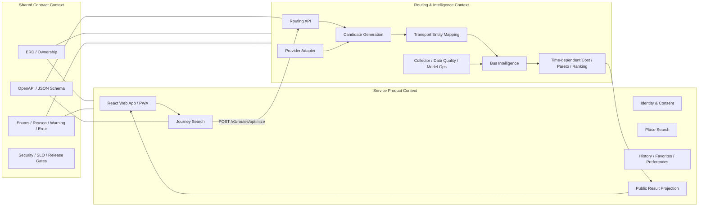

# Context Map and Responsibility Boundary

## 1. Bounded Context



## 2. Context별 소유권

| Context | 책임 | 저장소 | 하네스 |
|---|---|---|---|
| Identity & Consent | 계정, session, 동의, 탈퇴 | Service DB | Service Product |
| Preferences | walk·transfer·taxi budget 기본값 | Service DB | Service Product |
| Place | Kakao Local proxy, 저장 장소 | Service DB·Cache | Service Product |
| Journey Search | public input, Routing Gateway, history | Service DB | Service Product |
| Public Projection | 내부 결과를 사용자 안전 응답으로 축약 | Service DB snapshot | Service Product |
| Provider Integration | transit·walk·taxi·GBIS·KMA·GITS | Routing Cache·Raw Store | Routing |
| Entity Mapping | Provider ID↔canonical route·stop | Routing DB | Routing |
| Route Optimization | 후보·time-dependent cost·Pareto | Routing DB·Cache | Routing |
| Bus Intelligence | ETA·seat·expected wait·confidence | Routing DB·Model Store | Routing |
| Model Ops | feature·training·registry·deployment | Routing DB·GCS | Routing |
| Common Contract | API·DTO·ERD·codes·NFR | Git | 공동 |

## 3. 서비스 호출 경계

```text
Browser
  -> Public Service API
     -> RoutingGateway interface
        -> Private Routing API
           -> Providers / Models / Routing DB
```

Frontend가 Routing API를 직접 호출하지 않는다. Service Backend가 Provider를 직접 호출하지 않는다.

## 4. 데이터 경계

### Routing 요청에 포함 가능

- origin/destination 좌표
- departure time, arrival deadline
- taxi budget과 route constraints
- 익명 preference 값
- opaque request ID
- locale, timezone

### Routing 요청에 포함 금지

- user ID
- email, 이름, 전화번호
- social ID
- saved place의 `집`, `직장`, `학교` label
- 사용자 검색 이력 전체

### Service Backend가 받지 않는 데이터

- Provider key와 raw credential
- 원문 번호판
- 모델 artifact URI와 hash 상세
- full feature vector
- raw Provider payload

## 5. DB 규칙

```text
Service Backend owns Service DB
Routing Server owns Routing DB
```

- cross-service foreign key 금지
- 상대 ORM model import 금지
- DB link·cross query 금지
- 필요한 정보는 API 또는 비식별 domain event로 전달
- 하나의 GCE 환경이나 managed PostgreSQL instance를 공유하더라도 database·role·schema는 논리 분리

## 6. 계약 변경 흐름

```text
문제·요구 발견
  -> ADR 초안
  -> common contract 수정
  -> examples / DBML / codes 동시 수정
  -> compatibility 검사
  -> Service consumer test
  -> Routing provider test
  -> 양쪽 QA 승인
  -> version / changelog / hash lock 갱신
```

## 7. 충돌 우선순위

1. 보안·개인정보·법률 gate
2. OpenAPI·DBML·code registry 같은 기계 판독 계약
3. `src/docs/shared` 공통 문서
4. 각 workstream 문서
5. `_workspace` 중간 메모

상위 원본과 충돌한 하위 문서는 수정한다. 계약의 의미를 임의로 해석하지 않는다.
