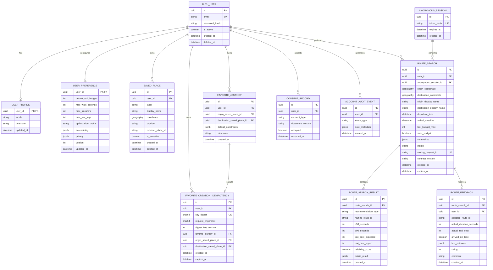

# Service DB and Routing DB ERD

## 1. 데이터 소유 원칙

- Service DB: 사용자 계정·설정·장소·검색 기록·즐겨찾기·동의·피드백
- Routing DB: Provider·canonical 교통 entity·observation·candidate·model·수집·품질
- cross-service FK, cross-schema ORM join, 상대 DB 직접 조회 금지
- 같은 GCE 환경이나 managed PostgreSQL instance를 사용하더라도 database/schema/role/migration을 분리

## 2. Service DB

`FAVORITE_JOURNEY.default_constraints`의 물리 shape는 Public 1.5에서도 JSONB로
유지한다. 새 row는 strict `FavoriteJourneySearchConditionsV1`을 저장하고, 기존 opaque
row는 backfill하거나 기본값을 추측하지 않는다. 임의 장소 즐겨찾기 생성 시 두
`SAVED_PLACE`, 한 `FAVORITE_JOURNEY`, 한 `FAVORITE_CREATION_IDEMPOTENCY` row는 같은
Service transaction에서 함께 commit 또는 rollback한다. additive ledger는 owner와
versioned domain-separated HMAC key digest로 24시간 receipt replay를 보장하며 raw key,
body, response, label, display name, 좌표를 저장하지 않는다. 기존 table의 column 변경은 없다.

## 3. Routing DB

```mermaid
erDiagram
    PROVIDER ||--o{ PROVIDER_OPERATION_STATE : exposes
    PROVIDER ||--o{ PROVIDER_ENTITY : identifies
    TRANSPORT_ROUTE ||--o{ ROUTE_STOP : contains
    TRANSPORT_STOP ||--o{ ROUTE_STOP : belongs
    PROVIDER_ENTITY ||--o{ ENTITY_MAPPING : maps
    ENTITY_MAPPING ||--o{ MAPPING_REVIEW : reviewed

    TRANSPORT_ROUTE ||--o{ BUS_VEHICLE_TRIP : operates
    BUS_VEHICLE ||--o{ BUS_VEHICLE_TRIP : assigned
    BUS_VEHICLE_TRIP ||--o{ BUS_LOCATION_OBSERVATION : observed
    BUS_VEHICLE_TRIP ||--o{ BUS_ARRIVAL_OBSERVATION : predicts
    BUS_VEHICLE ||--o{ VEHICLE_CAPACITY_ASSERTION : has

    ROUTE_OPTIMIZATION_RUN ||--o{ ROUTE_CANDIDATE : generates
    ROUTE_CANDIDATE ||--o{ ROUTE_LEG : contains
    ROUTE_LEG ||--o| BUS_LEG_ENRICHMENT : enriched
    ROUTE_LEG ||--o{ TRANSFER_EVALUATION : connects

    MODEL_FAMILY ||--o{ MODEL_VERSION : contains
    MODEL_VERSION ||--o{ MODEL_METRIC : evaluated
    MODEL_VERSION ||--o{ MODEL_DEPLOYMENT : deployed
    MODEL_VERSION ||--o{ PREDICTION_AUDIT : produces

    INGESTION_SOURCE ||--o{ INGESTION_CHECKPOINT : tracks
    INGESTION_SOURCE ||--o{ DATA_QUALITY_RUN : validates

    PROVIDER {
        uuid id PK
        string code UK
        string category
        boolean enabled
        jsonb config_without_secret
        datetime updated_at
    }
    PROVIDER_OPERATION_STATE {
        uuid id PK
        uuid provider_id FK
        string operation
        string documentation_state
        string key_verification_state
        string production_state
        string health
        int consecutive_failures
        datetime checked_at
    }
    TRANSPORT_ROUTE {
        uuid id PK
        string canonical_name
        string mode
        string route_type
        string region
        geography geometry
        datetime valid_from
        datetime valid_to
    }
    TRANSPORT_STOP {
        uuid id PK
        string canonical_name
        string region
        geography coordinate
        jsonb attributes
        datetime valid_from
        datetime valid_to
    }
    ROUTE_STOP {
        uuid route_id PK,FK
        uuid stop_id PK,FK
        int sequence PK
        string direction
        numeric cumulative_distance
    }
    PROVIDER_ENTITY {
        uuid id PK
        uuid provider_id FK
        string entity_type
        string external_id
        string fingerprint
        jsonb normalized_identity
        datetime valid_from
        datetime valid_to
    }
    ENTITY_MAPPING {
        uuid id PK
        uuid provider_entity_id FK
        uuid transport_route_id FK
        uuid transport_stop_id FK
        string direction
        numeric score
        string grade
        jsonb signal_breakdown
        string algorithm_version
        datetime valid_from
        datetime valid_to
    }
    MAPPING_REVIEW {
        uuid id PK
        uuid entity_mapping_id FK
        string status
        string reviewer
        string note
        datetime reviewed_at
    }
    BUS_VEHICLE {
        uuid id PK
        string provider_vehicle_token
        string vehicle_type
        datetime first_seen_at
        datetime last_seen_at
    }
    BUS_VEHICLE_TRIP {
        uuid id PK
        uuid route_id FK
        uuid vehicle_id FK
        date service_date
        string direction
        datetime inferred_start_at
        datetime inferred_end_at
        string identity_version
    }
    BUS_LOCATION_OBSERVATION {
        bigint id PK
        uuid trip_id FK
        uuid stop_id FK
        int station_sequence
        int remaining_seats
        int crowded_code
        geography coordinate
        datetime observed_at
        datetime ingested_at
        string source
        jsonb quality_flags
    }
    BUS_ARRIVAL_OBSERVATION {
        bigint id PK
        uuid trip_id FK
        uuid stop_id FK
        int provider_eta_seconds
        int remaining_seats
        datetime observed_at
        datetime predicted_arrival_at
        datetime ingested_at
        string source
        jsonb quality_flags
    }
    VEHICLE_CAPACITY_ASSERTION {
        uuid id PK
        uuid vehicle_id FK
        int capacity
        string source
        numeric confidence
        datetime valid_from
        datetime valid_to
    }
    ROUTE_OPTIMIZATION_RUN {
        uuid id PK
        string request_id UK
        string request_fingerprint
        geography origin
        geography destination
        datetime departure_time
        jsonb constraints
        string status
        string ranking_policy_version
        int duration_ms
        jsonb provider_summary
        datetime created_at
        datetime expires_at
    }
    ROUTE_CANDIDATE {
        uuid id PK
        uuid run_id FK
        string route_key
        string pattern
        int p50_seconds
        int p90_seconds
        int taxi_cost_expected
        int taxi_cost_upper
        int total_fare_expected
        int walk_seconds
        int transfer_count
        numeric reliability_score
        boolean pareto
        jsonb reason_codes
        jsonb warning_codes
    }
    ROUTE_LEG {
        uuid id PK
        uuid candidate_id FK
        int sequence
        string mode
        uuid route_id FK
        uuid from_stop_id FK
        uuid to_stop_id FK
        datetime expected_start_at
        datetime expected_end_at
        int p50_seconds
        int p90_seconds
        int fare_expected
        geography geometry
        jsonb provenance
    }
    BUS_LEG_ENRICHMENT {
        uuid route_leg_id PK,FK
        uuid entity_mapping_id FK
        int expected_wait_seconds
        int p90_wait_seconds
        numeric boardability_proxy
        numeric no_seat_probability
        string coverage
        string eta_model_version
        string seat_model_version
        jsonb candidate_vehicles
    }
    TRANSFER_EVALUATION {
        uuid id PK
        uuid route_leg_id FK
        int available_seconds
        int required_seconds
        int margin_p50_seconds
        int margin_p90_seconds
        numeric success_proxy
        jsonb reason_codes
    }
    MODEL_FAMILY {
        uuid id PK
        string purpose UK
        string target_definition
        string owner
    }
    MODEL_VERSION {
        uuid id PK
        uuid family_id FK
        string version UK
        string status
        string artifact_uri
        string artifact_sha256
        string feature_schema_version
        jsonb training_scope
        datetime created_at
    }
    MODEL_METRIC {
        uuid id PK
        uuid model_version_id FK
        string split_name
        string slice_key
        jsonb metrics
        datetime evaluated_at
    }
    MODEL_DEPLOYMENT {
        uuid id PK
        uuid model_version_id FK
        string environment
        string deployment_state
        numeric traffic_fraction
        datetime activated_at
        datetime deactivated_at
    }
    PREDICTION_AUDIT {
        bigint id PK
        uuid model_version_id FK
        string request_id
        string entity_key
        jsonb input_summary
        jsonb prediction
        datetime created_at
    }
    INGESTION_SOURCE {
        uuid id PK
        string code UK
        string data_type
        string owner
    }
    INGESTION_CHECKPOINT {
        uuid id PK
        uuid source_id FK
        string partition_key
        datetime last_observed_at
        datetime last_success_at
        string status
        jsonb cursor
    }
    DATA_QUALITY_RUN {
        uuid id PK
        uuid source_id FK
        string dataset_version
        string status
        jsonb metrics
        jsonb violations
        datetime started_at
        datetime finished_at
    }
```

## 4. Context Data

Routing DB 또는 object dataset에 다음을 versioning한다.

- weather observations and forecasts
- road traffic and incidents
- holiday calendar and events
- station/route demand
- feature and label datasets
- provider replay fixtures

대형 observation은 `observed_at` 기반 partition을 사용한다.
