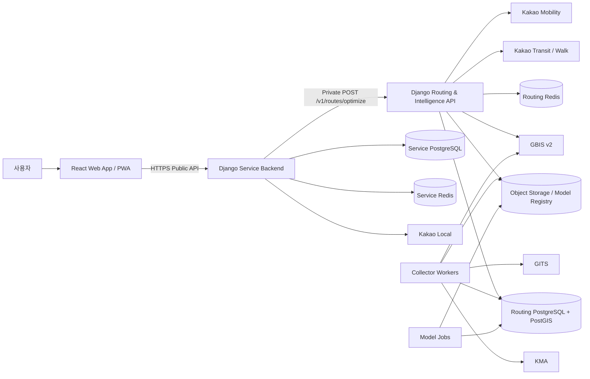
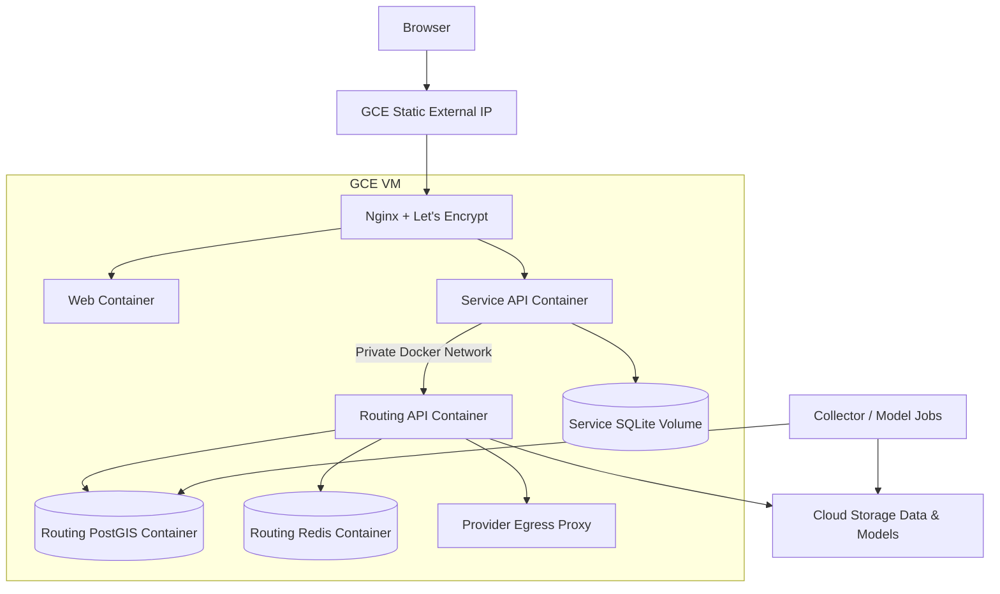

# System Architecture

## 1. 목표 구조



## 2. 두 독립 배포 단위

### Service Product

- 브라우저와 통신하는 유일한 공개 Backend
- 인증·동의·사용자 설정·장소 검색·검색 기록·즐겨찾기·피드백
- Routing API 호출과 사용자용 projection
- 지도·경로 카드·partial/unsupported UX

### Routing & Intelligence

- Service Backend만 접근하는 비공개 API
- 외부 교통 Provider orchestration
- canonical transport model과 ID mapping
- 후보 생성, time-dependent cost, strict budget, transfer risk, Pareto, ranking
- Bus Intelligence: ETA, seat risk, boardability proxy, expected/P90 wait
- 수집, 데이터 품질, 모델 registry와 추론

## 3. 요청 흐름

```text
1. 사용자가 출발지·목적지·출발시각·택시 예산·제약을 입력한다.
2. Service Backend가 인증·형식·quota·idempotency를 검증한다.
3. Service Backend가 사용자 identity를 제거한 canonical request를 Routing에 보낸다.
4. Routing이 transit, taxi, GBIS cache/API를 deadline 안에서 병렬 호출한다.
5. Adapter가 raw 응답을 canonical itinerary·leg·observation으로 정규화한다.
6. access/egress/upstream/Taxi Bridge 후보를 bounded하게 생성한다.
7. BUS leg를 canonical GBIS route·stop·direction으로 매핑한다.
8. ETA·seat risk·expected wait·transfer feasibility를 계산한다.
9. strict budget과 Pareto pruning, FASTEST/STABLE/EFFICIENT ranking을 적용한다.
10. Routing이 provenance·warning·reason을 포함한 내부 응답을 반환한다.
11. Service가 민감 내부 field를 제거한 public projection을 저장·반환한다.
12. Web App이 지도와 최대 네 개 추천을 표시한다.
```

## 4. Domain Core Independence

Routing 핵심 계산은 Django·ORM·HTTP·Redis를 직접 참조하지 않는다.

```text
Django API / ORM / Redis / HTTP Provider
                    │
            Infrastructure Adapters
                    │
             Application Use Cases
                    │
       Pure Python Routing Domain Core
```

이 원칙으로 HTTP 분리 배포와 향후 in-process 통합을 같은 domain package로 지원한다.

## 5. Online과 Background 분리

| 실행 단위 | 역할 | 소스 위치 |
|---|---|---|
| Web App | 사용자 UI·PWA | `src/apps/web` |
| Service API | public API·사용자 기능 | `src/services/service-api` |
| Routing API | 7초 안의 online 계산 | `src/services/routing-api` |
| Collector | GBIS·KMA·GITS 반복 수집 | `src/workers/transport-collector` |
| Data Quality | 지연·결측·schema drift 검사 | `src/workers/data-quality` |
| Model Jobs | 학습·평가·등록·배포 준비 | `src/workers/model-jobs` |

온라인 요청 안에서 모델 학습·대형 전처리·전체 데이터 재적재를 수행하지 않는다.

## 6. GCE 필수 배포



GCE는 유일한 지원 cloud compute 플랫폼이다. 현재 구현은 단일 VM Docker
Compose이지만, 이 사실이 production readiness를 의미하지 않는다. 실제 부하와
운영 evidence가 필요하면 같은 Google Cloud 안에서 GCE VM 수, load balancing,
managed database/cache/registry/secret/observability 구성을 진화시킬 수 있다.
하네스는 GCE 사용은 강제하되 아직 구현되지 않은 특정 managed-service topology를
완료 조건으로 강제하지 않는다.

## 7. 향후 두 서버 통합

Service는 `RoutingGateway` port만 안다.

```text
HttpRoutingGateway      현재
StubRoutingGateway      개발·테스트
ReplayRoutingGateway    장애·회귀 재현
InProcessRoutingGateway 향후 단일 process 통합
```

통합하더라도 public API, generated client, logical DB ownership, background worker 경계는 유지한다.
