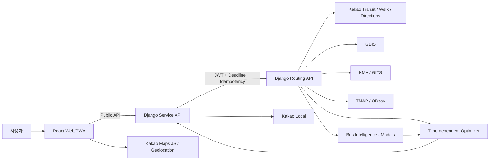

# 82TA 발표자료용 기술 정리

> 주요 알고리즘 · 수학적 수식 · 내부 API 명세 · 외부 API 사용 내역

이 문서는 발표자료를 만들 때 그대로 잘라서 사용할 수 있는 **기술 원문**이다. 정본 계약을 대체하지 않으며, 충돌 시 OpenAPI·공통 컴포넌트·코드 레지스트리·구현 코드가 우선한다.

| 항목 | 기준 |
|---|---|
| 작성 기준일 | 2026-08-25 KST |
| 프로젝트 | Budget Route Platform / 82TA |
| Context / Contract | `1.6.0` / `1.6.0` |
| Public OpenAPI | `1.6.0` |
| Private Routing OpenAPI metadata | `1.2.0` |
| Private request wire family | `contractVersion: "1.0"` — 1.x 호환 계열 |
| Ranking / Strategy | `rank-0.2.0` / `strategy-2.0.0` |
| Mapping policy | `0.1.0-planned` |
| Contract aggregate SHA-256 | `e2b9fd58b3ea0b37bdc82ae319efc9f23455e17f4ecae43b63473f2e444b8797` |

## 0. 발표용 한 줄 요약

82TA는 경기 남부↔서울 이동에서 **도보·택시·버스·지하철·GTX·열차를 조합**하고, 각 구간에 실제로 진입하는 시각에 따라 다음 비용을 다시 계산하면서, **모든 택시 구간의 최대 예상 비용 합이 사용자의 엄격한 예산을 넘지 않는 경로**를 찾는다. 이후 P50·P90 시간, 비용, 도보, 환승 위험의 Pareto frontier를 만들고 `FASTEST`, `STABLE`, `EFFICIENT`, `PUBLIC_TRANSIT_ONLY` 네 관점으로 추천한다.

버스 구간은 Kakao 대중교통 결과를 GBIS의 노선·정류장·방향과 높은 신뢰도로 매핑한 경우에만 별도 Bus Intelligence를 적용한다. 사용자가 정류장에 도착한 뒤 오는 차량만 후보로 삼고, 좌석형 버스는 좌석 부족 확률을 이용해 여러 차량에 걸친 expected/P90 대기시간을 계산한다.

---

## 1. 시스템 구조와 책임 경계



| 영역 | 소유 책임 | 하지 않는 일 |
|---|---|---|
| Web/PWA | 입력, 지도, 추천·상태 표시, 현재 위치 | Routing 직접 호출, 시간·요금·확률·순위 재계산 |
| Service API | 공개 API, 사용자/게스트 세션, 장소 proxy, 이력·즐겨찾기·동의, Routing 응답의 공개용 projection | Provider orchestration, Routing DB 접근, 알고리즘 재계산 |
| Routing API | Provider fan-in, canonical 변환, 매핑, Bus Intelligence, 후보 생성, 최적화, provenance | 사용자 identity·이메일·즐겨찾기·Service DB 접근 |
| Pure routing domain | 시간 의존 평가, 제약, graph search, Pareto, ranking | Django·ORM·Provider raw shape·네트워크 I/O |

핵심 내부 경계는 `POST /v1/routes/optimize`다. 브라우저는 Routing API를 직접 호출하지 않고 Service API만 호출한다.

### 1.1 공통 단위와 불변식

| 값 | 규칙 |
|---|---|
| 시각 | timezone-aware ISO 8601, 기본 timezone `Asia/Seoul` |
| duration | integer seconds |
| distance | integer meters |
| money | integer KRW |
| coordinate | WGS84, `{lon, lat}` |
| 불확실성 | 항상 `P90 >= P50` |
| strict budget | 모든 TAXI leg의 upper cost 합으로 판정 |
| 결측 | `null`, `unknown`, `unsupported`, 숫자 `0`을 서로 다르게 취급 |
| Bus Intelligence | 현재 유효한 `HIGH` 매핑이며 blocker가 없을 때만 허용 |
| 사용자 도착 | 정류장 도착시각보다 늦게 오는 차량만 후보 |
| 일반버스 | 혼잡도를 자동으로 승차 실패 확률로 바꾸지 않음 |
| 부분 실패 | `PARTIAL`과 warning/provider status로 명시 |
| provenance | Provider·모델·매핑·ranking 버전을 결과에 보존 |

---

## 2. 전체 경로 추천 파이프라인

```text
1. 외부 Provider에서 최대 5개 baseline itinerary 수집
2. Provider raw 응답을 canonical itinerary/leg로 정규화
3. access·egress·상류 정류장·Taxi Bridge 후보를 유한하게 생성
4. 필요한 WALK/TAXI/BUS 정보를 제한된 호출 수 안에서 exactify
5. canonical LegSpec graph 구성
6. 각 path를 실제 leg-entry time으로 평가하는 multi-label graph search
7. strict budget·도보·환승·택시 leg 제약 적용
8. exact Pareto → cycle-safe epsilon frontier 계산
9. 네 가지 recommendation 정책으로 대표 경로 선택
10. Private DTO → Service의 public-safe DTO로 projection
```

### 2.1 허용 멀티모달 패턴

| 패턴 | 의미 |
|---|---|
| `TRANSIT_ONLY` | 대중교통 중심, 택시 없음 |
| `TAXI_TRANSIT` | 출발지→허브를 택시, 이후 대중교통 |
| `TRANSIT_TAXI` | 대중교통 이후 목적지까지 택시 |
| `TAXI_TRANSIT_TAXI` | 양 끝 택시 + 중간 대중교통 |
| `TAXI_ONLY` | 전 구간 택시 |
| `TRANSIT_TAXI_BRIDGE_TRANSIT` | 두 대중교통망 사이를 짧은 택시로 연결 |
| `UPSTREAM_STOP_TAXI_TRANSIT` | 더 상류 정류장까지 택시로 이동해 승차 가능성·시간 개선 |

### 2.2 후보·호출 상한

상한 초과는 “경로 없음”이 아니라 **탐색 완전성을 인증하지 못한 capacity 상황**이다. 운영 경로에서는 429로 fail-closed 한다.

| 항목 | 상한 |
|---|---:|
| transit baselines | 5 |
| 출발 access hubs | 12 |
| 도착 egress hubs | 12 |
| 노선별 upstream 후보 | 5 |
| coarse combinations | 120 |
| exact taxi 평가 | 30 |
| full Bus Intelligence | 16 |
| pre-Pareto display 후보 | 20 |
| recommendation slots | 4 |
| Provider calls/request | 64 |
| 운영 graph expansions | 120 |
| 운영 labels/node | 120 |
| 운영 complete paths | 120 |
| legs/path | 12 |

---

## 3. 주요 알고리즘

### 3.1 시간 의존 순차 평가

단순히 각 구간의 소요시간을 한 번 계산해 더하지 않는다. 앞 구간이 늦어지면 뒤 버스·택시·환승의 진입 시각이 달라지고, 따라서 뒤 구간 비용도 다시 평가한다.

경로가 leg `i=1,...,n`, 분위수가 `q ∈ {0.5, 0.9}`일 때:

$$
r_{i,q}=A_{i-1,q}+\delta_{i,q}
$$

$$
S_{i,q}=r_{i,q}+W_{i,q}(r_{i,q})
$$

$$
A_{i,q}=S_{i,q}+T_{i,q}(S_{i,q})
$$

$$
D_q=A_{n,q}-t_0
$$

| 기호 | 의미 |
|---|---|
| `t0` | 사용자 출발시각 |
| `A(i-1,q)` | 직전 leg의 q 분위 도착시각 |
| `δ(i,q)` | 환승 buffer·connector walk 등 transfer requirement |
| `r(i,q)` | 다음 이동수단을 탈 준비가 된 시각 |
| `W(i,q)` | 그 시각에서의 대기시간 |
| `S(i,q)` | 실제 이동 시작시각 |
| `T(i,q)` | 시작시각에 따라 달라지는 이동시간 |
| `A(i,q)` | 해당 leg 종료시각 |

구현상 중요한 보정·거절 규칙:

- `startP90 < startP50`이면 시간을 임의로 고치지 않고 `P90_START_PRECEDES_P50`로 거절한다.
- `rawEndP90 < endP50`이면 `endP90 = max(rawEndP90, endP50)`로 전체 불변식을 보존한다.
- BUS Intelligence 대기는 Provider/schedule 대기를 **대체**한다. 둘을 더하면 같은 대기를 중복 계산하므로 금지한다.
- TAXI는 dispatch wait 이후 실제 drive 시작시각으로 교통시간·요금을 평가한다.
- `waitDuration`과 `travelDuration`은 leg별 설명용 optional 값이고, `duration`과 route total이 권위 있는 값이다. Service/Web은 이를 재합산해 순위나 총시간을 만들지 않는다.

#### 발표 포인트

> “08:00에 출발하는 택시의 시간”과 “앞 버스가 늦어져 08:20에 출발하는 택시의 시간”은 같지 않다. 82TA는 뒤 구간을 실제 진입시각으로 재평가한다.

### 3.2 엄격한 택시 예산

경로 `r`에 포함된 TAXI leg 집합을 `Taxi(r)`라 하면:

$$
C^{upper}_{taxi}(r)=\sum_{\ell\in Taxi(r)}C^{upper}_{\ell}
$$

$$
r\text{ is budget-feasible}\iff C^{upper}_{taxi}(r)\le B
$$

여기서 `B`는 사용자 입력 `taxiBudget.maxAmount`다. 예상값이나 평균값이 아니라 **upper estimate의 합**으로 판정한다.

- 두 개 택시 leg가 각각 upper 6,000원·5,000원이면 예산 10,000원에서 탈락한다.
- 어떤 TAXI leg의 upper fare가 unknown이면 `0`으로 간주하지 않고 `TAXI_COST_UNKNOWN`으로 해당 후보를 거절한다.
- P50/P90 진입시각에서 받은 fare range가 다르면 lower는 최솟값, upper는 최댓값으로 합성한다.

전체 feasible set은 다음과 같다.

$$
\mathcal F(B)=\left\{r\mid
C^{upper}_{taxi}(r)\le B,\;
Walk(r)\le W_{max},\;
Transfers(r)\le N_{max},\;
TaxiLegs(r)\le K_{max}
\right\}
$$

### 3.3 환승 가능성과 신뢰도

고정 출발편이 있는 다음 교통수단에 대해:

$$
m_{i,q}=Departure_i-r_{i,q}
$$

- `m(i,q) >= 0`: 해당 분위수에서 예정편을 잡을 수 있다.
- `m(i,q) < 0`: 그 예정편을 놓쳤다. evaluator가 명시적인 `next_service_wait`를 제공하면 다음 편으로 계속 계산하고, 그렇지 않으면 `TRANSFER_INFEASIBLE`로 거절한다.
- `m(i,0.9) < 180초`이면 `TRANSFER_MARGIN_LOW` warning을 붙인다.

leg 신뢰도 `R_i`는 ready/travel 평가에서 얻은 신뢰도의 보수적 최솟값이며, 경로 신뢰도는:

$$
R(r)=\prod_{i=1}^{n}R_i
$$

예정편을 잡을 수 있는 환승의 margin risk는:

$$
Risk^{margin}_i=\frac{1}{1+m_{i,0.9}/60}
$$

최종 transfer risk는:

$$
Risk(r)=\max\left(1-R(r),\;\max_i Risk^{margin}_i\right)
$$

즉, 전체 신뢰도가 낮거나 보수적 환승 여유가 작을수록 위험이 커진다.

### 3.4 비 FIFO 시간 의존 multi-label graph search

각 node에 하나의 최단시간만 남기는 일반 Dijkstra 방식은 사용할 수 없다. 더 늦게 도착한 label이 다음 교통수단의 유리한 시간대·급행편을 만나 최종적으로 더 빨라질 수 있기 때문이다.

label의 metric vector는 다음과 같다.

$$
L=[T_{50},T_{90},C^{upper}_{taxi},Walk,Transfers,TaxiLegs,Risk,-Reliability]
$$

label은 추가로 다음 상태를 보존한다.

- 현재 node
- 방문 node 집합 — cycle 방지
- 현재까지의 leg sequence
- TAXI/TRANSIT pattern automaton state
- strict budget 누적 상태
- deterministic path key

#### 안전한 dominance

`left`가 `right`를 제거하려면:

1. 두 label의 P50과 P90 도착시간이 **같아야 한다**.
2. 압축된 TAXI/TRANSIT pattern state가 같아야 한다.
3. `visited(left) ⊆ visited(right)`여야 한다.
4. 나머지 metric이 모두 같거나 더 좋고 하나 이상 엄격히 좋아야 한다.

$$
T^{left}_{50}=T^{right}_{50},\quad T^{left}_{90}=T^{right}_{90}
$$

$$
L^{left}_{3:}\preceq L^{right}_{3:}
$$

도착시각이 다르면, 앞선 label이 더 빨라도 downstream cost가 비 FIFO일 수 있으므로 둘 다 유지한다.

#### expansion 중 즉시 pruning

- 이미 방문한 node로 돌아가는 cycle
- 허용하지 않은 mode
- 지원하지 않는 pattern
- `allowTaxiBridge=false`인데 Taxi Bridge를 사용
- strict taxi budget 초과
- max walk / transfer / taxi-leg 초과
- 하드 cap을 넘겨 탐색 인증이 불가능한 경우

#### 정확성 범위

탐색은 **Provider가 반환하여 canonical graph에 편입된 유한한 경로 공간 내부**에서 정확하다. Provider가 물리적 교통망의 모든 경로를 반환했다는 보장은 없으므로 “전국 교통망 전체의 전역 최단경로”라고 발표하면 안 된다.

### 3.5 Pareto frontier와 cycle-safe epsilon dominance

Pareto metric:

$$
M(r)=[T_{50},T_{90},C^{upper}_{taxi},Walk,Risk]
$$

정확한 dominance:

$$
a\prec b\iff \left(\forall k, M_k(a)\le M_k(b)\right)
\land \left(\exists k, M_k(a)<M_k(b)\right)
$$

화면상 거의 같은 경로를 줄이기 위한 epsilon은:

| metric | epsilon |
|---|---:|
| P50 | 30초 |
| P90 | 60초 |
| Taxi upper | 100원 |
| Walk | 30초 |
| Transfer risk | 0.01 |

epsilon dominance:

$$
a\prec_{\epsilon}b\iff
\left(\forall k, M_k(a)\le M_k(b)+\epsilon_k\right)
\land
\left(\exists k, M_k(a)<M_k(b)-\epsilon_k\right)
$$

epsilon dominance는 비추이적이며 cycle이 생길 수 있다. 따라서 구현은:

1. exact Pareto frontier를 먼저 구한다.
2. epsilon dominance directed graph를 만든다.
3. Tarjan 알고리즘으로 strongly connected components를 찾는다.
4. condensation DAG에서 incoming edge가 없는 source component만 남긴다.
5. 각 component에서 `(P50,P90,cost,walk,risk,routeId,candidateKey)` 사전식 최소 대표를 고른다.

이 방식은 epsilon cycle 때문에 모든 경로가 사라지는 문제를 막는다.

### 3.6 네 가지 추천 정책

#### FASTEST

exact feasible set에서 다음 lexicographic key를 최소화한다.

$$
K_F(r)=(T_{50},-R,Risk,Walk,T_{90},C^{upper}_{taxi},routeId)
$$

즉 P50이 가장 빠른 것이 최우선이며, 동률이면 신뢰도·환승위험·도보·P90·비용 순으로 결정한다.

#### STABLE

먼저 `R >= 0.5`인 Pareto 후보가 있으면 그 집합만 사용하고, 없으면 전체 frontier를 사용한다.

선호 penalty:

$$
P_{pref}(r)=\left\lceil\max(0,Walk(r)-600)\times(1.25-1)\right\rceil
+120\times TaxiLegs(r)
$$

주 목적함수는:

$$
\min_r \left(T_{90}(r)+P_{pref}(r)\right)
$$

동률이면 `Risk`, `-Reliability`, penalty가 포함된 P50, walk, routeId 순이다.

#### EFFICIENT

1. Taxi upper cost가 같은 tier마다 선호 penalty를 포함한 시간이 가장 짧은 후보를 고른다.
2. 인접한 비용 tier `a→b`의 추가 비용 대비 절감시간을 계산한다.

$$
Gain(a,b)=\frac{D_{eff}(a)-D_{eff}(b)}{C^{upper}_{taxi}(b)-C^{upper}_{taxi}(a)}
$$

3. 절감시간이 최소 60초인 pair 중 `Gain`이 가장 큰 비싼 쪽 후보를 선택한다.
4. 의미 있는 gain이 없으면 zero-taxi public 후보 또는 가장 싼 tier를 선택한다.

#### PUBLIC_TRANSIT_ONLY

exact feasible set에서:

$$
C^{upper}_{taxi}(r)=0
$$

인 후보만 모아 FASTEST와 같은 key로 고른다.

#### 중요한 분리

`FASTEST`와 `PUBLIC_TRANSIT_ONLY`는 **epsilon display frontier가 아니라 exact feasible set**에서 선택한다. 작은 epsilon pruning 때문에 진짜 최단경로나 zero-taxi 기준 경로가 사라지지 않는다.

### 3.7 Kakao 대중교통 ↔ GBIS canonical 매핑

Provider의 BUS leg를 GBIS 노선·승차 정류장·하차 정류장·방향과 연결해야만 GBIS ETA/좌석 데이터를 안전하게 붙일 수 있다.

#### 거리 유사도

Haversine 거리:

$$
a=\sin^2\frac{\Delta\phi}{2}+\cos\phi_1\cos\phi_2\sin^2\frac{\Delta\lambda}{2}
$$

$$
d=2R\arcsin\sqrt{a},\quad R=6{,}371{,}000m
$$

정류장 좌표 유사도:

$$
s_{coord}(d)=
\begin{cases}
1 & d\le30m\\
1-\frac{d-30}{270} & 30m<d<300m\\
0 & d\ge300m
\end{cases}
$$

#### 가중 점수

결측 signal은 0점으로 넣지 않고 분모에서도 제외한다.

$$
S=\frac{\sum_{k\in Available}w_ks_k}{\sum_{k\in Available}w_k}
$$

| signal | weight | signal | weight |
|---|---:|---|---:|
| route name | 0.16 | route type | 0.06 |
| boarding name | 0.07 | boarding coordinate | 0.10 |
| alighting name | 0.07 | alighting coordinate | 0.10 |
| stop sequence | 0.12 | direction | 0.12 |
| branch | 0.08 | terminals | 0.05 |
| geometry | 0.03 | live vehicle | 0.01 |
| turning point | 0.03 |  |  |

#### grade

- `HIGH`: `S >= 0.92`, available weight `>=0.65`, 필수 signal 기준 충족, blocker 없음
- `MEDIUM`: `S >= 0.80`, available weight `>=0.40`, 중간 필수 기준 충족, blocker 없음
- 그 외 `LOW`

HIGH의 주요 prerequisite:

| signal | 최소 similarity |
|---|---:|
| route name | 0.98 |
| boarding/alighting name | 각각 0.80 |
| boarding/alighting coordinate | 각각 0.65 |
| sequence | 0.75 |
| direction | 1.00 |
| turning point | 1.00 |

강제 blocker:

- `OPPOSITE_DIRECTION`
- `BRANCH_MISMATCH`
- `SEQUENCE_DIRECTION_MISMATCH`
- `CANDIDATE_OUTSIDE_VALIDITY`
- `TURNING_POINT_MISMATCH`

상위 두 후보가 모두 HIGH이고 점수 차가 `<=0.01`이면 top 후보를 MEDIUM으로 낮추고 `AMBIGUOUS_TOP_CANDIDATES` review queue로 보낸다.

$$
BusIntelligenceAllowed = (grade=HIGH)\land(no\ blockers)\land(current\ validity)
$$

### 3.8 Bus Intelligence

#### 3.8.1 입력 필터

1. 평가시각 이후에 기록된 미래 observation은 버린다.
2. 차량별 가장 최근 observation 하나만 남긴다.
3. ETA P50이 사용자 정류장 도착시각보다 **엄격히 늦은** 차량만 후보로 둔다.

$$
Candidate_i\iff ETA^{50}_i>UserArrivalAtStop
$$

동일 시각 도착도 이미 탈 수 없다고 보고 제외한다.

#### 3.8.2 ETA arbitration

```text
fresh official ETA (age <= 180 s)
    > position-based ETA model
    > historical proxy
    > unavailable/null
```

공식 ETA가 오래되면 predictor fallback을 호출하고 `DATA_STALE`을 남긴다. predictor가 공식 ETA를 만들어내는 것은 금지한다.

#### 3.8.3 Seat Risk와 boardability proxy

좌석형 버스에서:

$$
p_{0,i}=P(RemainingSeat_i=0)
$$

$$
p_{2,i}=P(RemainingSeat_i\le2),\qquad
p_{5,i}=P(RemainingSeat_i\le5)
$$

단조성:

$$
0\le p_{0,i}\le p_{2,i}\le p_{5,i}\le1
$$

운영용 boardability proxy:

$$
b_i=1-p_{0,i}
$$

이 값은 실제 승차 확률이 아니라 정책용 proxy이므로 `BOARDABILITY_IS_PROXY` warning을 함께 제공한다.

- `SEATED`: 위 proxy를 순차 대기분포에 사용한다.
- `GENERAL`: 혼잡·좌석 값을 승차 실패로 해석하지 않고 operational mass를 `1`로 둔다.
- future target remaining seats는 label이며 online predictor input에서 제외한다. 없으면 `null`이고 음성 class나 0으로 바꾸지 않는다.

#### 3.8.4 여러 차량을 고려한 expected/P90 wait

후보 차량을 ETA 순으로 `i=1,...,n`이라 하고, 사용자 도착 이후 각 차량의 wait를 `w_i`라 한다.

초기 생존질량:

$$
s_1=1
$$

차량 `i`에 탑승하는 질량:

$$
m_i=s_i b_i
$$

다음 차량까지 남는 질량:

$$
s_{i+1}=s_i(1-b_i)
$$

관측 후보 밖 tail:

$$
h_{tail}=\max(900,\;median(positive\ ETA\ gaps))
$$

$$
w_{tail}=w^{90}_n+h_{tail}
$$

expected wait:

$$
E[W]=\left\lceil\sum_{i=1}^{n}m_iw^{50}_i+s_{n+1}w_{tail}\right\rceil
$$

P90 wait는 누적 탑승질량이 0.9 이상이 되는 첫 후보의 `w_i^90`이며, 끝까지 도달하지 못하면 `w_tail`이다. 마지막으로:

$$
W_{90}=\max(E[W],W_{90}^{raw})
$$

##### 짧은 계산 예시

후보 wait가 5분·12분·20분이고 `b=(0.6,0.8,0.9)`이면:

$$
m=(0.6,\;0.4\times0.8=0.32,\;0.08\times0.9=0.072)
$$

tail mass는 `0.008`이다. 보수적 tail wait를 35분이라 두면:

$$
E[W]=0.6(5)+0.32(12)+0.072(20)+0.008(35)=8.56분
$$

반올림 후 약 9분이며, 누적질량은 두 번째 차량에서 0.92가 되므로 P90은 약 12분이다.

#### 3.8.5 Bus Intelligence confidence

$$
Confidence=MappingScore\times
(0.35F+0.35C+0.30P)
$$

| 기호 | 의미 |
|---|---|
| `F` | 후보 observation freshness 평균 |
| `C` | 필요한 ETA/Seat coverage |
| `P` | ETA·Seat prediction confidence 평균 |

grade는 `HIGH >=0.8`, `MEDIUM >=0.55`, `LOW >0`, 그 외 `UNKNOWN`이다.

### 3.9 ETA·Seat Risk ML과 calibration

#### 현재 상태를 먼저 구분

- LightGBM 학습·native text artifact·schema/hash 검증·calibration·serving runtime은 코드와 테스트로 구현되어 있다.
- 하지만 실제 운영용으로 승인된 ETA/Seat artifact가 현재 local live 경로에 활성화된 것은 아니다.
- 따라서 local Kakao live 결과는 BUS mapping/GBIS/model 부재를 숨기지 않고 `PARTIAL`로 반환한다.

#### ETA model

Target:

$$
y^{ETA}=ActualArrivalAtTarget-PredictionAt
$$

LightGBM regression의 raw 중앙 예측을 `\hat y`라 하면 runtime은:

$$
P50=\lceil\max(0,\hat y)\rceil
$$

conformal calibration offset `q_0.9`를 이용해:

$$
P90=\lceil\hat y+q_{0.9}\rceil
$$

calibration set 크기가 `n`, 목표 coverage가 `c`일 때 구현된 finite-sample absolute residual radius는:

$$
q_c=Quantile_{\min(1,(n+1)c/n)}\left(\{|y_j-\hat y_j|\}_{j=1}^{n}\right)
$$

일반 conformal interval은:

$$
[\max(0,\hat y-q_c),\;\hat y+q_c]
$$

평가 metric은 MAE, median absolute error, P90 absolute error, interval coverage, mean interval width다.

#### Seat Risk model

미래 target-stop의 잔여좌석을 네 ordinal class로 만든다.

| class | 의미 |
|---:|---|
| 0 | `remaining = 0` |
| 1 | `1 <= remaining <= 2` |
| 2 | `3 <= remaining <= 5` |
| 3 | `remaining > 5` |

LightGBM multiclass 출력 `q0,q1,q2,q3`에서 cumulative raw probability를 만든다.

$$
p_0^{raw}=q_0,\quad p_2^{raw}=q_0+q_1,\quad p_5^{raw}=q_0+q_1+q_2
$$

각 threshold에 Platt 또는 isotonic calibrator를 적용한다.

Platt scaling:

$$
Cal(p)=\sigma(a\cdot logit(p)+b)
$$

calibration 후에도 `p0 <= p2 <= p5`가 아니면 inference를 거절한다.

평가 metric:

$$
Brier=\frac{1}{N}\sum_{i=1}^{N}(p_i-y_i)^2
$$

$$
ECE=\sum_{m=1}^{M}\frac{|B_m|}{N}|acc(B_m)-conf(B_m)|
$$

그 외 PR-AUC, threshold precision/recall, reliability bins를 기록한다.

#### leakage 방지

- random row split 대신 temporal holdout과 trip-group split을 사용한다.
- 같은 trip의 미래 observation이 feature에 들어가지 않게 point-in-time source를 사용한다.
- 미래 target observation이 없으면 Seat label 전체를 `NULL / has_target=false`로 두고 학습 row에서 제외한다.
- ETA와 Seat Risk는 feature, artifact, calibration, timeout, provenance를 분리한다.

### 3.10 deadline·resilience·load shedding

Routing hard deadline은 6.5초다.

$$
6500ms=5350ms\ work+1150ms\ reserve
$$

| stage | target / hard cap |
|---|---:|
| auth·header·schema·coordinate 검증 | 100 / 150 ms |
| idempotency·response cache | 100 / 150 ms |
| baseline transit/walk/taxi fan-out | 1800 / 2200 ms |
| canonical normalize·dedupe·coarse candidates | 300 / 400 ms |
| mapping·GBIS | 900 / 1050 ms |
| ETA·Seat batch inference | 300 / 400 ms |
| top-candidate exact enrichment | 1400 / 1550 ms |
| time propagation·constraints·Pareto·ranking | 300 / 400 ms |
| serialize·provenance·status | 150 / 200 ms |
| cancellation/network reserve | 1150 ms |

load shedding 순서는 optional geometry → Taxi Bridge/upstream optional 후보 → optional Bus enrichment다. 다음은 절대 완화하지 않는다.

- strict taxi budget
- 시간 순서와 `P90 >= P50`
- mapping HIGH gate
- 결측과 0의 구분
- 인증·schema·URL allowlist

실패 분류:

| 상황 | 결과 |
|---|---|
| optional Provider/Bus/model 일부 실패 | 가능한 경로 + `PARTIAL` |
| 필수 baseline Provider 사용 불가 | 503 |
| request deadline 초과 | 504 |
| admission/graph/candidate cap으로 인증 불가 | 429 |
| strict 제약을 만족하는 경로 없음 | `NO_FEASIBLE_ROUTE` |

### 3.11 결정적 replay

같은 입력 bundle은 같은 route key·Pareto·ranking·reason/warning을 만들어야 한다.

Replay bundle에는 다음을 고정한다.

- canonical request
- normalized Provider snapshot
- clock
- mapping version
- model versions와 feature schema
- ranking/strategy policy version
- feature flags

---

## 4. 내부 API 명세

### 4.1 API 버전이 여러 개로 보이는 이유

| 값 | 의미 |
|---|---|
| repository `contractVersion=1.6.0` | 전체 정본 계약 bundle 버전 |
| Public OpenAPI `1.6.0` | 사용자-facing API 문서 버전 |
| Private OpenAPI metadata `1.2.0` | Private OpenAPI 문서 자체 버전 |
| Private body `contractVersion="1.0"` | 호환되는 1.x wire family 식별자 |

따라서 Private 요청 body가 `1.0`이라고 해서 현재 플랫폼 계약이 1.0이라는 뜻은 아니다.

### 4.2 Public Service API — 전체 32개 operation

기본 server 예시는 `https://api.example.invalid`이며 실제 배포 주소로 교체한다. OpenAPI top-level은 public이며, 아래에 세션이 표시된 operation만 `sessionid` cookie 또는 `X-Guest-Token`을 요구한다.

| # | Method / Path | operationId | 인증 | 기능 | 응답 코드 |
|---:|---|---|---|---|---|
| 1 | `POST /api/v1/auth/register` | `registerWithEmail` | 공개 | 이메일·비밀번호·nickname·동의로 가입, USER session 생성 | 201, 400, 409, 429 |
| 2 | `POST /api/v1/auth/login` | `loginWithEmail` | 공개 | 이메일 로그인, session cookie 발급 | 200, 400, 401, 429 |
| 3 | `POST /api/v1/guest-sessions` | `createGuestSession` | 공개 | 일회성 opaque guest token 생성 | 201, 429 |
| 4 | `GET /api/v1/session` | `getCurrentSession` | session 또는 guest | 현재 subject와 만료시각 조회 | 200, 401 |
| 5 | `DELETE /api/v1/session` | `revokeCurrentSession` | session 또는 guest | 현재 세션/guest credential 폐기 | 204, 401 |
| 6 | `GET /api/v1/places/suggest` | `suggestPlaces` | 공개 | Kakao Local keyword 장소 추천 proxy | 200, 400, 429, 502 |
| 7 | `GET /api/v1/places/reverse-geocode` | `reverseGeocode` | 공개 | 좌표를 표시 주소로 변환 | 200, 400, 429, 502 |
| 8 | `POST /api/v1/route-searches` | `createRouteSearch` | 공개/선택적 owner context | 핵심 경로 탐색, Routing 호출, 공개 projection | 200, 400, 403, 409, 422, 429, 502, 503, 504 |
| 9 | `GET /api/v1/route-searches` | `listRouteSearches` | USER session | 저장된 검색 이력 목록 | 200, 401, 403 |
| 10 | `GET /api/v1/route-searches/{searchId}` | `getRouteSearch` | session 또는 guest | owner 검증 후 검색 결과 조회 | 200, 403, 404 |
| 11 | `POST /api/v1/route-searches/{searchId}/feedback` | `submitRouteFeedback` | session 또는 guest | 선택 경로·실제 시간/비용·버스 결과·평점 피드백 | 204, 403, 404 |
| 12 | `GET /api/v1/me/preferences` | `getPreferences` | USER session | 사용자 기본 경로 선호 조회 | 200, 401 |
| 13 | `PUT /api/v1/me/preferences` | `updatePreferences` | USER session | 선호 전체 갱신, optional `If-Match` 낙관적 동시성 | 200, 409 |
| 14 | `GET /api/v1/me/saved-places` | `listSavedPlaces` | USER session | 저장 장소 목록 | 200 |
| 15 | `POST /api/v1/me/saved-places` | `createSavedPlace` | USER session + 현재 위치 동의 | 정확한 장소 저장 | 201, 400, 401, 403, 429 |
| 16 | `PATCH /api/v1/me/saved-places/{savedPlaceId}` | `updateSavedPlace` | USER session | 저장 장소 일부 갱신; 좌표 변경만 현재 위치 동의 | 200, 400, 401, 403, 404, 429 |
| 17 | `DELETE /api/v1/me/saved-places/{savedPlaceId}` | `deleteSavedPlace` | USER session | 위치 동의 철회 뒤에도 저장 장소 삭제 | 204, 401, 403, 404, 429 |
| 18 | `GET /api/v1/me/favorite-journeys` | `listFavoriteJourneys` | USER session | 즐겨찾는 여정 목록 | 200 |
| 19 | `POST /api/v1/me/favorite-journeys` | `createFavoriteJourney` | USER session | 출발/도착 저장 장소와 기본 제약을 즐겨찾기 | 201, 400, 401, 403, 404, 429 |
| 20 | `POST /api/v1/me/favorite-journeys/from-places` | `createFavoriteJourneyFromPlaces` | USER session + 첫 생성 위치 동의 | 원자 생성과 24시간 불변 receipt replay | 201, 400, 401, 403, 409, 429 |
| 21 | `PATCH /api/v1/me/favorite-journeys/{favoriteJourneyId}` | `updateFavoriteJourney` | USER session | 즐겨찾는 여정 일부 갱신 | 200, 400, 401, 403, 404, 429 |
| 22 | `DELETE /api/v1/me/favorite-journeys/{favoriteJourneyId}` | `deleteFavoriteJourney` | USER session | 즐겨찾는 여정 삭제 | 204, 401, 403, 404, 429 |
| 23 | `GET /api/v1/me/consents` | `listConsents` | USER session | privacy·history·location·analytics·feedback 동의 조회 | 200, 401 |
| 24 | `PUT /api/v1/me/consents/{consentType}` | `recordConsent` | USER session | 동의/철회 및 문서 버전 기록 | 200, 400, 401 |
| 25 | `POST /api/v1/me/data-exports` | `createDataExport` | USER session | 개인정보 export 비동기 job 생성 | 202, 401, 409 |
| 26 | `GET /api/v1/me/data-exports/{jobId}` | `getDataExport` | USER session | export job 상태 조회 | 200, 403, 404 |
| 27 | `POST /api/v1/me/data-deletions` | `createDataDeletion` | USER session | 개인정보 삭제 비동기 job 생성 | 202, 401, 409 |
| 28 | `GET /api/v1/me/data-deletions/{jobId}` | `getDataDeletion` | USER session | 삭제 job 상태 조회 | 200, 403, 404 |
| 29 | `DELETE /api/v1/me/data` | `deleteUserData` | USER session | deprecated 삭제 compatibility alias | 202, 401 |
| 30 | `GET /api/v1/support/capabilities` | `getPublicCapabilities` | 공개 | 지원 지역·기능·Bus coverage 조회 | 200 |
| 31 | `GET /api/v1/health` | `publicHealth` | 공개 | 공개 서비스 health | 200 |
| 32 | `GET /api/v1/bike-options` | `getBikeOptions` | 공개 | 주변 따릉이 대여소와 시속 15km 기준 예상시간 조회 | 200, 400, 429 |

### 4.3 핵심 Public API: `POST /api/v1/route-searches`

#### Headers

| Header | 필수 | 용도 |
|---|---:|---|
| `Idempotency-Key` | 예 | 동일 요청 중복 실행·과금 방지, 다른 body 재사용 시 409 |
| `X-Correlation-Id` | 아니오 | Web→Service→Routing→Provider 추적 ID |
| `Cookie: sessionid=...` | 조건부 | 로그인 USER 소유권·history 저장 |
| `X-Guest-Token` | 조건부 | guest search 소유권 |

#### Request 주요 필드

| 필드 | 형식 / 제약 | 의미 |
|---|---|---|
| `origin`, `destination` | `PlaceRef` | 표시명, WGS84 좌표, optional Provider ID·region |
| `departure.type` | `DEPART_AT` 또는 `ARRIVE_BY` | 현재 `ARRIVE_BY`는 `ARRIVE_BY_UNSUPPORTED` |
| `departure.time` | timezone-aware date-time | 검색 기준시각 |
| `arrivalDeadline` | date-time 또는 null | optional 도착 마감 |
| `taxiBudget` | KRW, 0~500,000, `strict` | 택시 upper 합의 엄격한 한도 |
| `preferences.maxWalkSeconds` | 0~7,200 | 최대 도보시간 |
| `preferences.maxTransfers` | 0~8 | 최대 환승 수 |
| `preferences.maxTaxiLegs` | 0~3 | 최대 택시 구간 수 |
| `preferences.allowTaxiBridge` | boolean | 대중교통망 사이 택시 연결 허용 |
| `preferences.avoidHighBusSeatRisk` | boolean | Bus risk 회피 선호를 Routing에 전달 |
| `preferences.allowedModes` | canonical mode array | 허용 이동수단 |
| `preferences.optimization` | FASTEST/STABLE/EFFICIENT/BALANCED | 기본 profile |
| `requestedRecommendations` | 최대 네 canonical type | 요청할 대표 추천 |
| `saveToHistory` | boolean | Service-local opt-in, Routing으로 전달 금지 |

#### Canonical request 예시

```json
{
  "origin": {
    "displayName": "명지대학교 자연캠퍼스",
    "coordinate": {"lon": 127.187456, "lat": 37.222345},
    "provider": "KAKAO_LOCAL",
    "providerPlaceId": "example-origin",
    "regionCode": "GYEONGGI_YONGIN"
  },
  "destination": {
    "displayName": "판교역",
    "coordinate": {"lon": 127.111159, "lat": 37.394761},
    "provider": "KAKAO_LOCAL",
    "providerPlaceId": "example-destination",
    "regionCode": "GYEONGGI_SEONGNAM"
  },
  "departure": {
    "type": "DEPART_AT",
    "time": "2026-08-24T07:40:00+09:00"
  },
  "arrivalDeadline": null,
  "taxiBudget": {"currency": "KRW", "maxAmount": 10000, "strict": true},
  "preferences": {
    "maxWalkSeconds": 900,
    "maxTransfers": 3,
    "maxTaxiLegs": 2,
    "allowTaxiBridge": true,
    "avoidHighBusSeatRisk": false,
    "allowedModes": ["BUS", "GTX", "SUBWAY", "TAXI", "TRAIN", "WALK"],
    "optimization": "BALANCED",
    "accessibility": {"avoidStairs": false, "wheelchair": false}
  },
  "requestedRecommendations": [
    "FASTEST", "STABLE", "EFFICIENT", "PUBLIC_TRANSIT_ONLY"
  ],
  "saveToHistory": false
}
```

#### Response 주요 필드

| 필드 | 의미 |
|---|---|
| `contractVersion` | 현재 공개 계약 버전 |
| `searchId` | Service가 발급한 검색 ID |
| `status` | COMPLETE/PARTIAL/NO_FEASIBLE_ROUTE/PROVIDER_UNAVAILABLE/FAILED/EXPIRED |
| `generatedAt`, `expiresAt` | 생성·만료시각 |
| `baseline` | optional 기준 대중교통 경로 |
| `recommendations.fastest` | 가장 빠른 exact feasible route |
| `recommendations.stable` | P90·risk 중심 route |
| `recommendations.efficient` | 추가비용 대비 시간 절감 route |
| `recommendations.publicTransitOnly` | taxi upper=0인 기준 route |
| `paretoFrontier` | routeId, taxi upper, P50, P90 요약 |
| `warnings` | 사용자에게 공개 가능한 warning code |
| `support` | 지역·기능·Bus coverage |
| `history` | 저장 여부·owner kind·retention |

Service 공개 응답에는 Provider raw payload, private `providerStatus`, model artifact path, 내부 computation trace, JWT, 사용자 이메일이 포함되지 않는다.

### 4.4 Private Routing API — 전체 7개 operation

기본 server 예시는 `https://routing.internal.example.invalid`이며, private network에서 Service만 호출한다. `/v1/health/live`를 제외하고 기본적으로 service Bearer JWT를 요구한다.

| # | Method / Path | operationId | 인증 | 기능 | 응답 코드 |
|---:|---|---|---|---|---|
| 1 | `POST /v1/routes/optimize` | `optimizeRoutes` | service JWT | Provider fan-in→최적화→private canonical 결과 | 200, 400, 401, 409, 422, 429, 503, 504 |
| 2 | `GET /v1/capabilities` | `getRoutingCapabilities` | service JWT | 지역·Provider·모델·feature capability 조회 | 200 |
| 3 | `GET /v1/health/live` | `routingLiveness` | 없음 | process liveness | 200 |
| 4 | `GET /v1/health/ready` | `routingReadiness` | service JWT | DB·dependency·capability readiness | 200, 503 |
| 5 | `GET /v1/version` | `routingVersion` | service JWT | API·ranking·strategy·mapping·model 버전 | 200 |
| 6 | `POST /internal/admin/cache/invalidate` | `invalidateRoutingCache` | operator service JWT | namespace/fingerprint cache 무효화 | 202 |
| 7 | `POST /internal/admin/models/{version}/activate` | `activateModelVersion` | operator service JWT | 모델 목적·환경·traffic fraction activation 예약 | 202, 409 |

### 4.5 핵심 Private API: `POST /v1/routes/optimize`

#### 인증·Headers

| 항목 | 필수 | 규칙 |
|---|---:|---|
| `Authorization: Bearer <JWT>` | 예 | `iss`, `aud`, `exp`, `jti`와 서명 검증, 짧은 수명 |
| `X-Correlation-Id` | 예 | end-to-end trace |
| `X-Request-Deadline` | 예 | timezone-aware absolute deadline, 내부 최대 6.5초 |
| `Idempotency-Key` | 예 | 동일 body 재사용, body 충돌 시 409 |

#### Request 주요 필드

| 필드 | 의미 |
|---|---|
| `contractVersion: "1.0"` | 1.x private wire compatibility family |
| `requestId` | Service가 생성한 opaque request ID |
| `origin/destination.coordinate` | WGS84 좌표 |
| `origin/destination.regionHint` | optional 지원 지역 hint |
| `departureTime` | timezone-aware 출발시각 |
| `arrivalDeadline` | optional 도착 마감 |
| `constraints` | strict taxi budget, walk/transfer/taxi-leg/mode/accessibility |
| `preference` | optimization profile과 risk/walk/transfer aversion |
| `requestedRecommendations` | 네 recommendation type subset |
| `clientContext` | `locale`, `timezone=Asia/Seoul` |

#### Canonical request 예시

```json
{
  "contractVersion": "1.0",
  "requestId": "6aa87de7-8af7-55c9-bbb4-f518722ed833",
  "origin": {
    "coordinate": {"lon": 127.187456, "lat": 37.222345},
    "regionHint": "GYEONGGI_YONGIN"
  },
  "destination": {
    "coordinate": {"lon": 127.111159, "lat": 37.394761},
    "regionHint": "GYEONGGI_SEONGNAM"
  },
  "departureTime": "2026-08-24T07:40:00+09:00",
  "arrivalDeadline": null,
  "constraints": {
    "taxiBudget": {"currency": "KRW", "maxAmount": 10000, "strict": true},
    "maxWalkSeconds": 900,
    "maxTransfers": 3,
    "maxTaxiLegs": 2,
    "allowTaxiBridge": true,
    "allowedModes": ["BUS", "GTX", "SUBWAY", "TAXI", "TRAIN", "WALK"],
    "accessibility": {"avoidStairs": false, "wheelchair": false}
  },
  "preference": {
    "profile": "BALANCED",
    "avoidHighBusSeatRisk": false,
    "accessibility": {"avoidStairs": false, "wheelchair": false}
  },
  "requestedRecommendations": [
    "FASTEST", "STABLE", "EFFICIENT", "PUBLIC_TRANSIT_ONLY"
  ],
  "clientContext": {"locale": "ko-KR", "timezone": "Asia/Seoul"}
}
```

#### Response 주요 필드

| 필드 | 의미 |
|---|---|
| `status` | COMPLETE/PARTIAL/NO_FEASIBLE_ROUTE/PROVIDER_UNAVAILABLE |
| `computation.durationMs` | Routing 처리시간 |
| `computation.rankingPolicyVersion` | `rank-0.2.0` |
| `computation.mappingVersion` | 사용한 mapping version 또는 null |
| `computation.candidateCounts` | generated/coarsePruned/fullyEvaluated/pareto |
| `computation.cache` | cache 및 strategy policy 등 내부 안전 metadata |
| `recommendations` | 각 type이 가리키는 routeId |
| `routes[]` | canonical `RouteCandidate` 배열 |
| `paretoRouteIds[]` | 표시 frontier의 route IDs |
| `providerStatus[]` | operation별 status·latency·cache·messageCode |
| `modelVersions[]` | 실제 기여한 모델 목적·버전 |
| `warningCodes[]` | 전체 요청 warning |

### 4.6 Public → Private 변환 규칙

| Public 입력 | Private 입력 / 처리 |
|---|---|
| `origin/destination.displayName` | Routing으로 보내지 않음 |
| `origin/destination.coordinate` | 그대로 canonical coordinate로 전달 |
| `regionCode` | `regionHint`로 전달 가능 |
| `departure.type=DEPART_AT`, `time` | `departureTime` |
| `ARRIVE_BY` | Routing 호출 전에 400 `ARRIVE_BY_UNSUPPORTED` |
| `taxiBudget` | `constraints.taxiBudget` |
| walk/transfer/taxi-leg/mode | `constraints` |
| `preferences.optimization` | `preference.profile` |
| `avoidHighBusSeatRisk`, accessibility | canonical preference로 전달 |
| `saveToHistory` | Service에서만 처리, 절대 Routing으로 전달하지 않음 |
| session/user/guest ID, email, nickname | 절대 Routing으로 전달하지 않음 |

Private → Public 응답에서 Service는 duration·fare·ranking·probability를 재계산하지 않고 허용된 canonical 값을 통과시킨다. Provider 상태·모델 내부값·computation trace는 공개 응답에서 제거한다.

### 4.7 공통 DTO 핵심

#### `RouteCandidate`

```text
routeId, pattern, totalDuration, arrivalAt,
taxiCost, totalFareExpected, walkSeconds,
transferCount, taxiLegCount, reliabilityScore,
dominance, legs[], reasonCodes[], warningCodes[], provenance[]
```

#### `RouteLeg`

```text
legId, sequence, mode, from, to,
expectedStartAt, expectedEndAt,
duration, waitDuration?, travelDuration?,
distanceMeters, fare, geometry,
transit?, busIntelligence?, provenance[]
```

#### `BusLegIntelligence`

```text
mapping?, userArrivalTime?, candidateVehicles[],
expectedWaitSeconds, p90WaitSeconds,
coverage, warnings[]
```

#### `ProviderStatus`

```text
provider, operation?, status,
latencyMs, cache, messageCode?
```

Provider status enum:

```text
OK, PARTIAL, TIMEOUT, RATE_LIMITED,
UNAVAILABLE, BAD_RESPONSE, DISABLED
```

#### `ProblemDetails`

```text
type, title, status, code, detail?, retryable,
correlationId, violations[], safeContext
```

민감한 key, raw Provider body, 모델 파일 경로, stack trace는 `detail`이나 `safeContext`에 넣지 않는다.

---

## 5. 사용한 외부 API와 기능

상태 표기:

- `LOCAL_LIVE_EVIDENCE`: 실제 로컬 Docker에서 응답·정규화·E2E 증거가 있음. 운영 승인과는 다름.
- `IMPLEMENTED`: 코드와 테스트가 있으며 환경 key/domain/권한에 따라 사용.
- `ADAPTER_ONLY_DISABLED`: adapter는 있으나 현재 production capability 증거가 없어 기본 비활성.
- `NO_EXECUTABLE_ENDPOINT`: 공식 HTTPS endpoint를 확정하지 못해 호출 자체를 막음.
- `PLANNED`: 문서/feature 설계만 있고 실행 adapter 없음.

| API / 기능 | Method·Endpoint | 호출 위치 | 실제 사용 목적 | 현재 증거·상태 | Fallback / 주의 |
|---|---|---|---|---|---|
| Kakao Maps JavaScript SDK | `GET https://dapi.kakao.com/v2/maps/sdk.js?autoload=false&appkey=...` | Web browser | 지도 생성, `LatLng`, marker, polyline, 지도 click/marker drag 좌표 선택 | `IMPLEMENTED`; JavaScript key와 허용 domain 필요 | key 없으면 장소검색/텍스트 UI 유지, 지도 기능 비활성 |
| Browser Geolocation API | `navigator.geolocation.getCurrentPosition` | Web browser | 사용자가 눌렀을 때 현재 위치를 받아 지도 중심·출발지 후보에 사용 | `IMPLEMENTED`; 사용자 permission·secure context 필요 | 거부/미지원 시 수동 장소검색 |
| Kakao Local keyword search | `GET https://dapi.kakao.com/v2/local/search/keyword.json` | Service API | 검색어 autocomplete, 최대 10개 PlaceRef 생성, optional 거리순 정렬 | `IMPLEMENTED`; 이번 통합 기록에 별도 live probe 증거는 없음 | browser가 직접 key를 사용하지 않도록 Service proxy, 2초 timeout·512 KiB 제한 |
| Kakao Local reverse geocode | `GET https://dapi.kakao.com/v2/local/geo/coord2address.json` | Service API | 지도에서 고른 WGS84 좌표를 도로명/지번 표시 주소로 변환 | `IMPLEMENTED`; key 없으면 “선택한 위치” fallback | redirect 금지, response schema 검증 |
| Kakao Public Transit | `GET https://dapi.kakao.com/v2/routing/publictraffic` | Routing API | 현재 시각 transit baseline itinerary 수집 | `LOCAL_LIVE_EVIDENCE`: 로컬 probe에서 15개 정규화 결과 | TMAP→ODsay 순 fallback; 운영 capability 별도 승인 필요 |
| Kakao Walk | `GET https://dapi.kakao.com/v2/routing/walk` | Routing API | 출발 access, 환승 connector, 목적지 egress의 정확한 도보시간·거리·geometry | `LOCAL_LIVE_EVIDENCE`: 로컬 probe 1개 정규화 결과 | 실패 시 Provider itinerary 내부 walk 또는 해당 optional 후보 제외 |
| Kakao Mobility Directions — current | `GET https://apis-navi.kakaomobility.com/v1/directions` | Routing API | 현재 진입시각의 TAXI drive duration·거리·fare upper 평가 | `LOCAL_LIVE_EVIDENCE`: 로컬 probe 1개 정규화 결과 | dispatch wait는 별도 component; 운영 승인 별도 |
| Kakao Multi Destination | `POST https://apis-navi.kakaomobility.com/v1/destinations/directions` | Routing API | 한 출발지→여러 hub coarse taxi ranking | `ADAPTER_ONLY_DISABLED` | bounded single directions fallback |
| Kakao Multi Origin | `POST https://apis-navi.kakaomobility.com/v1/origins/directions` | Routing API | 여러 egress hub→목적지 coarse ranking | `ADAPTER_ONLY_DISABLED` | bounded single directions fallback |
| Kakao Future Directions | `GET https://apis-navi.kakaomobility.com/v1/future/directions` | Routing API | 미래 출발 택시 시간·요금 추정 | `ADAPTER_ONLY_DISABLED` | historical proxy 또는 unsupported |
| GBIS v2 arrivals | `GET https://apis.data.go.kr/6410000/busarrivalservice/v2/getBusArrivalListv2` | Routing API | 정류장 도착예정 차량·공식 ETA·관측 잔여좌석 확보 | `ADAPTER_ONLY_DISABLED` in current local live | 최근 유효 cache/historical; HIGH mapping 없으면 호출하지 않음 |
| GBIS vehicle locations | endpoint 미설정 | Routing API | 차량 위치 기반 ETA feature 계획 | `NO_EXECUTABLE_ENDPOINT` | 공식 endpoint 검증 전 0 calls |
| GBIS route catalog | `GET https://apis.data.go.kr/6410000/busrouteservice/getAreaBusRouteList` | collector/mapping | 노선 catalog와 canonical mapping 후보 | `ADAPTER_ONLY_DISABLED` | versioned catalog/cache |
| GBIS station catalog | endpoint 미설정 | collector/mapping | 정류장 catalog·근접 검색 계획 | `NO_EXECUTABLE_ENDPOINT` | 공식 endpoint 검증 전 0 calls |
| KMA 초단기 실황 | `GET https://apis.data.go.kr/1360000/VilageFcstInfoService_2.0/getUltraSrtNcst` | Routing/collector | ETA·Seat 모델의 날씨 context | `ADAPTER_ONLY_DISABLED` | 최근 유효 snapshot, missing flag 유지 |
| GITS traffic context | 실행 URL 미설정 | Routing/collector | 검증된 road-link corridor의 교통·incident context | `NO_EXECUTABLE_ENDPOINT` | 공식 HTTPS를 추측하지 않음; historical/Kakao context |
| TMAP Transit | `POST https://apis.openapi.sk.com/transit/routes` | Routing API | Kakao transit 실패 시 대중교통 fallback | `ADAPTER_ONLY_DISABLED` | ODsay fallback, 약관·저장 제한 검토 필요 |
| ODsay transit | `GET https://api.odsay.com/v1/api/searchPubTransPathT` | Routing API | transit fallback, 노선·정류장 structure/ID 보조 | `ADAPTER_ONLY_DISABLED` | 마지막 fallback; 상용·저장 조건 확인 필요 |
| KASI holiday calendar | 실행 adapter 없음 | offline data/model | 요일·공휴일 수요 feature | `PLANNED` | 내부 versioned calendar로 적재 예정 |

### 5.1 외부 API 호출 공통 정책

- URL은 `(provider, operation)`별 exact HTTPS allowlist에서만 결정한다. 사용자 입력 URL은 금지한다.
- key는 code·fixture·로그·public response에 넣지 않는다.
- redirect를 따라가지 않는다.
- operation별 timeout과 최대 response bytes를 강제한다.
- schema가 맞지 않으면 0이나 빈 정상값을 만들지 않고 `BAD_RESPONSE`/schema drift로 처리한다.
- empty payload는 성공한 경로 검색으로 간주하지 않는다.
- retry는 idempotent transient failure이며 deadline 안에 끝날 때만 제한적으로 수행한다.
- cache hit 여부, observed/received time, freshness, schema version을 `ProviderEnvelope`에 보존한다.
- capability는 `DOCUMENTED`, `KEY_VERIFIED`, `PRODUCTION_APPROVED`를 독립적으로 관리한다. adapter 코드가 존재한다고 활성화되지 않는다.

### 5.2 Provider fallback 순서

```text
Transit: Kakao Public Transit -> TMAP Transit -> ODsay
Walk: Kakao Walk -> Provider itinerary 내부 walk 또는 후보 제외
Taxi matrix: Kakao matrix -> 제한된 single Directions 호출
Bus ETA: fresh official GBIS -> position model -> historical -> null
Weather/traffic: recent valid cache -> missing context flag
```

서로 다른 Provider가 계산한 총소요시간을 근거 없이 평균하지 않는다.

---

## 6. API code registry

### 6.1 Recommendation reason codes

| Code | 의미 |
|---|---|
| `FASTER_THAN_PUBLIC_TRANSIT` | 대중교통 기준보다 빠름 |
| `BEST_MARGINAL_TIME_SAVING` | 추가 비용 대비 절감시간이 가장 큼 |
| `LOW_TRANSFER_RISK` | 보수적 환승 여유가 큼 |
| `UPSTREAM_STOP_HIGHER_BOARDABILITY` | 상류 정류장이 승차 가능성·대기를 개선 |
| `HIGH_BUS_SEAT_RISK_AVOIDED` | 높은 좌석 부족 위험 회피 |
| `TAXI_BRIDGE_CONNECTS_FAST_LINES` | 짧은 택시로 두 고속 대중교통망 연결 |
| `WITHIN_STRICT_TAXI_BUDGET` | 택시 비용 상한 합이 예산 이내 |
| `NO_MEANINGFUL_GAIN_FROM_MORE_BUDGET` | 추가 예산의 한계효용이 낮음 |
| `LOWER_WALKING_TIME` | 도보시간을 유의미하게 감소 |
| `LOWER_P90_ARRIVAL_TIME` | 보수적 도착시간이 우수 |

### 6.2 Warning codes

| Code | 의미 |
|---|---|
| `BUS_DATA_UNAVAILABLE` | 버스 실시간 정보 없음 |
| `BUS_MAPPING_LOW_CONFIDENCE` | Kakao↔GBIS 매핑 신뢰도 부족 |
| `ETA_MODEL_FALLBACK` | 공식 ETA 없이 자체 모델 사용 |
| `HISTORICAL_PROXY_USED` | 실시간 대신 과거 proxy 사용 |
| `TAXI_FARE_MAY_VARY` | 실제 택시요금과 다를 수 있음 |
| `TAXI_DISPATCH_WAIT_ESTIMATED` | 배차 대기가 자체 추정값 |
| `TRANSFER_MARGIN_LOW` | 환승 여유 부족 |
| `GEOMETRY_PARTIAL` | 일부 geometry 불완전 |
| `PROVIDER_PARTIAL_FAILURE` | 일부 Provider 실패 |
| `DATA_STALE` | freshness 기준 초과 |
| `BUDGET_NEAR_LIMIT` | 비용 상한이 예산에 근접 |
| `BOARDABILITY_IS_PROXY` | 실제 승차 outcome이 아닌 대용값 |
| `FEATURE_OUT_OF_DISTRIBUTION` | 모델 학습 범위 밖 가능성 |
| `FUTURE_TRANSIT_ESTIMATED` | 미래 transit이 과거 이력 기반 |

### 6.3 Error codes

| HTTP | Code | Retryable |
|---:|---|---:|
| 400 | `INVALID_COORDINATE`, `UNSUPPORTED_TIME`, `ARRIVE_BY_UNSUPPORTED`, `CONSTRAINT_OUT_OF_RANGE` | 아니오 |
| 401 | `AUTH_REQUIRED`, `INVALID_CREDENTIALS`, `SESSION_EXPIRED`, `SERVICE_AUTH_REQUIRED` | 아니오 |
| 403 | `FORBIDDEN`, `CONSENT_REQUIRED` | 아니오 |
| 404 | `SEARCH_NOT_FOUND`, `DATA_RIGHTS_JOB_NOT_FOUND`, `NO_ROUTE_FOUND` | 아니오 |
| 409 | `IDEMPOTENCY_CONFLICT`, `CONTRACT_VERSION_CONFLICT`, `PREFERENCE_VERSION_CONFLICT`, `DATA_RIGHTS_JOB_CONFLICT`, `ACCOUNT_ALREADY_EXISTS` | 아니오 |
| 422 | `UNSUPPORTED_REGION` | 아니오 |
| 429 | `RATE_LIMITED` | 예 |
| 502 | `PROVIDER_BAD_RESPONSE` | 예 |
| 503 | `TRANSIT_PROVIDER_UNAVAILABLE`, `MODEL_NOT_READY` | 예 |
| 504 | `ROUTING_DEADLINE_EXCEEDED` | 예 |

---

## 7. 현재 구현·검증 상태

### 확인된 것

- Public 32개, Private 7개 operation이 OpenAPI와 구현 경계에 존재한다.
- Service API가 공식 대여소 snapshot에서 출발·도착지 주변 따릉이 위치를 고르고,
  대여소 간 직선거리와 시속 15km로 예상시간을 계산하며 Web은 그 값을 표시한다.
  실시간 자전거와 빈 거치대 수는 제공된 것으로 위장하지 않는다.
- Service는 generated private client 기반 Routing gateway를 사용하고 공개 projection에서 private 필드를 제거한다.
- Provider→canonical graph→time-dependent optimizer→strict budget→Pareto/ranking 경로가 구현되어 있다.
- Kakao transit/walk/current directions는 local Docker live probe와 Web→Service→Routing E2E 증거가 있다.
- local live 결과는 HTTP 200 `PARTIAL`, `WALK → BUS → BUS → WALK`, `P50=P90=1579초`, taxi upper `0원 <= 10,000원`이었다.
- 해당 local run에서 6개 container가 healthy였고, route/4 legs/geometry가 PostGIS에 저장되었으며 public response에 private Provider/model/computation marker가 노출되지 않았다.
- context/contract `1.6.0` / `1.6.0`, 42-file contract lock과 repository validation이 통과한다.

### 아직 운영 완료라고 말하면 안 되는 것

- local live proof는 Kakao baseline에 한정된다. GCE staging/production 승격·trusted internal TLS·실트래픽 SLO는 별도 미검증이다.
- GBIS canonical BUS mapping과 live arrivals/seat, KMA, GITS, TMAP, ODsay capability는 현재 local live 결과에 활성화되지 않았다.
- 승인된 실제 ETA/Seat 모델 artifact가 local live 경로에 활성화되지 않았다.
- 따라서 Bus probability나 mapping ID를 임의로 만들지 않고 결과가 `PARTIAL`인 것이 정상이다.
- 유한 Provider payload graph 내부 최적성만 주장할 수 있고, 물리적 네트워크 전체의 전역 최적성은 주장하지 않는다.
- `mappingPolicyVersion=0.1.0-planned`, `featureSchemaVersion=0.1.0-planned`는 이름 그대로 planned 식별자다.

---

## 8. 발표 슬라이드 구성 추천

| 슬라이드 | 제목 | 핵심 내용 |
|---:|---|---|
| 1 | 문제 정의 | “빠르기만 한 경로”가 아니라 예산·불확실성·승차 가능성을 함께 최적화 |
| 2 | 전체 아키텍처 | Web→Service→Private Routing→Providers/Models, 경계와 개인정보 분리 |
| 3 | 후보 경로 공간 | 7개 멀티모달 패턴과 bounded candidate generation |
| 4 | 시간 의존 비용 | `ready→wait→start→travel→arrival` P50/P90 수식 |
| 5 | 엄격한 예산 | 택시 upper 합 수식과 unknown fail-closed 사례 |
| 6 | Graph search | 비 FIFO라서 multi-label이 필요한 이유와 safe dominance |
| 7 | Pareto·추천 | exact Pareto, epsilon SCC, 네 추천 정책 |
| 8 | Kakao↔GBIS 매핑 | Haversine·13개 signal·HIGH gate |
| 9 | Bus Intelligence | 사용자 도착 이후 차량, boardability, expected/P90 wait 계산 예시 |
| 10 | ETA·Seat ML | LightGBM·conformal·Platt/isotonic·NULL label 정책 |
| 11 | API 경계 | Public route-search와 Private optimize request/response 변환 |
| 12 | 외부 API | Kakao/GBIS/KMA/GITS/TMAP/ODsay 기능·상태 표 |
| 13 | 성능·복원력 | 6.5초 budget, load shedding, PARTIAL/429/503/504 |
| 14 | 실제 검증 | local Kakao live E2E 결과와 public redaction |
| 15 | 한계와 다음 단계 | GCE 승격·non-Kakao·mapping·model activation 미검증을 명확히 제시 |

---

## 9. 정본·구현 근거 파일

### 계약과 공통 문서

- `src/contracts/openapi/service-public.v1.yaml`
- `src/contracts/openapi/routing-private.v1.yaml`
- `src/contracts/openapi/common/components.v1.yaml`
- `src/contracts/openapi/examples/public-route-search-request.json`
- `src/contracts/openapi/examples/routing-optimize-request.json`
- `src/contracts/codes/reason-warning-error-codes.yaml`
- `src/contracts/versions/platform-versions.json`
- `src/docs/shared/PRD.md`
- `src/docs/shared/SYSTEM_ARCHITECTURE.md`
- `src/docs/shared/PROVIDER_CAPABILITY_MATRIX.md`
- `src/docs/shared/NON_FUNCTIONAL_REQUIREMENTS.md`

### 알고리즘 구현

- `src/packages/routing-domain/routing_domain/evaluation.py`
- `src/packages/routing-domain/routing_domain/graph_search.py`
- `src/packages/routing-domain/routing_domain/pareto.py`
- `src/packages/routing-domain/routing_domain/ranking.py`
- `src/packages/routing-domain/routing_domain/policy.py`
- `src/packages/routing-domain/routing_domain/patterns.py`
- `src/services/routing-api/transport_mapping/scoring.py`
- `src/services/routing-api/transport_mapping/pipeline.py`
- `src/packages/bus-intelligence-core/bus_intelligence_core/engine.py`
- `src/workers/routing_worker/native_lightgbm.py`
- `src/workers/routing_worker/model_jobs/evaluation.py`

### Provider와 Service/Web 연동

- `src/packages/provider-core/provider_core/named.py`
- `src/services/service-api/places/adapter.py`
- `src/services/service-api/journeys/gateway.py`
- `src/apps/web/src/features/map/kakaoMaps.ts`
- `src/apps/web/src/features/home/HomeMap.tsx`
- `src/apps/web/src/features/route-map/RouteMap.tsx`

### 현재 evidence

- `_workspace/integration/STATUS.md`
- `_workspace/integration/HANDOFF.md`
- `_workspace/routing-intelligence/STATUS.md`
- `_workspace/routing-intelligence/HANDOFF.md`
